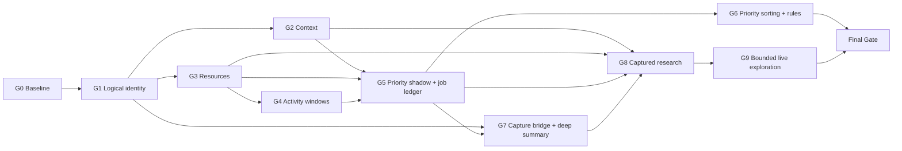

# Персональный слой внимания: Goal-mode runbook

- Статус: implementation in progress
- Полная спецификация: [personal-attention-layer-implementation-plan.md](personal-attention-layer-implementation-plan.md)
- Рецепт Rollback: [personal-attention-layer-rollback-recipe.md](personal-attention-layer-rollback-recipe.md)
- Обязательный scope: Gates G0–G9 и Final Gate
- Вне goal: optional Slice 10 до появления usage evidence
- Активный goal: `019ff487-6f70-7d13-a96a-08a131566281`

Этот файл — компактное исполняемое состояние многосессионной реализации. Полная продуктовая и техническая истина остаётся в implementation plan; runbook хранит только frontier, ownership, доказательства и правила перехода между gates.

## 1. Root goal

При явном старте реализации создать ровно один root goal без `token_budget`:

> Реализовать и доказательно ввести в эксплуатацию обязательные Slices 0–9 из `docs/personal-attention-layer-implementation-plan.md`: personal page context и exact-tab session intent, Resources и честные activity windows, раздельные user/AI priority с персональными правилами, page summary и evidence-backed resource research, сохранив Library-first UX, exact physical-tab actions, local-only privacy, EN/RU, целостность SQLite и независимые rollback paths. Если пользователь до R99 явно отменяет deployment, завершить только verified frozen release candidate с зафиксированным deployment waiver и без утверждения, что он введён в эксплуатацию. Slice 10 не выполнять без отдельного решения пользователя.

Правила Goal mode:

- дочерние агенты не создают собственные goals;
- root использует `update_plan` для gates и packets; одновременно `in_progress` только один gate;
- goal не получает token budget, если пользователь отдельно его не указал;
- `complete` допустим только при выполнении формулы Final Gate из §16;
- `blocked` допустим только после одного и того же blocker в трёх последовательных goal turns и невозможности продолжить другие ready packets;
- планирование этого файла не запускает реализацию и не изменяет live DB.

## 2. Mutable checkpoint

Root обновляет этот блок в конце каждого goal continuation:

```text
GOAL_STATUS: blocked
CURRENT_GATE: G9
LAST_ACCEPTED_GATE: G8
BASELINE_HEAD: 40f5297250cfd214d7fbac2639c013228044e56d
SCHEMA_HEAD: 26
EXPECTED_SCHEMA_TRANSITION: migrations 025 and 026 are implemented and independently accepted. Schema 25 owns bounded live-acquisition consent/action/materialization/handoff; schema 26 adds durable two-phase purge intents, exact abort acknowledgement and the closed mutation fence. Fresh schema-26 and isolated schema-24 -> 26 migration/feature-off rollback proofs pass. The user's loaded test runtime remains intentionally untouched until an explicit later rollout gate.
QUARANTINE_STATE: closed_after_A70; baseline patch sha256=52ff4898270f40375e103bae6c7ec3d989fdfe9b082552dbb2b1e3bf20348016; accepted A70 quarantined 3-file composite sha256=3b8810ca3aa167ce9186342960ff432274dedd2d2a971d1cd0a7d1ac05068aba; G9 has no extension packet and must leave these paths/hashes unchanged
ACTIVE_PACKETS: none. R5/schema-026, C90b Verticals 3-5/final/read projection and W90 are independently accepted and documented. G9 remains open only for real-public J3, extension-session tab-invariance/fallback proof and user review; no implementation packet currently owns production files.
C90B_RESUME_FREEZE: historical pre-R2/R3 composite SHA-256=633b78ce85557948d91cca5e7e8d33d128e99c4db8428f8bacce7289c0d29d90 remains audit history. C90b is accepted: bounded acquisition, materialization/traversal, immutable handoff, status projection and purge-safe reads have final P0/P1/P2/UNVERIFIED=0.
ACCEPTED_PACKETS: C00, W00, A00, A01, C10, C11, W10, A10, C20, C21, W20, A20, A21, C22, W22, A22, C30a, C30b, C30c, R30, W30, A30, C40, W40, A40, C50, R50, C52a, C51, C52b, C53, W50, A50, C60a, C60b, C60c, R60, W60, A60, C70, A70, W70, C71, W71, C80, C81, C80r, C82a, C82b, C82c, W80a, C82d, A80, W80b, C90a, C90a-R2a, C90a-R2b, C90a-R3, C90b-V2, C90a-R5/schema-026, C90b-V3-V5, C90b-final, C90b-read-projection, W90
BLOCKERS: G9 live J3 cannot start because no ANTHROPIC_API_KEY or immutable research pricing/model configuration is present; effective liveAcquisition is therefore false. R-UAT12-v1 is materialized through production catalogs on a pristine isolated schema-26 DB with 12 public IANA pages, exactly 6 captured/6 missing, integrity ok/FK 0, and all 12 URLs status-200/usable through the production SafePublicHttpClient. The isolated extension relay/activation smoke and public-SPA exact capture/captured-only preflight are complete. After provider readiness, G9 still requires real server egress/handoff/J3 dossier, final captured-only dossier and user-selected personally relevant Resource review.
BLOCKED_AUDIT: 2026-08-21 same external prerequisite confirmed for three consecutive goal turns. `.env` has no configured ANTHROPIC_API_KEY, ANTHROPIC_RESEARCH_MODEL, ANTHROPIC_RESEARCH_INPUT_USD_PER_MTOK or ANTHROPIC_RESEARCH_OUTPUT_USD_PER_MTOK; isolated PID 692804 therefore projects liveAcquisition=false. ACTIVE_PACKETS is empty, G9 cannot PASS without provider-backed J3/final dossiers, and Final cannot begin before G9 PASS. Resume when the four values are configured locally; never record the secret value in evidence or chat.
USER_DECISION_2026-08-23: partial rollout approved by the user (see docs/decisions.md 2026-08-23 and CONTEXT.md). Research, live acquisition and privacy purge receive an explicit pre-R99 `deployment_waiver` and stay feature-off; G9 stays PENDING and is not claimed verified. All server-side providers stay off for the Trial week. Live DB is confirmed at schema 17 (no persisted attention-layer fingerprints yet); last backup `backups/tabhub-2026-08-12T15-44-44.092Z.sqlite` is stale and must be replaced by a fresh same-day backup before migration.
ROLLOUT_2026-08-23: executed. Old PID 581820 (schema 17) stopped; live `data/tabhub.sqlite` migrated 17 -> 26 with sha256 9077d227...ebb54830 before and 554d2fa2...edac3371 after; integrity ok, FK 0, tables 28 -> 167, row counts unchanged (tabs 2198, tab_instances 1154, tags 26, tab_tags 2285). New PID 1099148 on 127.0.0.1:7717 at head d2579aa reports health schema 26 and `/api/features` with context/logicalImportance/resources/activityWindows/agentUserImportance/priorityReaders/priorityShadow/priorityPersonalization true and liveAcquisition/pageSummaryCapture/priorityAssessmentWriter/privacyPurge/research false; activityDailyWriter is on in `.env` but not projected by `/api/features`. No Provider credential is configured. MCP stdio smoke lists 32 tools and `get_stats`/`list_resources` answer from the live runtime. The installed extension reconnected on its own; a deliberate reload and the live J1/J2/J4 journeys remain user-owned and unclaimed. Trial week day count starts on the first full day of real use AFTER the user has run the J1/J2/J4 journeys and confirmed the extension works on the new build (issue #12), decided 2026-08-23: until that is proven, a broken Agent path would invalidate the week anyway and the count would restart; G9 stays PENDING and Final is not claimed. Скорректировано 2026-08-23 (issue #20): вердикт rollout receipt теперь `PASS_WITH_UNPROVEN_ITEMS`. Из восьми флагов Trial-недели семь наблюдаемы через `/api/features`, а `activityDailyWriter` подтверждён только файлом окружения; `agentUserImportance` — производная способность, а не один из восьми. Логи приложены путями и фактом пустого stderr, без содержимого. C98 rollback artifact `rollback/trial-week-feature-off.env` и его smoke созданы ПОСЛЕ rollout (issue #18, `C98-rollback-artifact-receipt.json`), поэтому требование §10.1 «до live rollout» на момент выката выполнено не было. Перезагрузка расширения и journeys J1/J2/J4 остаются недоказанными (issue #12).
REDEPLOY_2026-08-23: the Trial-week runtime moved off head d2579aa onto head 8a88bb7 BEFORE the Trial week started counting, because the user decided that day that the per-entry context visibility choice goes away (issue #30, closed) and that pairing must explain itself on screen (issue #31, half done). No schema change and no migration: the database stayed at user_version 26 and its SHA-256 b77dd1f2...759424ec is byte-identical before and after. Fresh pre-redeploy backup `backups/tabhub-2026-08-23T14-20-12.990Z.sqlite` sha256=b684c6be...7af3dcd, verified schema 26 / integrity ok / FK 0 / 167 tables / 2,266 tabs. Old PID 1099148 stopped, new PID 1094604 on 127.0.0.1:7717. Health schema 26, `/app/` 200, `/api/tabs` 200, feature projection identical field for field, MCP stdio lists 32 tools and `get_stats`/`list_resources` answer. The served web bundle was fetched from the running server and verified to contain the new pairing copy and not the removed visibility key, so the new build is what is served rather than what is on disk. The edge extension reconnected on its own at 14:21:12Z at protocol 5; chrome and yandex were asleep. Receipt `docs/implementation-evidence/personal-attention-layer/trial-week-redeploy-receipt.json`, verdict PASS_WITH_UNPROVEN_ITEMS. STILL UNPROVEN and unchanged by this redeploy: no extension has been reloaded, so the user-visible half of #30 and #31 is deployed but has not been seen in any browser; that reload and the live J1/J2/J4 journeys remain user-owned under issue #12, and the Trial week still has not started.
REDEPLOY_2_2026-08-23: second redeploy the same day, head 8a88bb7 -> 89e135e, still before the Trial week began counting. Carries the one-click pairing handover (issue #31, closed). No schema change, no migration; database SHA-256 0e71ef2b...5bb9101 byte-identical before and after. Pre-redeploy backup `backups/tabhub-2026-08-23T15-27-11.304Z.sqlite` sha256=1340049e...3aa8caa9, verified schema 26 / integrity ok / FK 0 / 167 tables / 2,269 tabs. Old PID 1094604 stopped, new PID 676880 on 127.0.0.1:7717. Health schema 26, `/app/` 200, `/api/tabs` 200, feature projection identical field for field, MCP stdio 32 tools answering, served bundle fetched from the running server and verified. Both edge and yandex reconnected on their own at 15:27:24Z at protocol 5. Receipt `docs/implementation-evidence/personal-attention-layer/trial-week-redeploy-2-receipt.json`, verdict PASS_WITH_UNPROVEN_ITEMS. UNPROVEN: the installed extensions still run the pre-change bundle, so the one-click handover cannot succeed until they are reloaded — an extension that does not know the `pair` request refuses it and the page falls back to the manual code, which is the designed degradation and is tested, but means #31 is deployed and not yet exercised. Issue #32 records two pre-existing gaps left unfixed on purpose: any script in the Library page can mint a challenge for an arbitrary extension origin, and neither pairing endpoint is rate-limited. Trial week still gated on issue #12.
REDEPLOY_3_2026-08-23: third redeploy the same day, head 89e135e -> fe36d6a, still before the Trial week began counting. Carries automatic browser detection and the Library pairing banner. No schema change and no migration. Pre-redeploy backup `backups/tabhub-2026-08-23T17-05-29.024Z.sqlite` sha256=3ec29e79...f025adba, verified schema 26 / integrity ok / FK 0 / 2,269 tabs. Old PID 676880 stopped, new PID 904356 on 127.0.0.1:7717. Health schema 26, `/app/` 200, `/api/tabs` 200, feature projection unchanged, served bundle fetched from the running server and verified to carry the banner copy. Unlike the two earlier redeploys the main database file hash moved (6215daee... -> 8dff92c6...): the runtime ingests continuously and the restart checkpointed the WAL into the main file. That is ordinary write activity, not a migration. Receipt `docs/implementation-evidence/personal-attention-layer/trial-week-redeploy-3-receipt.json`, verdict PASS_WITH_UNPROVEN_ITEMS. DETECTION VERIFIED 2026-08-23 17:11-17:15Z for edge and yandex, not by a contrived test. The user reinstalled both extensions rather than reloading them, wiping `browser.storage.local` (installation ids changed: edge 56024a43 -> 5507a07a, yandex 0bcfb199 -> f5c71c21), so no explicit choice existed. `currentTabCommandScope` returns undefined without a browser identity and the relay cannot register a scope without one, yet both registered within seconds already labelled correctly — detection is the only thing that could have supplied the label. The user then opened the extension options in both and found the browser already correct; opening writes nothing, because the save path is bound to the select's `change` event. STILL UNVERIFIED: chrome, whose branch names Chrome by the absence of any other brand and is therefore the one most likely to mislabel. SIDE EFFECT: both browsers lost their personal-context pairing, because the pass is bound to the installation id; capability rows 56024a43 and 0bcfb199 are now orphaned and can never authenticate again. The pairing banner is likewise unseen, because the installed extensions predate the probe field it keys on. Trial week still gated on issue #12.
LEASE_VIOLATION_2026-08-23: §4 rule 1 was broken and is recorded here rather than left out. Two sessions worked the repository at once; commit 781993b rewrote packages/server/test/persisted-fingerprint-roundtrip.test.ts from scratch over the version 4dd680f had already committed from the other session, deleting four round-trips. Commit 4dd680f restored them verbatim and kept the one addition worth keeping, so no ticket lost anything; the breach itself stands. No mechanism prevents a repeat: the repository has no cross-session lease, so a second session must read `git log` for the files it is about to write before writing them.
NEXT_READY_FRONTIER: (1) DONE 2026-08-23 — canonicalization collapsed into the shared `researchCanonicalSha256PayloadV1`/`canonicalJsonV1`, the SQLite `json_object()` byte mirror split out as `sqlJsonObjectMirrorV1`, and G8/G9 receipts re-run (`G8-G9-unified-hashing-rehash-receipt.json`); no canonicalization-derived digest in any receipt changed; (2) DONE 2026-08-23 - fresh same-day backup `backups/tabhub-2026-08-23T02-16-12.227Z.sqlite`, isolated 17 -> 26 migration and feature-off smoke (`rollout-fresh-backup-and-isolated-migration-receipt.json`), then the live database migrated 17 -> 26 and the Trial-week runtime started on port 7717 as PID 1099148 (`rollout-receipt.json`); (3) DONE 2026-08-23 - runtime redeployed onto head 8a88bb7 (issues #30/#31) with no schema change; see REDEPLOY_2026-08-23; (4) issue #12 - deliberate extension reload plus live J1/J2/J4, still user-owned and still the gate on the Trial week; (5) Trial week = 7 days without rollback (triggers: data loss/corruption, Library slowdown, local-only text leaving the machine); (6) after the Trial week: remaining debt, then the pluggable-AI initiative (Agent write path first). Former frontier (provider config + real-public J3 + user review before G9 PASS) remains valid for G9 itself and is deferred.
G8_LIVE_CANDIDATE: historical audit receipt only; its schema-24 PID/extension state from 2026-08-14 is not a current G9 runtime. Isolated schema-26 rollback smoke PID 1160972/port 7796 passed and was stopped; attempted J3-readiness PID 1002236/port 7797 proved effective liveAcquisition=false without provider config and was stopped. R-UAT12-v1 is now served from a mutable copy of the pristine hashed fixture DB by PID 692804 on port 7718, health/schema 26 ok; research/resources/privacyPurge are enabled and liveAcquisition remains effectively false until provider readiness. The user's isolated extension is connected at protocol v5 and exact activation of the existing 7718 TabHub tab preserved 475 total tabs and one exact target. Working PID 581820 on port 7717/schema 17 and its live DB remain untouched.
G9_PREFLIGHT: accepted revision 6 is IPv4-transport-only with audited but unselected native AAAA, fail-closed prior-epoch DNS reconciliation, RFC9309 product/wildcard/end-anchor semantics plus text/plain-only robots, component-wide camel/full-token-segmented credential detection, chrome-pruned primary-content usability, expiry-bounded requests and terminal materialization, assembly-only no-late guards, all-blocking-trigger composite-PK purge authority, migration-023-compatible handoff order, existing-attempt daily attribution, captured/live evidence projection, mixed-run outcome and disclosed daily/network caps; C90a now freezes migration 025, schema/deletion inventories and the closed exact-plan executor
LAST_FULL_REGRESSION: 2026-08-23 at head ad27f24 PASS through the mandated command itself, no substitution: `corepack pnpm test` exit 0 with shared 83/83, extension 321/321, MCP 140/140, server 1,312 passed and 2 skipped, web 609/609 — 2,465 passed and 2 skipped. `corepack pnpm typecheck` exit 0 and `corepack pnpm build` exit 0. Free physical memory before the run: 18.0 GB of 127.2 GB. The two skips are the live-database migration proof and its gate, which report themselves skipped unless TABHUB_PROVE_LIVE_MIGRATION=1; that proof was run separately and passed. This record follows the web-suite stability work of issue #28: the same command was run five consecutive times immediately before this one and every package was green in all five, where before the fix it failed three times in ten. Evidence: docs/implementation-evidence/personal-attention-layer/web-suite-stability-table.md. The 2026-08-23 record at head 409638d, produced by a hand-run per-package loop, is retained as audit history and does not satisfy the rule.
LAST_SCOPED_VERIFICATION: 2026-08-21 post-load independent audit ACCEPT with P0/P1/P2/UNVERIFIED=0/0/0/0. Production-catalog R-UAT12-v1 fixture materialization PASS: schema 26, 12 logical IANA pages, 6 captured/6 missing, integrity ok, FK 0; all 12 pinned public HTTPS pages passed the production SafePublicHttpClient with exact 200 and usable HTML. Isolated extension protocol-v5 relay/exact activation PASS. Public Compound SPA safe HTTP limitation `INSUFFICIENT_PUBLIC_TEXT`, exact navigation fence, exact physical-tab capture of 2,044 characters and captured-only production preflight 2 discovered/1 captured/1 missing PASS; temporary tabs were cleaned up and browser returned to 22 windows/475 tabs. W90 web 142/142, integrated EN/RU journey 2/2, corrected server matrix 79/79 and MCP startup-adjacent 53/53 remain accepted. Provider-backed real-public J3, final captured-only dossier and user UAT remain pending.
EVIDENCE_MANIFEST: docs/implementation-evidence/personal-attention-layer/G8.md (integrated G8 PASS); docs/implementation-evidence/personal-attention-layer/G8-final-gate-receipt.json (frozen final-PID smoke and exact-exit commands); docs/implementation-evidence/personal-attention-layer/G8-C80.md (C80 plus corrective reissue); docs/implementation-evidence/personal-attention-layer/G8-C81.md (C81 PASS); docs/implementation-evidence/personal-attention-layer/G8-C80r.md (C80r PASS); docs/implementation-evidence/personal-attention-layer/G8-C82a.md (C82a PASS); docs/implementation-evidence/personal-attention-layer/G8-C82b.md (C82b PASS); docs/implementation-evidence/personal-attention-layer/G8-C82c.md (C82c PASS); docs/implementation-evidence/personal-attention-layer/G8-C82d.md (C82d PASS); docs/implementation-evidence/personal-attention-layer/G8-W80a.md (W80a PASS); docs/implementation-evidence/personal-attention-layer/G8-W80b.md (W80b PASS); docs/implementation-evidence/personal-attention-layer/G8-A80.md (A80 PASS); docs/implementation-evidence/personal-attention-layer/G8-forget-lifecycle.md (gate integration PASS); docs/implementation-evidence/personal-attention-layer/G8-regression.md (1,928/1,928 and MCP transcript PASS); docs/implementation-evidence/personal-attention-layer/Q10K-G8-v1.md (current C82c strict reissue); docs/implementation-evidence/personal-attention-layer/G9-contract-freeze.md (accepted revision-6 exact-hash audits); docs/implementation-evidence/personal-attention-layer/G9-C90a.md (accepted original/corrective C90a evidence); docs/implementation-evidence/personal-attention-layer/G9-C90a-R2a.md (direct epoch/predicate-aware Resource-history correction independently accepted); docs/implementation-evidence/personal-attention-layer/G9-C90a-R2b.md (durable traversal/reservation/capture/adoption schema independently accepted); docs/implementation-evidence/personal-attention-layer/G9-C90a-R3.md (provider-ledger binding/accounting independently accepted); docs/implementation-evidence/personal-attention-layer/G9-C90b-V2.md (atomic live-acquisition start/runtime independently accepted); docs/implementation-evidence/personal-attention-layer/G9-C90a-R5.md (schema-026 purge correction accepted); docs/implementation-evidence/personal-attention-layer/G9-C90b-V3-V5.md (materialization/traversal/handoff accepted); docs/implementation-evidence/personal-attention-layer/G9-C90b-final.md (final C90b audit accepted); docs/implementation-evidence/personal-attention-layer/G9-C90b-read-projection.md (status/redaction projection accepted); docs/implementation-evidence/personal-attention-layer/G9-W90.md (W90 accepted); docs/implementation-evidence/personal-attention-layer/G9-regression.md (2,435/2,435 plus typecheck/build); docs/implementation-evidence/personal-attention-layer/G9-isolated-migration-rollback-receipt.json (isolated migration and feature-off rollback PASS); docs/implementation-evidence/personal-attention-layer/G9-live-gate-receipt.json (J3 readiness pending provider/fixture); docs/implementation-evidence/personal-attention-layer/G9.md (root aggregate PENDING)
EVIDENCE_MANIFEST_CONTINUED: docs/implementation-evidence/personal-attention-layer/G9-r-uat12-v1-receipt.json (fresh production-catalog deterministic public fixture and production SafePublicHttpClient probe PASS); docs/implementation-evidence/personal-attention-layer/G9-extension-7718-harness-receipt.json (isolated second-extension protocol-v5 relay/exact-activation smoke PASS_ISOLATED_SMOKE); docs/implementation-evidence/personal-attention-layer/G9-extension-captured-only-fallback-receipt.json (public-SPA typed limitation, navigation fence, exact capture and captured-only preflight PASS; provider dossier pending); docs/implementation-evidence/personal-attention-layer/G8-G9-unified-hashing-rehash-receipt.json (G8/G9 receipts re-run under unified hashing; G8 PASS unchanged, G9 still PENDING under the research deployment waiver); docs/implementation-evidence/personal-attention-layer/G9-live-database-17-to-26-isolated-receipt.json (live database migrated 17 -> 26 on an isolated online-backup copy: schema 26, integrity ok, FK 0, row counts unchanged, feature-off Library read 200, live file hash unchanged); docs/implementation-evidence/personal-attention-layer/rollout-fresh-backup-and-isolated-migration-receipt.json (same-day fresh backup plus repeated isolated 17 -> 26 migration and feature-off smoke at head d2579aa); docs/implementation-evidence/personal-attention-layer/rollout-receipt.json (live rollout: old/new PID, pre/post database hashes, schema 26, health, runtime feature projection, Library read 200, MCP stdio smoke); docs/implementation-evidence/personal-attention-layer/C98-rollback-artifact-receipt.json (hashed feature-off rollback profile and build, smoke on an online-backup copy: schema 26, integrity ok, FK 0, every projected flag false, Library read 200, zero row changes across 166 tables; produced after the rollout)
```

Checkpoint никогда не заменяет evidence manifest. Он нужен, чобы следующий continuation не повторял выполненную работу.

## 3. Workspace guardrails

До G0 в worktree уже существуют пользовательские изменения:

- `packages/extension/entrypoints/background.ts`
- `packages/extension/lib/tab-command-relay-agent.ts`
- `packages/extension/lib/tab-command-relay-agent.test.ts`

На старте G0 root записывает их status, SHA-256 и наблюдаемую семантику в baseline manifest. Packet `A01` выполняет ранний read-only reconciliation и возвращает каждую исходную hunk, связанную с тестом/инвариантом; root сохраняет полный diff как immutable локальный `quarantine-baseline.patch`, а в sanitised manifest — только hash и artifact path. Эти файлы остаются в quarantine:

- их нельзя менять в обычных adapter packets;
- пересечение разрешено только packets `A21` и `A70`, причём lease каждого заранее перечисляет точные quarantined paths и ожидаемые hunks;
- каждый из этих packets получает `quarantine-baseline.patch`, применяет новый diff поверх исходного пользовательского состояния и обязан доказать сохранение всех инвариантов `A01` отдельными regression tests;
- после принятия каждого пересекающего packet root записывает новый composite patch/hash; следующий packet сверяется и с исходным baseline, и с последним accepted composite state;
- `A01` переводит состояние в `reconciled`; после принятия `A70` G7 manifest фиксирует composite hashes и `QUARANTINE_STATE=closed_after_A70`;
- G9 не имеет extension packet: bounded live acquisition выполняется закрытым server-only transport, поэтому любое G9-изменение quarantined path является drift и останавливает packet;
- неизвестное изменение quarantined file немедленно останавливает затронутый packet.

Live `data/tabhub.sqlite` не используется как migration test target. Обычный прогон тестов его не открывает: доказательство миграции на реальных данных включается отдельно, `TABHUB_PROVE_LIVE_MIGRATION=1`, и любое другое значение переменной останавливает прогон, чтобы опечатка не выключала проверку молча. Сначала создаются backup и disposable copy. После успешного proof Final Gate включает отдельный real rollout step либо получает явный `deployment_waiver` пользователя. Rollout evidence фиксирует pre-rollout DB hash/backup, build path, старый/новый PID, schemaVersion/health, fresh logs, extension reload и четыре live journeys.

Субагенты не stage/commit/push. Root также не делает git commit без явной авторизации пользователя; если commits разрешены, root добавляет файлы только явным списком, никогда через `git add -A`.

## 4. Concurrency lanes

Доступно четыре слота, включая root. Одновременно работают не более трёх субагентов — по одному packet на lane.

| Lane | Владелец | Эксклюзивный write lease |
|---|---|---|
| Root | Orchestrator/integrator | runbook, evidence manifests, финальная документация; feature-файлы только для интеграционного исправления после остановки агентов |
| Core | Server/data agent | `packages/server/**`, `packages/shared/**` и соответствующие tests |
| Web | UX agent | `packages/web/**` и web tests |
| Adapters | Adapter agent | `packages/mcp/**`, `packages/extension/**` и их tests с учётом quarantine |

Правила leases:

1. Один файл принадлежит только одному активному packet.
2. Shared contracts сначала принимает Core gate, затем Web/Adapters строятся на них.
3. Root не редактирует leased feature path, пока агент работает.
4. Если packet требует чужой path, он возвращает interface request; root создаёт новый packet владельцу lane.
5. Остаток, не помещающийся в один agent turn, получает новый ID; scope существующего packet не раздувается.

## 5. Dependency DAG



G2 и G3 могут быть разными waves только потому, что оба требуют Core writes. Пока Core выполняет один из них, свободные lanes могут брать только ready packets с уже принятыми contracts.

## 6. Work packets

Каждый packet рассчитан максимум на один содержательный agent turn/session.

| Gate | Core lane | Web lane | Adapters lane |
|---|---|---|---|
| G0 | `C00` DB fixture, backup/restore harness, feature flags и structured evidence payload для Root | `W00` Library/Graph/physical-tab regression baseline | `A00` MCP/extension protocol+i18n baseline; `A01` read-only reconciliation, quarantine diff payload и semantic invariants для dirty files |
| G1 | `C10` shared contracts + migration 018/backfill/audit; `C11` catalog, atomic writers, retention compatibility | `W10` no-op Library/Graph compatibility and legacy-importance review UI | `A10` legacy MCP importance compatibility/deprecation |
| G2 | `C20` context schema/ledger/reviews/FTS; `C21` trusted projections, REST/search/retention | `W20` Drawer editor, disposition, reviews, exact scope/history/undo/a11y | `A20` MCP shareable-only context; `A21` popup exact intent/offline queue |
| G3 | `C30a` resource schema/resolver/unmatched queue; `C30b` aliases/override/merge/split commands; `C30c` evaluation/context/routes | `W30` Topics/Resources facet, chips, inline header, unmatched/override UX | `A30` MCP resource/context/activity/evaluation contracts |
| G4 | `C40` daily buckets, persisted epoch, idempotent ingest, page/resource rollups | `W40` 7d/30d/all with honest coverage | `A40` resource-activity MCP parity |
| G5 | `C50` priority schema/evaluator/typed exclusions/resource assessments; Root `R50` фиксирует UAT seed; `C52a` `DurableAiJobs` facade/ledger + summary/assessment adapter contracts; `C51` fingerprint, recompute, scheduling, routes как consumer; `C52b` restart/recovery/cancellation proof обоих adapters | `W50` shadow badges, explanations, feedback, review queue | `A50` MCP explain/feedback/user-importance with provenance |
| G6 | `C60` total ordering, server sort before pagination, ruleset lifecycle | `W60` My/AI/Recommended, manual single/bulk controls, rule editor/version rollback | `A60` priority recompute/status MCP parity if exposed |
| G7 | `C70` exact-instance capture command/server contract; `C71` default-off page-summary-capture capability boundary | `W70` exact-copy picker/bridge client; `W71` Short/Deep orchestration | `A70` extension capture command with reconciled quarantine overlap |
| G8 | `C80` research schema/evidence snapshots; `C81` preflight/corpus; `C80r` corrective migration-024 report FTS; `C82a` report/evidence contracts, catalog, search and priority signal; `C82b` provider/worker/retry/runtime/refine lifecycle; `C82c` safe local/agent client boundaries | `W80a` entry points, preflight, progress; `W80b` ResourceDrawer history/evidence/next actions/refine | `A80` async research MCP/job/report flow |
| G9 | `C90a` migrations 025/026, source bridge, workflow recovery, pure preview and exact purge quiescence; `C90b` closed safe-fetch, acquisition orchestration, budget and purge | `W90` live consent/fallback/progress/server-egress audit | none; existing relay/G7 remains unchanged |
| Final | `C98` schema-26-aware rollback artifact/profile + feature-off/read-only smoke; `C99` fresh/live-copy migration, restore and server proof; Root `R99` rollout-or-waiver, quiet-state barriers `Q99a/Q99b`, UAT `U99`, conditional fail-closed rollback `R100` | `W99` full EN/RU/a11y and four journeys on the R99-selected runtime | `A99` extension/MCP build, protocol and live relay proof on the same runtime |

`Ready(packet)` означает: gate находится `in_progress`, все перечисленные ниже predecessors приняты, нужный lane свободен, lease и acceptance заранее записаны. Канонический packet DAG:

```text
G0:    C00; W00; A00 -> A01
G1:    C10 -> C11 -> {W10, A10}
G2:    C20 -> C21 -> {W20, A20, A21}; A01 -> A21
G3:    C30a -> C30b -> C30c -> {W30, A30}
G4:    C40 -> {W40, A40}
G5:    C50 -> R50(seed receipt) -> C52a -> C51 -> C52b -> {W50, A50}
G6:    C60a -> C60b -> Root R60(Q10K-G6-v1) -> {W60, A60}
G7:    C70 -> A70 -> W70 -> C71 -> W71; A01 -> A70
G8:    C80 -> C81 -> C80r -> C82a -> C82b -> {W80a, C82c}; C82c -> A80; {W80a, C82c} -> W80b
G9:    C90a (schema 24 -> 25 -> 26) -> C90b -> W90
Final: freeze accepted candidate; C98 -> C99 -> R99(rollout-or-waiver) -> A99 -> Q99a -> W99 -> Q99b -> U99
       any post-rollout FAIL -> R100(fail-closed rollback receipt) -> affected gate
```

Semicolon разделяет независимые roots одного gate, braces — packets, которые можно запустить параллельно при свободных lanes. `R50`, `R99`, `Q99a/Q99b`, `U99` и `R100` принадлежат Root. `R50` до первого реального G5 assessment сохраняет seed/hash и sampling algorithm в G5 manifest. `C52a` фиксирует job interface до появления consumer, `C52b` принимает integrated recovery behavior. `C98` создаёт отдельный hashed rollback artifact/profile, который включает migration metadata до schema 26, но запускается с новыми writers/jobs/browser actions и UI entry points выключенными; он не может быть старым schema-24 binary, потому что текущий runtime fail-fast отклоняет более новую DB через `DatabaseSchemaTooNewError`. `R99` либо выполняет разрешённый live rollout с receipts, либо записывает явный пользовательский deployment waiver; `U99` координирует deterministic UAT. A99 и W99 не управляют одной browser/extension session параллельно: Q99 barriers ждут отсутствия active commands/jobs, фиксируют tab/session/activity state и подготавливают следующий deterministic test scope без закрытия пользовательских вкладок. При rollout A99/W99/U99 проверяют именно развёрнутый runtime; при waiver — один frozen non-production candidate, а `Final.md` явно говорит, что deployment не выполнен. Любая дополнительная связь добавляется в manifest до запуска зависимого packet. Заранее раздробленные `C30a/b/c`, `C52a/b`, `C80r`, `C82a/b`, `W80a/b` и `C90a/b` нельзя снова объединять. Остальной packet root дробит только до старта (`C20a`, `C20b`), сохраняя interface и write lease; после старта scope не расширяется. Новый domain decision создаёт decision ticket (§11), а не скрытую импровизацию в коде.

## 7. Packet prompt contract

Каждое поручение субагенту содержит:

```text
PACKET_ID
GOAL_AND_GATE
BASE_HEAD_AND_SCHEMA
SOURCE_SECTIONS
DEPENDENCIES_ACCEPTED
EXCLUSIVE_WRITE_LEASE
READ_ONLY_NEIGHBORS
QUARANTINED_PATHS_AND_ACCEPTED_COMPOSITE_HASH
EXPECTED_SCHEMA_TRANSITION: none | from -> to + reserved migration files
REQUIRED_INTERFACE_AND_INVARIANTS
ACCEPTANCE_TESTS
EVIDENCE_TO_RETURN
OUT_OF_SCOPE
STOP_CONDITIONS
```

Обязательный handoff агента:

```text
PACKET / BASE_HEAD
FILES_TOUCHED
INTERFACE_AND_INVARIANTS
TESTS: exact command + exit code
DATA_OR_UI_PROOF
PRIVACY_AND_SAFETY_PROOF
DIRTY_QUARANTINE: unchanged / overlap reconciled
UNVERIFIED_OR_BLOCKED
ROLLBACK
NEXT_READY_PACKETS
```

Слова «tests pass», «работает» или «готово» без точной команды и наблюдаемого результата не принимаются.

## 8. Gate entry contract

Gate может стать `in_progress`, только если:

1. Все incoming DAG dependencies имеют accepted `PASS` manifest.
2. Root сверил `get_goal`, `HEAD`, `git status --short`, schema head и quarantine hashes.
3. Ни один live agent не владеет нужным lease.
4. Baseline failures либо устранены, либо записаны как доказанно unrelated и не маскируют новый regression.
5. Для migration gate доступна свежая disposable copy live DB и проверенный backup; entry manifest резервирует точный `from -> to`, номера/имена migration files и ожидаемый resulting schema head для каждого migration packet.
6. Acceptance criteria и команды известны до записи кода.
7. Если изменилось предположение спецификации, сначала закрыт decision ticket.

G0 дополнительно создаёт baseline manifest с timestamp, DB SHA-256, schema version, migration head, HEAD, counts/checksums, feature flags, тестами и начальными performance measurements. C00/W00/A00/A01 только возвращают evidence payloads; Root один материализует `G0.md`, immutable local quarantine patch и их hashes в соответствии с Root lease. Жёсткие live counts из спецификации считаются историческим снимком; сравнение выполняется с этим manifest, а не с числом `1 509`.

Для G9 entry дополнительно обязательно `QUARANTINE_STATE=closed_after_A70` из PASS G7 и совпадение текущих hashes с accepted G7 composite state; C90a/C90b/W90 не получают write lease на quarantined extension paths.

## 9. Evidence manifests

Для каждого gate root создаёт sanitised файл:

`docs/implementation-evidence/personal-attention-layer/G<n>.md`, а для Final — `Final.md`.

Он содержит:

- baseline HEAD и resulting diff/commit, если commits разрешены;
- accepted packet handoffs и точные paths;
- команды, exit codes и краткий результат;
- DB before/after counts и deterministic checksums;
- `PRAGMA integrity_check` и `PRAGMA foreign_key_check`;
- REST/MCP success, error, idempotent replay, pagination и privacy-negative transcripts;
- UI/browser/extension evidence с EN/RU и keyboard/a11y results;
- live health/schemaVersion после fresh restart;
- performance before/after;
- feature-flag-off proof;
- rollback drill и остаточные риски;
- verdict `PASS` или `FAIL`.

Raw DB copies, private page text, full context, secrets и sensitive screenshots не коммитятся. Manifest хранит hashes, redacted excerpts и пути к временным локальным artifacts, когда они нужны.

## 10. Gate exit contract

Любой G1–G9 получает `PASS` только при логическом AND:

1. Все packets gate приняты, write leases соблюдены, неизвестных edits нет.
2. Acceptance каждой затронутой interface доказан через interface-level tests.
3. Scoped tests зелёные; полный `corepack pnpm test`, `corepack pnpm typecheck`, `corepack pnpm build` завершился с exit code 0 на resulting gate state; `git diff --check` чист.
4. Cross-surface integration test доказывает общий invariant, а не только отдельные modules.
5. Feature flag off сохраняет поведение предыдущего accepted gate.
6. Migration, если есть, проходит на fresh DB и fresh copy baseline DB без потери children/FK.
7. Новая UI surface имеет EN/RU, keyboard и accessibility evidence.
8. Privacy/safety negative tests проходят с нулём утечек/неразрешённых actions.
9. Rollback path выполнен на disposable copy, а не только описан.
10. Нет открытых P0/P1 review findings и нет обязательного `UNVERIFIED`.
11. Evidence manifest имеет `PASS`.

### 10.1 Final Gate entry/exit

Final может начаться только после PASS G6 и G9, отсутствия active packets и повторной сверки baseline/quarantine. C98 сначала доказывает rollback artifact/profile на fresh schema-26 fixture и migrated live-copy; C99 проверяет frozen candidate; затем Root завершает R99 rollout-or-waiver. A99, W99 и U99 последовательно выполняются на одном выбранном R99 runtime/build/HEAD с Q99 quiet-state barriers.

До live rollout R99 фиксирует rollback recipe и exact C98 artifact/profile hash. Зафиксированный рецепт: [personal-attention-layer-rollback-recipe.md](personal-attention-layer-rollback-recipe.md) (2026-08-23) — точный feature-off набор Trial week, три триггера отката и правило, что restore из backup требует отдельного явного поручения пользователя. Обязательный default — schema-compatible rollback: выключить новые writers/UI/adapters, остановить new jobs/actions и запустить C98 rollback artifact на той же schema-26 DB, не откатывая пользовательские записи. C98 smoke обязан доказать open/health/schemaVersion/Library reads, отсутствие new writes/actions и feature-off compatibility на migrated live-copy; без PASS C98 live rollout запрещён. Pre-rollout backup остаётся disaster-recovery artifact. Destructive DB restore разрешён только отдельным явным поручением пользователя после quantified reconciliation: R99 включает maintenance/write-quiescence до backup, журналирует post-backup writes, а R100 предъявляет exact row/action delta и план сохранения/повтора; без этого restore запрещён. Если rollout состоялся, но A99/W99/U99 или любой privacy/safety check завершился FAIL, Root до паузы запускает `R100`: запрещает новые writers/actions, запускает exact C98 hash, доказывает PID/artifact path/hash/health/schemaVersion/fresh logs/extension reload и сохраняет отдельный rollback receipt. Post-rollout FAIL нельзя заменить deployment waiver. Root помечает affected gate и все его transitive DAG descendants, включая Final, `stale/pending`; повтор начинается с affected gate на новом HEAD, и старые PASS manifests остаются audit history, но не удовлетворяют dependencies.

`PASS(Final)` существует только если `Final.md` доказывает:

1. C98/C99/W99/A99 handoffs и root-owned R99/Q99/U99 receipts приняты без lease or shared-session violations; `R100` отсутствует, либо его rollback receipt PASS и Final всё ещё помечен FAIL до повторной проверки.
2. Full test/typecheck/build, release restart и C98 schema-26 rollback-artifact smoke имеют exit code 0; оба artifact hashes записаны.
3. Fresh-DB и fresh live-copy migration/restore проходят integrity/FK/count/checksum gates.
4. Все четыре product journeys прошли на одном build.
5. Performance/privacy/a11y/safety budgets выдержаны на обоих фиксированных fixtures и всех immutable versioned query sets.
6. Либо attempted live rollout имеет `actual_live_rollout_pass=true`, либо rollout не начинался и до R99 приложен явный `deployment_waiver`; проваленный rollout waiver’ом не обходится.
7. При live rollout доказаны backup/hash, executable/build path, old/new PID, health/schemaVersion, fresh-log health и extension reload.
8. P0/P1 и required unverified items равны 0; все required diffs accounted and integrated, независимо от наличия git commit.
9. Условные UAT и post-rollout measurement predicates из §13/§16 выполнены; провал при достаточном sample/window нельзя заменить waiver/checkpoint.

Полный `corepack pnpm test`, `corepack pnpm typecheck`, `corepack pnpm build` обязателен перед `PASS` каждого G0–G9 и Final; gate не считается independently shippable без этого прогона. Каждый package задаёт свой bounded worker count прямо в `test` script (server 2, остальные 4), поэтому мандатная команда и есть та, которая запускается: подменять её на ручной per-package прогон нельзя. Предусловие прогона — не менее 16 GB свободной физической памяти; свободный объём записывается в regression record. Ниже этого порога прогон может оборваться аллокацией в произвольном package. Оговорка распространяется только на такой обрыв: процесс, умерший на аллокации, не дал результата, повторяется и не может цитироваться как evidence. Провал assertion остаётся FAIL при любом состоянии машины и нехваткой памяти не объясняется. После G2, G7, G8, G9 дополнительно обязательны extension reload и exact physical-tab live smoke. После MCP gates обязательны protocol/tool transcripts.

## 11. Decision frontier

На момент подготовки runbook blocking design fog отсутствует: defaults из §22 implementation plan приняты как рабочие. Если во время goal появляется вопрос, который меняет schema, privacy, user semantics или scope, root добавляет компактный ticket:

```markdown
## #N: Короткий вопрос

Blocked by: #N или none
Type: Research | Prototype | Discuss

### Question

Один проверяемый вопрос, помещающийся в один agent session.

### Answer

Unresolved до отдельного решения; после решения — принятое правило и ссылка на evidence/ADR.
```

Пока ticket unresolved, блокируется только зависимый packet. Независимые ready DAG nodes продолжаются. Новые top-level screens, server crawler, automatic deletion или Slice 10 всегда требуют отдельного пользовательского решения.

## #1: Доверенная local-UI capability для расширения

Blocked by: none
Type: Research

### Question

Может ли существующая relay registration или проверка `chrome-extension://` Origin безопасно выдавать доступ к `local_only` context?

### Answer

Нет. Текущий relay принимает self-asserted installation/session scope, а Origin расширения сам по себе не доказывает принадлежность конкретной установке. До принятия G2 migration 019 и C21 добавляют одноразовое, инициированное пользователем pairing: короткоживущий одноразовый challenge, хешированный credential на installation, rotation/revoke и generic fail-closed error. Web получает отдельную server-side HttpOnly same-origin session. Capability не передаётся через URL, не логируется и никогда не поступает в MCP/AI adapter. Threat boundary защищает от remote web, DNS rebinding, произвольного extension Origin и случайного agent-доступа, но не обещает защиту от malware или другого процесса с полномочиями того же OS user.

## #2: Неизменяемая история и deterministic resolution ресурсов

Blocked by: none
Type: Research

### Question

Как совместить обязательные alias edits, idempotent merge/split, append-only resource history и неоднозначные resolver matches, если исходный `ResourceCommand` и migration-020 sketch этого полностью не моделируют?

### Answer

До C30a принимается минимальное расширение: closed command union получает `set_aliases`; все команды используют append-only idempotency receipts с normalized payload fingerprint. Rules, assignments и resolution events неизменяемы, а отдельные head/projection tables атомарно указывают current state; merge сохраняет source identity как `merged`, split оставляет source active. Resolver precedence: current user/manual assignment → agent/on-behalf assignment → user/on-behalf alias rule → system seed rule → registrable-domain derived rule; внутри класса priority, exact host, longest path-prefix, longest host. Равный authoritative match разных resources даёт `ambiguous`, не row-id tie-break. Автоматически определяется только доказуемое из URL; authenticated/sensitive access class задаётся explicit rule/resource, а слабые признаки остаются unmatched/ambiguous. Internal/private origins получают typed exclusion и никогда автоматически не становятся research target.

## #3: Детерминированный контракт PriorityEngine v1

Blocked by: none
Type: Discuss

### Question

Какие точные score/confidence defaults, allowlisted AST, conflict precedence,
privacy boundary, baseline provenance и feature flags обязан реализовать C50,
чтобы одинаковые inputs/ruleset были воспроизводимы, а schema не закрепила
неявные продуктовые решения?

### Answer

До C50 принят следующий v1 contract:

1. Migration 022 создаёт и активирует прозрачный immutable baseline ruleset
   `TabHub baseline`, version `1`, с `created_by='agent'`; это системная
   исходная политика, а не пользовательское решение. Миграция не создаёт ни
   одного реального assessment/exclusion. Первый collection run допустим только
   после root-owned `R50` seed receipt.
2. Policy defaults: `baseScore=40`, `baseConfidence=0.65`,
   `lowConfidenceThreshold=0.60`; bands — `low=0..24`, `medium=25..59`,
   `high=60..84`, `critical=85..100`. Эти v1 policy constants self-describing
   в AST, но не редактируются personal rules; validator отклоняет другие
   значения, а SQL проверяет соответствие persisted band score. Отсутствие
   captured content добавляет
   `captured_content` в `missingSignals` и вычитает `0.20` только из confidence,
   никогда из score. Score и confidence clamp соответственно к `0..100` и
   `0..1`; low confidence выставляет `needsReview`, но не меняет band. Обе
   typed assessment tables добавляют persisted
   `needs_review INTEGER NOT NULL CHECK (... IN (0,1))`, иначе явное правило
   review не переживёт reload/history. Значение равно
   `(confidence < lowConfidenceThreshold) OR effectiveExplicitNeedsReview`.
3. Baseline содержит только объяснимые additive rules: shareable next action
   `+25/+0.15`, shareable project context `+15/+0.10`, current-project
   membership `+15/+0.10`, pinned `+10/+0.05`, honest 30d active use не менее
   15 минут `+10/+0.10`, current research report `+10/+0.10`, current summary
   `+0/+0.05`, relation membership `+5/+0.05`. Здесь первое число — score,
   второе — confidence. Пассивное foreground time, user importance и resource
   user evaluation в baseline score не входят.
4. `rule_ast_json` — strict JSON schema version `1`, максимум `64 KiB`, не
   более `100` rules, не более `8` conditions в rule. Каждый rule имеет unique
   stable `ruleKey`, integer `priority` `0..1000`, typed
   `appliesTo=page|resource|both`, `when.all` и effect. Signal allowlist:
   `has_shareable_next_action`, `has_shareable_project_context`,
   `has_current_project_membership`, `topic_paths`, `workspace_names`,
   `is_pinned`, `is_open`, `status`, `relation_count`,
   `active_use_30d_ms`, `on_screen_30d_ms`, `age_days`, `last_seen_days`,
   `has_captured_content`, `has_current_summary`,
   `has_current_research_report`, `duplicate_physical_count`,
   `resource_page_count`, `resource_captured_page_count`. Все signals доступны
   обоим subject types через deterministic aggregation C51, кроме двух
   `resource_*_count`, которые разрешены только Resource. Boolean signals
   принимают только `eq` с boolean; finite numeric — `eq|gte|lte` с finite
   number; string-array signals (`topic_paths`, `workspace_names`, `status`) —
   только `in` с непустым bounded unique string array и означают любое точное
   пересечение. Missing/unknown signal никогда не match. Для page `status`
   является
   отсортированным unique set всех canonical copy states, а не случайно
   выбранной browser-row; Resource получает такой же unique union по current
   member pages. Pinned/open/workspace/duplicate signals для Resource также
   агрегируются по current membership, а не объявляются несовместимыми.
   Subject-incompatible signals отклоняются. Unknown fields, duplicate `ruleKey`,
   non-finite number, executable code, SQL, regex и свободный prompt как
   runtime отклоняются. Readable label — inert bounded text, не executable
   input.
5. Effect allowlist: integer `scoreDelta=-100..100`, finite
   `confidenceDelta=-1..1`, `scoreFloor=0..100`, `scoreCap=0..100`,
   `needsReview=true|false` и только typed `user_excluded|policy_excluded`.
   Rule обязан иметь хотя бы один effect; rule с собственным
   `scoreFloor > scoreCap` invalid и отклоняется до записи. Matching order total:
   `priority DESC, ruleKey ASC`. Deltas суммируются. Effective floor — maximum
   matching floor, cap — minimum matching cap; при `floor > cap` остаётся bound
   rule с более высоким total-order precedence, второй игнорируется с явной
   diagnostic reason. Typed exclusion всегда побеждает assessment; несколько
   exclusions разрешаются тем же total order. Reasons и missing signals
   сортируются и дедуплицируются детерминированно. Для нескольких explicit
   `needsReview` побеждает первый rule в total order; explicit `false` не может
   скрыть review, вызванный low confidence. Rule с условием
   `has_captured_content eq false` может только уменьшать confidence и/или
   выставлять `needsReview=true`; score delta/floor/cap, exclusion, положительный
   confidence delta и `needsReview=false` в такой ветке invalid. Поэтому
   отсутствие content не может скрыто снизить score.
6. Inputs/fingerprint используют только canonical typed feature object.
   `local_only` context body и сам факт его существования не входят ни в
   features, ни в fingerprint/reasons/MCP/AI/log. Допустим только явно
   shareable context. Authenticated/sensitive Resource остаётся priority-
   eligible; research restrictions не превращаются в priority exclusion.
   Internal/private/unsupported subject получает persisted typed exclusion.
   Канонический eligible Resource denominator — строки `resource_heads`, чей
   current `resource_events.lifecycle_state='active'`; merged Resources не
   входят в current coverage и сохраняют только superseded history. C51 обязан
   агрегировать page/resource signals детерминированно и не выбирать incidental
   browser copy; честно неполный 30d signal отсутствует и не match.
7. Page и Resource outcomes физически типизированы и не смешивают одинаковые
   numeric IDs. В одной transaction current assessment XOR exclusion
   supersede и заменяется одним outcome; exact same subject/fingerprint/ruleset
   — idempotent no-op. Semantic history immutable, кроме одноразового
   `superseded_at: NULL -> timestamp`; delete/cascade разрешён только для
   privacy lifecycle. Staleness в C51 вычисляется из active ruleset version и
   feature fingerprint, отдельный mutable `stale_at` не вводится.
   Новый Resource outcome разрешён только для current active resource head;
   merged identity не может получить новый current outcome.
   `assessmentMethod/modelProvenance` относятся только к persisted assessment:
   eligibility/rule exclusion всегда возвращается как typed exclusion без
   model provenance и не является ошибкой. Для exclusion no-op identity —
   subject + feature fingerprint + ruleset/version. Для assessment provenance
   является частью semantic identity: no-op дополнительно требует одинаковые
   `assessmentMethod` и canonical `modelProvenance`; новый method/provider/model/
   prompt version создаёт successor, не возвращает строку с ложным provenance.
8. Feedback v1 относится только к current assessment, потому что schema хранит
   строгий composite FK на assessment того же typed subject. Exclusion feedback
   не имитируется; его изменение проходит через personal-rule lifecycle G6.
   Idempotency key глобален между page/resource feedback tables: exact replay
   возвращает исходную historical row даже после supersession, а любое иное
   payload/type даёт `IDEMPOTENCY_KEY_CONFLICT`. Новый feedback требует current
   assessment, прямого current predecessor и `revision=previous+1`; composite
   FKs, unique successor и clock checks запрещают cross-subject fork/cycle.
9. Объявляются три независимых default-off флага:
   `TABHUB_FEATURE_PRIORITY_ASSESSMENT_WRITER`,
   `TABHUB_FEATURE_PRIORITY_READERS`, `TABHUB_FEATURE_PRIORITY_SHADOW`.
   Shadow эффективен только вместе с readers и schema 22; writer может быть
   включён отдельно для staged collection. C50 объявляет/валидирует флаги, но
   не добавляет routes, jobs, UI/MCP и не запускает collection.
10. SQLite checks fail closed: invalid timestamp/JSON path не может пройти как
    SQL `NULL`; все canonical timestamp predicates используют explicit
    `CASE/COALESCE`. SQL AST numeric values ограничены тем же safe finite range,
    что TypeScript. Persisted reasons/missing-signals имеют строгую item schema,
    bounds/uniqueness и повторно валидируются при чтении. Version/revision и
    boolean storage обязаны иметь соответствующий SQLite integer type.
11. Assessment и feedback writers используют `BEGIN IMMEDIATE` semantics, так
    что read-before-write replacement/idempotency не оставляет concurrency race
    между несколькими локальными server processes; rollback остаётся atomic.

Архитектурная запись: [`docs/decisions.md`](decisions.md), решение от
`2026-08-12` о deterministic PriorityEngine v1.

## #4: DurableAiJobs v1 и два физических ledger adapters

Blocked by: none
Type: Discuss

### Question

Какой точный interface, identity, lifecycle, lease/cancellation contract и
fairness обязан реализовать C52a, чтобы общий `DurableAiJobs` обслуживал
существующий page summary и новые priority/research jobs, не переписывая
legacy `jobs` и не оставляя неоднозначностей для C51/C52b?

### Answer

До C52a принят следующий v1 contract:

1. `DurableAiJobs` — глубокий внутренний module с внешним interface ровно
   `submit(task)`, `get(id)` и `cancel(id)`. Он скрывает два реальных adapters:
   неизменённый `SummaryCatalog`/таблицы `jobs` + `summary_job_attempts` для
   `page_summary` и новый ledger migration 023 для `priority_assessment` и
   `resource_research`. Legacy rows, числовые shared/REST IDs, FK
   `contents.summary_job_id` и текущий summary worker не мигрируются и не
   rebuild'ятся.
2. Общий durable `JobId` — additive namespaced string, строго
   `summary:<positive-safe-integer>`,
   `priority_assessment:<positive-safe-integer>` или
   `resource_research:<positive-safe-integer>`. Regex prefix/suffix —
   `^(summary|priority_assessment|resource_research):([1-9][0-9]*)$`, после чего
   suffix обязан быть safe integer. Текущие numeric `jobIdSchema`,
   `SummaryJob.id`, `SummaryEnqueueResponse.jobId` и `/api/jobs/:id` остаются
   неизменными; новые namespaced routes появятся в последующих packets.
3. `AiTaskSpec` — закрытый discriminated union version 1:
   `page_summary` адресует `tab` и несёт существующие `depth`, `requestedBy`,
   `requestedModel`, `maxAttempts`; `priority_assessment` адресует ровно один
   `page`, `resource` или singleton `collection:all` и несёт exact
   `rulesetId/version`, semantic assessment provenance
   `rule | model(provider/name/promptVersion)`, domain input fingerprint,
   idempotency key, step batch size `1..100`, request provenance, scheduling
   priority и budget; `resource_research` адресует ровно один
   `page`, `resource` или immutable `selection` fingerprint и несёт versioned
   workflow ref, domain input fingerprint, idempotency key, provenance,
   scheduling priority и approved budget. Collection job — coordinator, а C51
   передаёт `PriorityEngine` page/resource steps максимум по 100. Свободный
   prompt, page text, corpus и `local_only` data в task/checkpoint запрещены.
4. Общие `JobRef`/`JobView` возвращают namespaced `id`, `kind`, typed `subject`,
   common status (`queued|running|succeeded|partial|failed|cancelled|superseded`),
   attempts/maxAttempts, `{completed,total,stage}` progress, `canCancel`,
   cancellation request, lifecycle/next-attempt timestamps, bounded typed error
   и typed result. Legacy summary честно проецирует только свои четыре status
   без угадывания `superseded` по тексту ошибки, `canCancel=false`, progress как
   один item и существующий `SummaryJobResult`; adapter не читает legacy SQL
   напрямую ради дополнительных полей. New result union: output fingerprint
   для priority и positive report ID для research.
5. Facade canonicalizes полную submission и вычисляет отдельный
   `submission_fingerprint`; переданный consumer'ом `input_fingerprint` остаётся
   domain staleness guard. JSON ограничен 64 KiB, должен быть strict/canonical,
   не иметь unknown/duplicate keys и содержать только конечные safe
   integers/numbers. Один globally unique idempotency key + тот же submission
   fingerprint возвращает исходный job в любом status; тот же key + другая
   submission даёт `IDEMPOTENCY_KEY_CONFLICT`.
   Любой успешный submit, включая reuse уже active priority job с новым
   idempotency key, атомарно создаёт immutable idempotency receipt, который
   связывает exact key и fingerprint именно этой submission с возвращённым job.
   Поэтому replay такого alias после terminal state по-прежнему возвращает
   исходный job, а key остаётся глобально занятым между обоими новыми kinds.
6. Migration `023_ai_jobs.sql` создаёт `ai_jobs` только для двух новых kinds.
   Row хранит typed subject columns и canonical `subject_key`,
   `requested_by/request_method/authorization_ref` с разрешёнными комбинациями
   `user/manual/no authorization`,
   `agent/on_behalf_of_user/required authorization` и
   `system/scheduled/no authorization`, idempotency/submission/input
   fingerprints, scheduling/status/attempt/availability, progress и bounded
   strict checkpoint, spent/maximum steps, tokens, cost/time budget,
   cancellation requester/timestamp, unique lease owner/token/expiry, typed
   result, typed bounded error, event sequence и lifecycle timestamps. Required
   strings не пусты; fingerprints — lowercase 64-hex; IDs/counters safe,
   positive или non-negative по смыслу; spent не превышает budget; progress
   monotonic и `completed <= total`, когда total известен. SQLite и TypeScript
   одинаково проверяют subject/kind XOR, provenance, status/lease/timestamp/
   result shapes и canonical millisecond UTC timestamps.
7. `subject_key` обязан равняться `page:<id>`, `resource:<id>`,
   `collection:all` или `selection:<fingerprint>`. Два partial unique indexes —
   отдельно для active priority и active research `subject_key` — исключают
   второй queued/running target. Same active target + same input возвращает
   active job. Changed priority input атомарно supersede прежний active job и
   fence его attempt до INSERT successor; changed active research input даёт
   `JOB_ACTIVE_CONFLICT`, потому что scope/budget нельзя неявно заменить.
8. `ai_job_attempts` хранит unique `(job_id, attempt_no)`, unique `(id,job_id)`,
   lease token/worker, provider/model/prompt/request IDs, lifecycle, outcome,
   раздельные input/output tokens, total usage/cost и bounded typed error.
   Provider/model/prompt metadata вместе с immutable canonical `provider_bound_at`
   однократно bind'ится непосредственно перед provider call; request ID вместе с
   immutable `request_bound_at` однократно bind'ится только после этого и только
   когда ответ действительно дал ID. Оба binding timestamp обязаны быть не раньше
   последнего persisted job/event timestamp и строго раньше текущего lease expiry.
   Provider failure может оставить request ID и `request_bound_at` `NULL`, но не
   стирает provider identity. Разрешено только одно завершение
   `running -> terminal`; остальные semantic fields immutable. Direct SQL не
   может поменять порядок этих фаз или заранее создать attempt с usage/metadata.
   `ai_job_events` хранит append-only contiguous unique `(job_id,sequence_no)`
   transitions/progress с optional composite `(attempt_id,job_id)` FK. Каждый
   `progress` хранит новый cumulative usage и точные неотрицательные delta
   `input_tokens`, `output_tokens`, `cost_usd`, `steps`, `wall_time_ms`; SQL trigger
   проверяет, что delta равна разнице между новым cumulative значением и текущей
   projection. Renewal использует нулевые delta. Events
   не содержат arbitrary detail/error body, prompt, content или context;
   UPDATE/DELETE запрещены trigger, а insert trigger проверяет next sequence,
   monotonic time и legal event/status pair.
9. Exact transitions/events:
   `submitted null->queued`, `claimed queued->running`,
   `progress running->running`, `cancel_requested running->running`,
   `retry_scheduled|recovered running->queued`,
   `succeeded|partial|failed running->same-named-terminal`,
   `cancelled queued|running->cancelled`,
   `superseded queued|running->superseded`. Terminal states immutable. Job
   projection и event в одной `BEGIN IMMEDIATE` transaction. Claim увеличивает
   attempts и назначает unique lease token; checkpoint/complete/fail требуют
   exact running `(job_id, lease_owner, lease_token)` и неистёкший lease, иначе
   `JOB_LEASE_LOST` и output не публикуется.
   Research completion API — только `complete(claim, checkpoint, completion)`,
   failure API — только `fail(claim, checkpoint, failure)` с обязательным
   checkpoint (допустима нулевая delta), а `completeIf` также всегда принимает
   checkpoint. Terminal success/failure и cancellation-requested running job при
   следующем worker checkpoint сначала добавляют финальный `progress` с известной
   usage delta, затем terminal event в той же transaction. Обычная queued
   cancellation не принимает worker checkpoint и сразу становится cancelled.
   Двухаргументного
   `complete` и terminal пути, теряющего известную usage, нет.
10. Lease v1: 60 seconds, renewal every 20 seconds. Recovery касается только
    expired running lease: cancellation request завершает `cancelled`; иначе при
    оставшихся attempts/budget job возвращается в `queued`, а при исчерпании —
    `failed`; attempt становится `interrupted`, lease очищается и event
    добавляется атомарно. Новый claim меняет token и fence старого worker. Clock
    раньше persisted job/event timestamp даёт `JOB_CLOCK_REGRESSION` без
    частичной записи. C52a доказывает ledger recovery; C52b отдельно докажет
    integrated restart/recovery обоих adapters и реальных consumers.
    `claimNext` возвращает validated execution envelope: exact typed task,
    subject, input fingerprint, current progress/checkpoint и created anchor
    вместе с attempt/lease identity. Consumer не читает `ai_jobs` напрямую и
    после restart не подменяет queued ruleset/workflow текущей activation.
    Guarded completion не принимает произвольный callback, SQL, statement или
    executable normalizer на каждый call. При construction ledger получает
    immutable internal registry `guardId -> fixed reviewed SQL + closed declarative
    parameter descriptors + usage:{stepsPerRow:1}`; ledger сам клонирует definition
    и готовит statement на
    своём connection. C51
    регистрирует reviewed `priority_coverage_v1`, а C52a использует только test
    template. Consumer передаёт `guardId`, bounded args и expected canonical
    result fingerprint. Внутри одной `BEGIN IMMEDIATE` transaction ledger
    проверяет, что зарегистрированный statement принадлежит этому connection,
    одновременно `readonly=true`, `reader=true` и не busy, заново валидирует все
    normalized args и выполняет его сам streaming iteration без предварительного
    `.all()`. Число строк, canonical byte size и аргументы жёстко ограничены;
    canonical positional rows сохраняют column order и duplicate column names.
    Ledger сравнивает SHA-256 canonical result. DDL,
    DML, writable/readless PRAGMA, multi-statement и oversized result не могут
    попасть в registry. SQL, args, rows и actual mismatch digest не сохраняются
    и не раскрываются. При mismatch checkpoint/usage сохраняются, но result не
    публикуется; при match actual digest, expected fingerprint и published
    priority output fingerprint совпадают, а completion payload структурно связан
    с тем же fingerprint; checkpoint/usage сохраняются вместе
    с terminal result. Guard возвращает ledger только actual digest и row count;
    одна positional row означает один заново проверенный subject. Ledger сам
    прибавляет row count к `usage.steps`, измеренный своим clock elapsed guard time
    к `usage.wallTimeMs` и сохраняет эту augmented usage как при acceptance, так и
    при rejection. Неожиданный выход augmented usage за approved budget откатывает
    всю transaction и оставляет job nonterminal. После guard ledger повторно
    проверяет clock и lease.
    Обычный mismatch оставляет job running. Опциональный closed `onMismatch`
    terminalizes mismatch в той же transaction как честный non-coverage
    `partial`, когда post-guard budget уже не вмещает ещё один полный guard или
    ledger насчитал subject-typed fixpoint limit: `3` фактически исполненных
    guard cycles для single и `4` для collection. Generic `checkpoint` отклоняет
    reserved `ledger:*` stages, а ledger после фактического mismatch сам
    append-only сохраняет `ledger:guard-cycle:N` и сбрасывает `nextOffset=0`;
    restart и denominator growth/shrink не обнуляют предел. До ledger-provable
    exhaustion или exact cycle limit intent считается преждевременным, actual
    guarded usage сохраняется и job остаётся running. `observedDenominator`
    равен фактическому guard row count.
    Для preflight отдельный `completePartial` атомарно сохраняет checkpoint/usage
    и terminal partial без запуска guard, но только при ledger-provable exhaustion
    после этого checkpoint: `(remainingSteps < observedDenominator &&
    observedDenominator > 0) || remainingWallTimeMs == 0`. Иначе он отклоняется
    без writes. V1 не принимает speculative wall estimate: при положительном
    remaining wall точное будущее время guard неизвестно, поэтому guard запускается,
    а неожиданный actual overflow откатывает transaction и оставляет job
    nonterminal. Для single page/Resource `initialDenominator=1`, а observed равен
    `0|1`; collection допускает nonnegative growth/shrink и C51 выводит observed
    только из canonical preflight enumeration. В обоих partial случаях caller
    передаёт только strict versioned
    `initialDenominator`/`observedDenominator`, но не fingerprint: ledger сам
    canonicalizes `{version,coverage:false,status,diagnostic,subject,ruleset,
    initialDenominator,observedDenominator,completedSteps,progress,checkpoint}` и
    публикует его SHA-256. Matched `completeIf` публикует только `succeeded`.
    Для предсказанного превышения guard envelope существует отдельный closed
    `completePartialIfGuardLimit`: caller передаёт только зарегистрированный
    `guardId`, declarative args, checkpoint, initial denominator и fixed
    collection cycle limit `4`. Ledger сам внутри `BEGIN IMMEDIATE` выполняет
    тот же reviewed guard до первого доказанного превышения `10_000 rows` или
    `4 MiB` exact canonical `{columns,rows}` envelope, считает и атомарно
    списывает реально inspected rows и elapsed time. Только ledger-observed
    overflow публикует partial с self-describing
    `{kind,limit,observed,rowCount}`; caller не передаёт proof. Если race уменьшил
    результат ниже cap, вызов сохраняет очередной внутренний guard cycle и
    остаётся nonterminal либо после четвёртого фактического cycle публикует
    fixpoint partial. Эта seam не принимает expected fingerprint и никогда не
    публикует coverage success.
11. `cancel(summary:*)` сначала проверяет существование job, затем всегда даёт
    `JOB_NOT_CANCELLABLE` и не меняет legacy row. Queued new job сразу становится
    `cancelled`; running job получает durable `cancel_requested` event и остаётся
    running до bounded checkpoint/recovery, чтобы worker безопасно прекратил
    следующий step. Повтор pending/cancelled idempotently возвращает view;
    `canCancel=true` только для queued/running без request. Cancel
    succeeded/partial/failed/superseded даёт `JOB_NOT_CANCELLABLE`.
12. Typed errors v1:
    `INVALID_JOB_ID`, `INVALID_JOB_INPUT`, `JOB_SUBJECT_NOT_FOUND`,
    `JOB_INPUT_UNAVAILABLE`, `JOB_NOT_FOUND`, `JOB_NOT_CANCELLABLE`,
    `JOB_ACTIVE_CONFLICT`, `JOB_KIND_UNAVAILABLE`,
    `JOB_BUDGET_EXHAUSTED`, `JOB_LEASE_LOST`, `JOB_CLOCK_REGRESSION`,
    `INVALID_JOB_TRANSITION`, `IDEMPOTENCY_KEY_CONFLICT` и
    `JOB_STORAGE_CORRUPT`. Caller не разбирает message; messages не содержат
    task JSON, context или corpus.
13. Fair scheduler — чистая deterministic policy с saturated cycle
    `summary, summary, summary, summary, priority_assessment,
    priority_assessment, resource_research`. Он получает cursor, eligible kinds
    и injected per-kind `maxConcurrent`, `maxAttemptsPerUtcDay` и nullable
    `maxCostUsdPerUtcDay`, сканирует вперёд, заимствует unavailable slot и
    продвигает cursor после successful claim. Внутри kind:
    `schedulingPriority DESC, availableAt ASC, createdAt ASC, id ASC`.
    Attempts, включая failures, считаются в UTC quota; over-limit job остаётся
    queued/deferred. Existing summary wiring/default daily 100 сохраняются;
    точные limits priority выбирает C51, research — G8. C52a доказывает чистые
    4:2:1, borrowing, limits и отсутствие research starvation. Кроме pure
    policy, C52a обязан предоставить каждому физическому adapter узкий
    execution-scheduling seam: validated candidate/usage snapshot и/или
    atomic `claimNext` с injected limits. Для нового ledger проверка
    concurrency, начатых attempts текущего UTC-day (включая failed) и
    persisted cost выполняется внутри той же `BEGIN IMMEDIATE` transaction,
    что и claim. Уже потраченный cost текущего UTC-day считается как сумма точных
    `progress.delta_cost_usd` по `event.occurred_at` этого дня, а не по дню старта
    attempt. Cost guard прибавляет оставшийся `maxCostUsd - spentCostUsd` всех
    текущих running jobs и оставшийся job budget кандидата, поэтому переход через
    UTC midnight не освобождает уже потраченный сегодня cost и
    новый claim не может сделать maximum outstanding spend выше daily cap;
    достижение или пересечение cap не создаёт attempt и не теряет job.
    Legacy summary adapter делегирует claim существующему
    `SummaryCatalog.claimNext(dailyLimit)` и не дублирует его SQL. C52b затем
    принимает общий runtime loop: persisted cursor, фактическую 4:2:1
    оркестрацию, restart integration и enforcement обоих adapters; C51 не
    читает физические ledger tables напрямую.
14. Migration 023 применяется независимо от feature flags. C52a не добавляет
    `/api/features`, routes, app wiring или workers. Priority job submit/claim в
    C51 отдельно требуют schema `>=23` и effective
    `priorityAssessmentWriter`; это не меняет C50 schema-22 direct evaluator.
    Research submit/claim в G8 требуют effective `research`; disabled kind даёт
    `JOB_KIND_UNAVAILABLE` и ноль writes. `priorityReaders`/`priorityShadow` не
    авторизуют writes, четвёртый priority flag не вводится, summary работает как
    раньше.
    Subject FK новых jobs используют `ON DELETE RESTRICT`, а не ложный
    `CASCADE`: append-only attempts/events/idempotency receipts сохраняют durable
    audit и предсказуемо блокируют удаление parent subject. G9 обязан ввести
    отдельный авторизованный whole-subject purge/redaction protocol; ослаблять
    immutable triggers или полагаться на неработающий cascade запрещено.
15. C52a lease: migration 023, additive shared durable-job contracts, facade,
    legacy summary adapter, new ledger adapter/runtime seam, pure scheduler и
    focused public-interface tests. Обязательны migration 22->23 preservation,
    strict negative constraints, ID collision isolation, all legacy mappings,
    idempotency/supersession/conflict, queued/running/terminal cancellation,
    two-connection claim, expired recovery/stale-token fencing, append-only
    events, 4:2:1/borrowing/limits, feature-off zero writes, privacy sentinel и
    unchanged existing summary regressions. Вне scope: `app.ts`, `main.ts`,
    REST/MCP/web, summary catalog/worker/provider behavior, PriorityEngine
    consumer/recompute/routes (C51), integrated worker proof (C52b) и research
    tables/workflow (G8). Migration 023 не создаёт fake research table:
    `result_id` пока без report FK; migration 024 обязана связать publication с
    durable job через настоящий `research_runs.job_id`.

Архитектурная запись: [`docs/decisions.md`](decisions.md), решение от
`2026-08-13` о DurableAiJobs v1.

## #5: Priority feature projection v1 и derived fixpoint recompute

Blocked by: none
Type: Discuss

### Question

Как C51 обязан извлекать персональные сигналы, определять dirty subjects и
доводить collection assessment до полного XOR coverage без очереди
инвалидаций, утечки `local_only` existence или зависимости от случайной
browser copy?

### Answer

До C51 принят следующий v1 contract:

1. `PriorityFeatureCatalog` — единственный глубокий read module для page и
   Resource feature projection. `PriorityAssessmentCoordinator` предоставляет
   `submit`, `read` и bounded `process`; routes и worker не повторяют SQL,
   staleness, XOR, fingerprint или job policy. C51 может минимально расширить
   `PriorityEngine` экспортом canonical feature-fingerprint и active-ruleset
   read, но не создаёт вторую canonicalization.
2. Fingerprint равен lowercase SHA-256 canonical JSON от строго
   `{subject,features,eligibility}`. Object keys сортируются рекурсивно, arrays
   заранее нормализованы, string sets unique/sorted; known `false`, `0`, `[]`
   сохраняются, unavailable signal отсутствует. Raw body, user importance,
   Resource evaluation, retention state и passive all-time foreground totals
   не читаются и не входят ни в feature payload, ни в fingerprint/job/log.
   `topic_paths`/`workspace_names` не обрезаются до старых engine limits:
   feature-domain принимает до `10_000` unique values, до `8_192` UTF-8 bytes
   на value и до `4 MiB` суммарно; это покрывает valid 2048-character Topic
   path и Resource union более 100 элементов. C51 расширяет только feature-input
   normalization, не schema-22 ruleset AST. Выход за эти hard bounds не
   truncates input: offending set отсутствует, а eligibility детерминированно
   становится `temporarily_unavailable` с detail code
   `feature_set_limit_exceeded`, который входит в fingerprint.
3. Current shareable context вычисляется **относительно shareable
   projection**: entry считается superseded только shareable successor того же
   ledger. Поэтому появление или изменение `local_only` entry не меняет даже
   факт/хеш shareable signal. Учитывается current active, `share_with_ai` entry,
   для которого `stale_at IS NULL OR stale_at > job.createdAt`; immutable job
   anchor не даёт одному batch менять смысл из-за wall clock. User entry доверен
   напрямую, agent entry — только если current review head accepted.
   System-derived context не поднимает v1 priority signal без отдельного
   решения. Это одинаково для page и Resource; direct read использует свой
   immutable request anchor.
4. `has_shareable_project_context` означает qualifying context kind `project`.
   Отдельный `has_current_project_membership` не дублирует context: он true,
   если page имеет Topic path ровно `Current projects` или descendant
   `Current projects/...`, **либо** состоит в сохранённом workspace, чьё имя
   ровно `Current projects` или начинается с `Current projects/`.
   Сравнение v1 case-sensitive после обычного persisted trim; произвольный
   `project` context влияет только на первый сигнал. Resource использует ANY по
   current distinct member pages.
5. Page projection объединяет все browser rows с тем же
   `tabs.logical_page_id`: Topics через `tab_tags`, workspaces через
   `saved_workspace_items.canonical_tab_id -> tabs.id`, relations через
   incident `knowledge_entities(kind='tab',tab_id=tabs.id)`, content/summary
   через `contents.tab_id`, status — unique sorted union. `is_open`/`is_pinned`
   — ANY; `duplicate_physical_count=max(0, COUNT(current tab_instances)-1)`.
   `age_days` и `last_seen_days` — неотрицательная разность UTC dates от
   immutable job `createdAt` anchor, не от wall clock каждого batch.
6. Resource projection сначала materializes distinct current membership из
   `logical_page_resource_heads -> logical_page_resource_assignments` с
   `action='assigned'`, затем агрегирует page projections без multiplication.
   Direct qualifying Resource context OR member-page context даёт context
   signal; Topics/workspaces/status — union, booleans — ANY, relations —
   distinct incident rows across member pages, activity — sum per logical page,
   duplicates — сумма page copies сверх первой. `resource_page_count` и
   `resource_captured_page_count` считают distinct members; age берётся из
   `resources.created_at`, last seen — newest member. Denominator включает
   только `resource_heads` с current `resource_events.lifecycle_state='active'`.
7. 30d signals существуют только когда validated persisted daily-writer state
   сейчас enabled и его `coverage_started_at` не позже начала 30-calendar-day
   UTC window. Отсутствующая daily row означает честный zero, а не coverage
   gap. При неполном/disabled/corrupt coverage оба сигнала отсутствуют; partial
   `ActivityCatalog` rollup не переиспользуется как полный. UTC-day rollover и
   writer-state/coverage участвуют в derived dirtiness.
8. Page eligibility потребляет current
   `resource_resolution_heads -> resource_resolution_events`, не дублирует URL
   classifier. `invalid_url|unsupported_scheme|registrable_domain_unavailable`
   дают `unsupported_url`; browser-internal/extension/file/data/credentials/
   localhost/private reasons дают `private_or_internal`. Public
   weak-sensitive/unmatched/ambiguous остаются eligible; missing current head
   даёт `temporarily_unavailable`, а malformed/corrupt storage fail closed.
   Resource access class authenticated/sensitive сам по себе не исключает
   priority.
9. Dirtiness — derived predicate: нет current outcome, fingerprint отличается,
   ruleset ref отличается или assessment semantic identity не равна desired
   `rule/null-model`. Matching exclusion method-independent. Поэтому никаких
   ephemeral invalidation events/table C51 не добавляет. Source mutation,
   crash, mutation до/после cursor и restart обнаруживаются повторным scan.
10. Collection order total: pages by logical-page ID, затем active Resources by
    resource ID. Step обрабатывает не более persisted `stepBatchSize` (`1..100`,
    default `50`) и checkpoint `{version:1,nextOffset}`. После scanning обязателен
    полный verifying pass с offset 0; любое dirty/XOR расхождение возвращает
    scanning к 0. Последняя full verification и публикация semantic coverage
    fingerprint/`succeeded` выполняются через C52a guarded-completion seam в
    **одной `BEGIN IMMEDIATE` transaction**. Зарегистрированный guarded SELECT
    внутри этой transaction заново перечисляет весь current denominator от начала и
    проверяет каждый subject: extracted fingerprint, active ruleset, desired
    semantic identity и XOR. Incremental verifying pass вне guarded SELECT — только
    preflight и не является доказательством completion. Guard не пишет
    assessments; при любом dirty subject фактический canonical projection не
    совпадает с expected fingerprint и ledger возвращает guarded rejection с
    фактически проверенным usage и checkpoint `scanning:0`. Ledger атомарно
    сохраняет этот progress/usage, но не публикует terminal result. При guarded
    acceptance тот же usage сначала учитывается в transaction, затем в ней же
    публикуется terminal result. До full guard consumer считает current
    denominator и remaining step/wall budget; если полного прохода уже не
    помещается, он не начинает неполную success-проверку, а атомарно публикует
    честный `partial` manifest с diagnostic `JOB_BUDGET_EXHAUSTED`. Exception и
    неожиданный budget overflow roll back'ят всю
    transaction и оставляют job nonterminal;
    writer другого local process не может изменить уже проверенную часть corpus
    между проверкой и terminal event. OFFSET churn допустим только вместе с
    этой атомарной публикацией; стабильный corpus обязан завершаться. Тот же
    `completeIf` обязателен для успеха single page/Resource jobs: их отдельный
    зарегистрированный guarded SELECT
    заново извлекает subject, проверяет existence/active state, fingerprint,
    ruleset, desired semantic identity и XOR; false запускает bounded reprocess.
    Для single и collection ledger заново вычисляет semantic output/coverage
    fingerprint из bounded canonical rows зарегистрированного guard и публикует
    completion лишь когда actual digest совпал и с expected digest, и с
    `completion.result.outputFingerprint`. Counts, sorted subject keys и outcomes
    manifest, из которых получен collection hash, берутся именно из этой guarded
    re-enumeration, а не из предварительного прохода или отдельно переданного
    снаружи непроверенного result.
11. Priority runtime limits: `maxConcurrent=1`, `maxAttemptsPerUtcDay=100`,
    daily cost cap `null`; max attempts `3`. Page/Resource job допускает три
    цикла `extract+assess`/guarded re-extract, `maxSteps=6`, zero tokens/cost и
    60 seconds. На третьем mismatch guard публикует exact bounded `partial` и
    scheduler создаёт successor; четвёртого цикла нет. Collection допускает
    максимум `4` полных
    scan+preflight-verify+guarded-verify cycles, имеет max steps
    `max(8, 12 * initialDenominator)` (overflow отклоняется), zero tokens/cost и
    60 seconds.
    Каждый subject guarded pass считается в durable `usage.steps`, в том числе
    при rejection; wall-time включает guarded scan. Если corpus не
    стабилизировался за этот budget, job публикует `partial` с
    отдельный canonical partial fingerprint/typed
    `JOB_BUDGET_EXHAUSTED` diagnostic, а system scheduler создаёт новый
    idempotent dirty-recompute job; partial fingerprint содержит status,
    diagnostic, subject/scope, ruleset, initial/observed denominator,
    completed steps и checkpoint и **не** является доказательством XOR coverage.
    Successor idempotency key включает terminal predecessor job ID/event
    sequence и потому не разрешается обратно в terminal partial. Job не
    продолжает вне budget. Interactive
    priority `50`, explicit collection `10`, system dirty recompute `0`.
    Submit/claim требует schema >=23 и effective `priorityAssessmentWriter`.
12. Local user feedback/recompute routes требуют local capability и server-side
    фиксируют `user/manual`; отдельные agent routes server-side фиксируют
    `agent/on_behalf_of_user` и требуют authorization ref. Public body не задаёт
    provenance, raw features, fingerprint, scheduling priority или budget.
    Чтобы W50 не создавал N+1 reads, C51 также владеет bounded
    `POST /api/personalization/priority/read-batch`: максимум 100 strict typed
    page/resource subjects, response сохраняет input order и возвращает только
    current outcome, `isCurrent`/derived `dirty` metadata и typed exclusion, без
    raw features. `GET /api/personalization/priority/review-queue` — paginated
    stable total order (pages по logical-page ID, затем active Resources по ID),
    opaque cursor, bounded `limit` и та же безопасная read projection. Эти routes
    являются C51 Core interface для W50, а не UI-owned query seam.
    `app.ts` wiring входит в C51; process timer/restart/fair runtime loop и
    `main.ts` принадлежат C52b.
13. `priority_coverage_v1` не может проверять только persisted outcome: такой
    guard пропустил бы source mutation между preflight и `completeIf`. Поэтому
    `PriorityFeatureCatalog` до construction ledger регистрирует на том же
    connection ровно один versioned deterministic aggregate с фиксированными
    name/arity и без DB access, I/O, clock, randomness или mutable closure
    state. Его step получает только normalized source-fact columns, которые
    перечисляет fixed reviewed guard SQL, а result вызывает тот же pure
    canonical projection reducer и `canonicalPriorityFeatureProjection`, что и
    обычный Catalog read. Ни route, ни consumer, ни caller не передают в ledger
    callback/function/SQL или выбирают implementation aggregate; registry
    ledger по-прежнему содержит только closed `guardId`, declarative args и
    reviewed SQL. Guard SQL получает immutable job anchor/ruleset/method по
    positive job ID, заново materializes denominator и все source families,
    затем выдаёт ровно одну compact canonical row на subject: source-derived
    feature fingerprint, active и queued ruleset refs, desired semantic
    identity, current outcome identity/XOR и `semantic_ok`. Preflight выполняет
    этот же statement, требует точный denominator и `semantic_ok=1` для каждой
    строки и только затем вычисляет positional-row digest; `completeIf`
    повторяет statement внутри `BEGIN IMMEDIATE`. Изменение любого source после
    preflight поэтому меняет actual digest и даёт guarded rejection с
    `scanning:0`, а не stale success. Aggregate exception fail-closed откатывает
    guard transaction. Registration order, duplicate/re-registration failure,
    pure reducer parity, отсутствие side effects и mutation races каждой source
    family имеют прямые tests. Если compact result не помещается в принятые
    C52a `10_000 rows / 4 MiB`, consumer не начинает **success guard** и вызывает
    только ledger-owned `completePartialIfGuardLimit`, который сам повторяет
    closed guard для доказательства cap и не доверяет caller-provided числам.
    Это construction-time расширение
    фиксированного SQL vocabulary, а не запрещённый per-call executable
    normalizer из решения #4.

Архитектурная запись: [`docs/decisions.md`](decisions.md), решение от
`2026-08-13` о Priority feature projection v1.

## #6: G6 total order и lifecycle персональных priority rules

### Question

Какие exact sort semantics, feature boundary, composition personal rules,
natural-language compilation, preview, activation/disable/reset/rollback и
recompute behavior обязан реализовать C60, если schema 23 уже хранит immutable
rule versions, но не фиксирует эти продуктовые различия?

### Answer

До C60 принят следующий v1 contract:

1. G6 не добавляет migration и использует существующие schema-23
   `priority_rulesets`, immutable `priority_rule_versions` и единственную
   mutable current projection `priority_ruleset_activations(scope='global')`.
   История версий, а не история переключений current pointer, является audit
   history v1. Новый default-off
   `TABHUB_FEATURE_PRIORITY_PERSONALIZATION` включает G6 routes/UI только при
   schema `>=23` и accepted priority readers. Optional client capability
   `priorityPersonalization` отсутствует/false на старом server и при выключенном
   flag. Выключение flag возвращает exact G5 shadow/default ordering, не удаляя
   rules, preferences или outcomes. Draft/preview доступны при personalization;
   activation/recompute дополнительно требуют priority writer.
2. Existing query без `priority_mode` сохраняет exact pre-G6 ordering и
   pagination. Opt-in `priority_mode` имеет closed values `my | ai |
   recommended`; priority direction всегда high-to-low. Existing `sort_by` и
   `sort_direction` задают secondary sort; `importance` как secondary для
   priority mode invalid, а отсутствие secondary использует существующий
   Library default. После secondary всегда идут normalized browser name и
   physical `tabs.id`, поэтому order total и exact physical actions не
   схлопываются. Primary priority SQL выполняется до LIMIT/OFFSET.
   `priority_mode` или `needs_review` несовместимы с `search_mode=semantic` и
   `similar_to`, потому что текущий EmbeddingCatalog уже выполняет relevance
   pagination; shared validator возвращает typed
   `PRIORITY_SEARCH_MODE_CONFLICT` вместо ложного заявления о sort/filter before
   pagination. Full-text/default search остаются SQL-corpus filters и совместимы.
   Будущий global semantic+priority rerank/filter потребует отдельного versioned
   query/architecture packet.
3. `my` упорядочивает canonical logical user importance как
   `3 > 2 > 1 > null`; AI outcome полностью игнорируется. `ai` использует только
   current non-stale assessment: `critical > high > medium > low > unranked`,
   затем score descending; stale/missing assessment и typed exclusion имеют
   `unranked` и не показываются как current score. `recommended` берёт effective
   band из user importance (`3=high`, `2=medium`, `1=low`), иначе из current
   non-stale AI assessment. Order:
   `critical > high > medium > low > unranked`; внутри band user-confirmed
   precedes AI-provisional, затем current AI score descending, secondary sort,
   browser и physical ID. Отсутствующий score использует sentinel ниже `0`.
   Поэтому user band нельзя понизить/повысить AI score, но provisional AI
   `critical` честно остаётся выше user `high`.
4. `needs_review=true` match только current non-stale assessment с
   `needs_review=1`; `false` включает остальные rows, в том числе stale,
   missing и exclusion. Flag не меняет band/order. Resource list получает те же
   `my | ai | recommended` semantics через canonical `user_evaluation` и typed
   Resource outcome; его final tie-break — normalized resource key и resource
   ID. Inactive/merged Resource не имеет нового current AI outcome: в `ai` он
   unranked, `needs_review=false`; `my` и `recommended` всё ещё могут учитывать
   сохранённую canonical `user_evaluation`, но priority reader не вызывается для
   inactive ID. Page и Resource numeric IDs нигде не смешиваются.
5. Baseline ruleset `1/1` и его policy constants/rules остаются immutable.
   Существует не более одного локального ruleset с canonical name
   `Personal priority rules`. Client draft передаёт только bounded personal rule
   additions; server запрещает namespace `baseline.*`, требует stable
   `personal.*` keys, canonicalizes additions и materializes self-contained AST
   как exact accepted baseline AST плюс additions. Total AST сохраняет C50 cap
   `<=100` rules, поэтому personal additions `<=92`; policy constants, signal/
   operator/effect allowlist, conflict order и missing-content restrictions
   нельзя переопределить.
6. C60 включает bounded deterministic
   `PriorityRuleNaturalLanguageCompilerV1`, поэтому natural-language user flow
   не откладывается и не требует сети, LLM, секретов или AI budget. Это explicit
   controlled natural language на EN/RU: documented grammar поддерживает
   conjunction из allowlisted boolean/numeric/string signals, `eq/gte/lte/in`,
   quoted string values, bounded numeric units и allowlisted score/confidence/
   floor/cap/review/exclusion effects. Он создаёт deterministic
   `personal.nl.<sha256-prefix>.<index>` keys и labels, возвращает
   `compilerVersion`, canonical additions и exact source spans. Неизвестная,
   неоднозначная или неполная фраза целиком отклоняется typed
   `PRIORITY_RULE_LANGUAGE_UNSUPPORTED`; partial compilation запрещена. EN/RU
   equivalent phrases обязаны давать один canonical AST. Source `1..4,000`
   Unicode chars и одновременно `1..8,192` UTF-8 bytes (точная граница уже
   immutable schema-23 `natural_language_source` CHECK); обе границы
   проверяются shared/server validator до SQLite. Output `<=92` additions и
   общий C50 AST cap/validator.
   Source spans используют Unicode code-point offsets `[start,end)`, а не
   UTF-16 code-unit offsets, поэтому кириллица и astral symbols однозначно
   отображаются в UI. `natural_language_source` остаётся inert provenance, а compiled output всегда
   проходит тот же preview и explicit confirmation. Structured builder и local
   compiler равноправно создают один closed draft. W60 показывает grammar/help,
   source, compiled conditions/effects и precise errors; generated EN/RU
   readable sentence существует и для structured rule. Provider-backed free
   prompt не исполняется; будущий broad compiler потребует отдельный packet.
7. Все lifecycle write routes доступны только trusted local-UI capability и
   server-side фиксируют `created_by='user'`; agent/MCP rule mutation в G6
   отсутствует. Closed operations: `save | activate | disable | reset |
   rollback`. Request/response schemas содержат exact target/candidate,
   `expectedLatestVersion`, `expectedActiveRef`, canonical
   `requestFingerprint`, `replayed` и `changed`; typed errors включают
   `PRIORITY_RULESET_CONFLICT`, `PRIORITY_RULESET_NOT_FOUND`,
   `PRIORITY_RULESET_VERSION_NOT_FOUND`, language/AST validation и feature
   unavailable. `BEGIN IMMEDIATE` выполняет compare-and-swap.

   Durable replay v1 не требует новой receipt table: immutable version content
   является receipt для version-creating operations, activation pointer — для
   pointer-only operations. Save создаёт новую inactive immutable version. Если
   exact concurrent/retry request с прежним expected latest видит ровно
   `expected+1` с тем же full canonical AST, exact natural source и
   `created_by='user'`, он возвращает её с `replayed=true`; любая divergence или
   более поздняя version конфликтует. Activate/disable/rollback сначала
   проверяют, что current pointer уже равен exact target, и тогда replay no-op;
   иначе требуют exact `expectedActiveRef` и атомарно меняют pointer. Disable
   target — system baseline `1/1`. Reset атомарно создаёт следующую personal
   version с zero additions и активирует её; exact retry требует совпадения
   latest content **и** active pointer, иначе конфликт. Request fingerprint
   вычисляется и проверяется, но не выдаётся за независимо persisted
   idempotency key. Crash возможен только до или после одной SQLite transaction;
   tests покрывают exact replay, divergent retry, concurrent winner/loser и
   reopen. Feedback остаётся evidence для следующего draft и не меняет active
   version.
8. Preview читает canonical features, но не outcomes/jobs/preferences. Он
   сравнивает active и candidate AST, возвращает canonical rule diff и до `20`
   logical-page examples. Deterministic strata precedence:
   `exclusion changed > band changed > score/confidence/needsReview changed >
   unchanged`; explanation/reason-only differences without a change to those
   decision fields belong to `unchanged`. Внутри stratum order
   `(SHA-256(candidateAstHash || logicalPageId), logicalPageId)`, сначала до `4`
   из каждого, затем deficit до `20` той же hash-сортировкой. При `>=10`
   eligible pages result обязан иметь `10..20`; scan keyset-bounded `<=10,000`
   subjects, batch `<=100`, wall `<=60 s`, иначе typed non-preview error. Preview
   не подменяет full recompute и не пишет assessment.
9. Activation возвращает `recomputeRequired=true`; until accepted collection
   recompute finishes, old outcomes честно stale из-за ruleset mismatch. Она не
   выдаётся за atomic assessment publication. W60 явно запускает existing
   durable recompute и показывает progress/stale state; A60 даёт parity для
   recompute/status, если tools exposed. Ни lifecycle, ни sorting не меняют user
   importance/evaluation, AI outcome, feedback или retention. Manual single/
   bulk edits используют accepted canonical importance seams и не запускают
   retention/browser action.
10. После принятия contract Root packet `R60` один раз создаёт immutable
    `Q10K-G6-v1` из accepted S10K с deterministic canonical preferences,
    current/stale/missing page/Resource outcomes, `Needs review`, all priority
    bands и cross-browser duplicates на pagination boundary. Versioned query set
    включает My/AI/Recommended page pagination, Recommended с secondary sort и
    duplicate boundary, Needs-review filter и Resource parity. SQL oracle
    доказывает full total order/no gaps/no repeats; introducing p95 каждого
    query `<=1,000 ms`. Изменение query composition создаёт новый version/hash.

Architecture record: [`docs/decisions.md`](decisions.md), decision dated
`2026-08-13` on G6 priority ordering and personal-rules lifecycle.

Before implementation Root split `C60` into sequential Core packets under one
write lease. `C60a` owns shared query/capability/error contracts, the default-off
personalization flag and page/Resource total ordering/filtering before
pagination. `C60b` consumes those frozen contracts and owns the closed EN/RU
compiler, preview and ruleset save/activate/disable/reset/rollback lifecycle.
Neither packet may narrow the original C60 scope; `R60` and W60/A60 wait for
aggregate C60 acceptance.

## #7: G7 capture-and-summary capability boundary

### Question

Как feature-off обязан вернуть exact G6 behavior, если W70 добавляет новый exact
capture control, а legacy short-summary action и остальные relay-команды должны
остаться доступными?

### Answer

До W71 принят отдельный default-off capability
`TABHUB_FEATURE_PAGE_SUMMARY_CAPTURE`. Он не переиспользует `research`, потому
что deep page summary остаётся анализом одной страницы, а G8/G9 research имеет
другие corpus, budget и consent semantics. Сервер публикует optional capability
`pageSummaryCapture`; отсутствие поля и `false` равнозначны. При `false`:

- web не монтирует exact-copy capture picker, `Short / Deep` и orchestration;
- HTTP relay отклоняет только `capture-tab-content` typed feature-unavailable
  ответом до dispatch, не затрагивая activation/close/workspace commands;
- `POST /api/ingest/exact-instance-content` не регистрируется и возвращает 404,
  поэтому stale extension не может использовать G7 ingest surface; обычный
  `/api/ingest/content` остаётся;
- extension не получает capture command от корректного server, а его protocol-v5
  parser остаётся rolling-compatible;
- существующий Library `Create/Refresh short summary` продолжает работать на уже
  захваченном content и является rollback surface Slice 7.

При `true` server route и web capability включаются совместно; W71 всё равно
fail-closed проверяет exact instance, receipt и content revision. C71 владеет
shared/server capability, env и REST negative tests без migration; W71 потребляет
его в UI. Disposable feature-off smoke обязан доказать отсутствие capture
dispatch/UI при сохранении legacy short action и остальных relay commands.

Architecture record после принятия: [`docs/decisions.md`](decisions.md), решение
о G7 page-summary capture capability.

## #8: G8 captured-research publication, evidence and privacy boundary

Blocked by: none
Type: Discuss

### Question

Как migration 024 должна связать immutable captured corpus, typed evidence,
версии report и `DurableAiJobs`, если schema-23 ledger пока принимает от caller
только готовый `reportId`, reports должны одновременно поддерживать stale/forget,
а браузерная навигация остаётся вне G8?

### Answer

До C80 принят следующий `ResearchWorkflow v1` contract.

1. Target — closed union `page | resource | selection`. Page/resource содержат
   настоящий FK. Selection содержит `target_selection=1`, `selection_fingerprint`
   и `1..100` уникальных positive-safe logical page IDs, вставленных в одной
   transaction; fingerprint — lowercase SHA-256 canonical JSON отсортированных
   IDs. CHECK требует ровно одну target-ветвь. Stable target key равен
   `page:<id>`, `resource:<id>` или `selection:<fingerprint>` и совпадает с
   subject/schema-23 `ai_jobs`.
2. Preflight не пишет run/job. Он детерминированно перечисляет до `10,000`
   unique logical pages target и для каждой фиксирует один exact browser-page
   candidate: явно выбранный physical copy, иначе current captured copy с
   максимальными `(content_revision, extracted_at, tab_id)`. Больший scope даёт
   `RESEARCH_SCOPE_TOO_LARGE`, а не truncation. Arithmetic всегда выполняет
   `discovered = captured + missing + failed`, `0 <= eligible <= captured` и
   `0 <= used <= eligible`; `failed` заменяет `missing` только после известной
   exact-capture failure. `captured - eligible` имеет typed privacy/format/size
   reason. Preflight показывает authenticated/sensitive sources, только реально
   shareable context, estimate calls/tokens/cost/time, acquisition level и
   limitations.
3. Preflight возвращает canonical `approvalFingerprint`. Он покрывает target,
   question/scope, optional `parentReportId`, sorted page manifest, chosen exact
   tab/revision/content digest, shareable-context snapshot digests, privacy
   confirmations, capture failures, workflow version и exact approved budget.
   `request` принимает fingerprint + explicit confirmation + idempotency key и
   внутри одной `BEGIN IMMEDIATE` заново строит manifest. Mismatch возвращает
   `RESEARCH_PREFLIGHT_STALE` и делает zero writes. Exact replay возвращает тот
   же run/job; divergent reuse даёт `IDEMPOTENCY_KEY_CONFLICT`.
4. Approved run manifest содержит до `10,000` `research_sources` rows — по одной
   на каждую discovered logical page, включая missing/failed. Не более `100`
   eligible rows получают `included` payload и могут стать `used`: page/selection
   сохраняют explicit order, Resource выбирает stable
   `(extracted_at DESC, logical_page_id ASC, tab_id ASC)` и preflight явно
   показывает ограничение. На included source допускается максимум `64 KiB`
   UTF-8 evidence material и `4 MiB` суммарно. Oversize input режется только
   детерминированным versioned chunk
   selector с видимой coverage limitation; он никогда не выдаётся за полный
   текст. `research_sources` фиксирует run, exact nullable tab ID, required
   logical ID, content revision, SHA-256 content digest, acquisition method и
   inclusion/failure state. Exact URL/title/chunks/locators живут в отдельной
   one-to-one redactable payload row; обычные logs, task JSON, checkpoints и
   evidence manifests содержат только IDs/digests/counts.
5. Provider получает только approved captured payload и current context с
   `share_with_ai`; `local_only` body, count и existence signal отсутствуют в
   task, checkpoint, MCP/provider input, error и log. First-party preflight может
   объяснить, что private context не будет отправлен, но agent projection не
   сообщает скрытый count. Page strings всегда обрамляются как untrusted source
   material; page instructions не меняют workflow/model instruction.
6. Migration 024 добавляет `research_runs`, selection pages, exact sources и
   redactable source payloads, reports и redactable report payloads, normalized
   claims, typed evidence/snapshot tables, append-only report/source
   state/redaction events и trigger-owned target-head projection. Evidence row
   имеет CHECK ровно одной ветви: `tab_content -> research_sources`, typed page
   or Resource context snapshot, activity snapshot или relation snapshot;
   произвольный polymorphic integer не является FK. Manifest identity всегда
   защищён `UNIQUE(run_id, logical_page_id)`; exact-capture identity отдельно
   защищён partial unique `(run_id, tab_id, content_revision, content_digest)`
   только для non-null `tab_id`. Источник сохраняет immutable numeric
   `captured_tab_id_snapshot` без FK и отдельный nullable live `tab_id` с
   composite FK `(tab_id, logical_page_id) -> tabs(id, logical_page_id)`: это
   позволяет privacy-redaction обнулить live-ссылку и не блокировать обычный
   retention purge, сохранив audit identity.
7. Report identity, target/version, run/parent link, coverage, provenance,
   input fingerprint and publish status (`succeeded|partial`) immutable.
   Derived state (`fresh|stale|redacted|superseded`) меняется только append-only
   event; text/structured JSON находится в separately redactable payload.
   Target head хранит `latest_published_report_id`, `current_fresh_report_id`
   и `last_successful_report_id` и обновляется только trigger/projector. Failed,
   cancelled, stale or partial rerun не скрывает last successful report. Refine
   всегда создаёт новый run/version с `parent_report_id`; старый report не
   обновляется.
8. Каждый non-inference claim обязан иметь хотя бы одну существующую typed
   evidence row из своего report/corpus. Claim без evidence разрешён только с
   `is_inference=1`, explicit rationale и confidence; digest без retained
   material не считается valid evidence. Report coverage повторно выводится из
   persisted source states при publication и обязана совпасть с payload.
9. Schema-23 caller-supplied research `reportId` является временным seam и не
   используется G8. C80 добавляет construction-time registered, closed
   `ResearchPublication` adapter и `completeResearch(claim, checkpoint, draft)`.
   Ledger владеет одной `BEGIN IMMEDIATE`: rechecks exact lease/cancellation and
   run/job/corpus ownership, вызывает зарегистрированный publisher на той же
   connection, validates typed claims/evidence/coverage, получает созданный
   report ID и только затем вставляет terminal job event + run/head projection.
   Любая ошибка откатывает и report, и terminal event. Caller не передаёт SQL,
   callback, executable normalizer или заранее созданный report ID; generic
   `complete` для `resource_research` fail-closed после schema 24.
10. Publication в той же transaction повторно сверяет каждый used source с
    current exact `(tab_id, logical_page_id, content_revision, digest)` и
    approval/corpus fingerprint. Mismatch никогда не создаёт fresh success:
    worker либо durable-retry/rebuild'ит corpus, либо при исчерпанном approved
    budget публикует честный `partial+stale` snapshot report, не меняя
    `current_fresh`/`last_successful`. Source/content mutation после успешной
    публикации append'ит stale event и очищает только current-fresh projection;
    history и immutable payload остаются до explicit privacy redaction.
    `content_digest` вычисляется одной exported versioned canonical function над
    точным UTF-8 captured text payload; C81 preflight и C80 publication recheck
    обязаны использовать эту же функцию и версию.
11. C80 добавляет отдельный closed `submitResearch(task, approvalRequest)` seam:
    schema-23 generic `submit` не получает corpus, а caller не передаёт captured
    text, готовый corpus, callback или SQL. Ledger-owned outer `BEGIN IMMEDIATE`
    сначала выполняет canonical idempotency check. Exact replay возвращает уже
    созданный job/run **до** нового чтения изменившегося corpus; divergent reuse
    даёт `IDEMPOTENCY_KEY_CONFLICT`. Только для новой заявки construction-time
    registered `ResearchApproval` adapter на той же connection заново строит
    current manifest/snapshots из декларативного request, сверяет полный
    `approvalFingerprint` и при mismatch даёт `RESEARCH_PREFLIGHT_STALE` с zero
    writes. После успешной сверки ledger вставляет job, а adapter атомарно
    вставляет run, selection/source/context snapshots, payloads/events и FK
    back-reference; failure любого шага откатывает всё. Таким образом submit
    атомарно создаёт corpus и `resource_research` job с
    `research_runs.job_id UNIQUE NOT NULL` FK. Run
    status — event-derived projection того же lifecycle
    `queued|running|succeeded|partial|failed|cancelled|superseded`. Checkpoint
    содержит только bounded indexes/digests/stage, не corpus/output. Restart,
    lease fencing, usage accounting, cancellation between steps, max three
    attempts and exact replay reuse decision #4. Explicit replacement alone may
    supersede an active run; superseded claim can never publish.
    Migration 024 append-only supersede'ит queued/running schema-23
    `resource_research` jobs без `research_runs`, чтобы они не claim'ились и не
    блокировали active uniqueness. Terminal legacy jobs остаются immutable
    legacy-unbound audit и не превращаются задним числом в G8 reports; новый
    submit/claim/complete требует связанный run.
12. Research scheduler limits are `maxConcurrent=1`,
    `maxAttemptsPerUtcDay=10`, `maxCostUsdPerUtcDay=2.00`; claim uses the existing
    atomic UTC-day spent + outstanding-reservation calculation. Per-run exact
    steps/tokens/cost/wall budget is shown and approved in preflight and cannot
    exceed the server limits. `accepted budget overrun = 0`; exhaustion can
    publish only an honestly covered partial report.
13. G8 is captured-only. It never calls `fetch`, opens/navigates a URL or plans
    browser exploration. `Capture selected open pages` reuses G7 exact-instance
    command in a user-confirmed batch of at most `100` already-open copies,
    sequentially records per-copy receipt/failure, then requires a new
    preflight/approval. MCP research cannot dispatch capture/navigation and gets
    `RESEARCH_CAPTURE_REQUIRED` when no approved captured corpus exists. G9 alone
    owns live acquisition/consent/origin/depth/action receipts.
14. Research-owned privacy phase first fences new work and cancels active runs,
    then appends invalidation/redaction events, deletes redactable source/report
    payload material child-to-parent and marks retained typed evidence refs
    unavailable plus reports redacted/stale before context/content deletion.
    Claim/evidence identity remains audit history and never masquerades as valid
    material after redaction. A matching event is required for material delete;
    retry is idempotent. Minimal run/report/job audit and
    logical identity remain because decision #4 uses `ON DELETE RESTRICT` and
    immutable events. G9 owns authorized whole-subject ledger/audit purge and
    extension tombstones; G8 neither weakens those constraints nor claims full
    device cleanup.
    Redaction event является единственным разрешением на переход nullable live
    `tab_id -> NULL`; immutable `captured_tab_id_snapshot`, logical ID,
    revision/digest и evidence identity остаются audit-only. После event payload
    удаляется, evidence проецируется unavailable, resurrection payload запрещён,
    а повтор того же privacy request идемпотентен.
15. Migration 024 always applies. Effective `research=false` makes preflight/
    submit/refine/cancel-writer and research claims unavailable with zero writes,
    hides new write UI/tools and leaves already published history readable and
    redactable through first-party privacy lifecycle. It does not affect summary,
    priority or G7 exact-capture behavior.
16. Packet ownership is frozen: C80 owns shared contracts, migration 024,
    schema/store primitives, trigger/event projections and atomic ledger
    publication seam; C81 owns preflight, approval, corpus snapshot/redaction and
    REST boundaries; corrective C80r amends the not-yet-live migration 024 with
    the missing report FTS namespace, current-head Library search and reissued
    migration/Q10K evidence; C82a owns closed report/evidence contracts,
    `ResearchReportCatalog`, FTS reader semantics and the priority feature signal;
    C82b owns provider/worker/retry/refine lifecycle and runtime wiring; C82c
    owns agent-safe research routes/provenance/projections/idempotent command
    receipts plus the read-only current ResourceResolution route; W80a owns
    entry/preflight/progress/exact-capture batch;
    W80b owns history/evidence/next-action/refine; A80 owns async MCP/job/report
    parity. C80 acceptance includes fresh and `23 -> 24` migration, XOR/selection,
    FK/unique/immutability/redaction negatives, atomic submit/publication rollback,
    and proof that a caller-supplied report ID cannot complete a research job.

17. C81 boundary details are frozen before its implementation. Preflight
    `coverage.used` is always `0`; publication alone computes non-zero used.
    The `100` cap applies to included page sources, while shareable context,
    activity and relation snapshots have a separate closed maximum of `100` and
    `64 KiB` each. Authenticated/sensitive captured sources remain potentially
    eligible but always require explicit per-run confirmation; an automatic
    Resource classification must not turn that confirmation path into a hard
    exclusion. `POST /api/research/redactions` is the first-party closed-union
    privacy boundary for `source|report|logical_page|target`; it is not physical
    tab trash. Effective research-off routes return typed `FEATURE_DISABLED`
    for writers with zero writes, while published history and privacy redaction
    remain readable/available. C81 does not own provider execution, report
    list/get or refine; those remain C82. Parent reports must have the same
    target and may be fresh, stale or partial but never redacted/superseded.
    Preflight performance evidence uses the G8 Q10K fixture and must remain
    bounded by `<= 30` SQL statements and `p95 <= 2 s` on the reference machine.
    C81 uses versioned `captured_text_chunks:v1`: exact UTF-8 source bytes are
    split at valid code-point boundaries into ordered chunks no larger than
    `64 KiB`, with `(version, byteStart, byteEnd, chunkDigest, truncated)` in the
    manifest; only the deterministic prefix fitting the per-source and `4 MiB`
    corpus caps is included and `truncated=true` is a visible limitation. Server
    run ceilings are `maxSteps<=100`, `maxTokens<=200000`,
    `maxWallTimeMs<=1800000`, `maxCostUsd<=2`. Shareable snapshots include only
    current accepted `share_with_ai` page/resource context belonging to target
    pages/resources, current daily activity rows for those pages, and current
    typed relations whose endpoint is in scope; local-only entries, their count
    and existence never enter preflight/provider projections.
18. C81 exposes one deep `ResearchWorkflow` seam with `preflight(request)`,
    `requestRun(approval)`, `cancel(jobId)` and `redact(request)`, plus an
    internal-only `ResearchCorpusReader`; routes neither rebuild manifests nor
    inspect corpus tables. The public redaction request accepts only
    `source|report|logical_page|target`; direct `snapshot` remains in the
    internal privacy schema for cascades and tests and is never accepted by the
    public route. Preflight is write-free and returns only a safe page manifest:
    ordinal, logical page/selected tab/revision/digests, state, exact typed
    exclusion, access class, optional origin digest, confirmation flag, failure
    code and captured-chunk manifest. It also returns a discriminated safe
    snapshot manifest: page context `(contextEntryId, logicalPageId)`, Resource
    context `(contextEntryId, resourceId)`, activity
    `(logicalPageId, activityDate)` or relation `(relationId)`, plus ordinal,
    snapshot digest, canonical material bytes and truncation flag. No URL,
    title, captured text, context/note material or `local_only` signal appears.
    `originDigest` is lowercase SHA-256 of canonical lowercase HTTP(S) origin;
    it is null when no origin can be parsed. Exact closed exclusion reasons are
    `invalid_url|browser_internal|extension|file|data|unsupported_scheme|embedded_credentials|localhost|private_ip|private_hostname|registrable_domain_unavailable|weak_sensitive_signal|empty_captured_text|source_limit|corpus_byte_limit`,
    each with deterministic `format|privacy|size|limit` category; reasons are
    present in the safe manifest and deduplicated limitations and are covered by
    the approval fingerprint. Authenticated/sensitive HTTP(S) sources remain
    eligible but preflight returns their exact sorted unique per-class origin
    digest sets. Run approval must confirm exactly those sets; missing, extra,
    wrong-class or unsorted digests give `RESEARCH_PREFLIGHT_STALE` and zero
    writes. Unsafe/internal/private/credentialed/weak-sensitive URLs are hard
    exclusions and cannot be confirmation-overridden. A zero-included corpus
    still yields an actionable preflight, but run approval returns
    `RESEARCH_CAPTURE_REQUIRED` before ledger submission and with zero writes.

    Estimates use frozen `research_estimate:v1`. Let `I` be included sources,
    `B` exact included source UTF-8 bytes, `S` exact included canonical snapshot
    bytes and `Q` question UTF-8 bytes. `calls = I===0 ? 0 : 1`;
    `inputTokens = calls===0 ? 0 : ceil((B+S+Q)/4)+512`;
    `outputTokens = calls===0 ? 0 : min(8192,max(1024,256+64*I))`.
    In C81 `costUsd` and `wallTimeMs` are explicitly a
    `reservation_envelope`, not provider predictions: when calls are non-zero
    they equal the exact approved `maxCostUsd` and `maxWallTimeMs`, otherwise
    both are zero. Response includes `estimateVersion` and `estimateKind`; the
    estimate, exact budget and version/kind are fingerprinted. Approval requires
    `maxTokens >= inputTokens+outputTokens` and `maxSteps >= calls+2`; all
    arithmetic is finite/integer-safe. C82 may add a separately named,
    provider/model/pricing-versioned quote but cannot reinterpret this envelope.

    Canonical routes are `POST /api/research/preflight` -> 200,
    `POST /api/research/runs` -> 202 for both new and exact replay,
    `POST /api/ai/jobs/:id/cancel` -> 200 and
    `POST /api/research/redactions` -> 200. Validation is 400; target/parent/job
    not found is 404; scope too large is 413; capture required or invalid
    selection is 422; stale preflight, idempotency/active/not-cancellable and
    unavailable parent conflicts are 409; unexpected/corrupt storage is opaque
    500. Effective research-off returns exact 409 `FEATURE_DISABLED` before
    invoking preflight/run/research-cancel dependencies and with zero writes,
    while job/history reads and privacy redaction remain available. Shared job
    GET/cancel routes are registered once, outside priority routes. Schema 24
    constructs exactly one ResearchStore, one AiJobLedger carrying both priority
    guards and research adapters, and one DurableAiJobs facade; get is
    flag-independent while mutations, claims and recovery are kind-gated.

    `Q10K-G8-v1` is a new immutable introducing-gate contract derived twice from
    the accepted S10K source into schema-24 copies. It measures authenticated
    first-party Resource preflight for a maximum 10,000-page manifest with a
    deterministic mixed corpus, exactly 100 included sources and the snapshot
    cap exercised. After app construction and auth bootstrap, three warmups and
    twenty samples each execute no more than 30 prepared statements independent
    of 1/100/10,000 scope and have p95 at most 2 seconds. Every result matches an
    independent SQL/canonical-fingerprint oracle. Evidence hashes the contract,
    runner, source/derived fixture and JSON artifact and proves two derivations
    equal, source and measured DB bytes unchanged after WAL checkpoint,
    `total_changes=0`, integrity ok and zero FK violations. Final reruns it with
    the later-gate threshold
    `min(2000, max(accepted_p95*1.20, accepted_p95+100ms))`.

19. C82 readiness is frozen before implementation and is split into C80r, C82a,
    C82b and corrective C82c. C80r amends the not-yet-live migration 024 rather
    than consuming G9 migration 025 and creates external-content FTS5
    `research_reports_fts(report_text)`, backed by
    `research_report_payloads(report_id)` with insert/delete synchronization and
    no update path because report payloads are immutable. Explicit report
    redaction deletes the indexed row and the existing no-resurrection guard
    remains authoritative. Ordinary Library search may match only a report named
    by `research_target_heads.current_fresh_report_id`; it maps a page target
    directly, a Resource target through the page's current assignment, and a
    selection target through `research_run_selection_pages`. Historical,
    last-successful-but-not-current, stale, partial and redacted reports do not
    affect current search. C80r must re-prove fresh and `23 -> 24` migrations,
    integrity/FK, FTS synchronization, payload immutability/redaction and the
    strict Q10K-G8 derivation before acceptance.

    C82a replaces arbitrary report/dossier JSON with one closed bounded schema:
    `executiveSummary`, `valueForUser`, `capabilities[]`, `limitations[]`,
    `risks[]`, `unknowns[]` and `nextSteps[]`. Server code deterministically
    renders `report_text` from that dossier and normalized claims. Evidence
    locators form a closed union: tab content uses
    `{version:"utf8_range:v1",byteStart,byteEnd}`; context, activity and relation
    snapshots use `{version:"whole_snapshot:v1"}`. Worker-side validation must
    prove current run/corpus ownership, valid non-empty UTF-8 boundaries or exact
    canonical snapshot bytes, derive the excerpt/hash and sorted unique
    `usedSourceIds`, and reject provider-supplied forged identity. The store
    repeats locator/hash validation at publication. Every non-inference claim has
    at least one valid evidence item.

    C82a also owns one deep `ResearchReportCatalog`. The bounded local-capability
    list route is `GET /api/research/reports?targetType=page|resource|selection&`
    `targetId=<id-or-selection-fingerprint>&limit=1..100&beforeVersion=<optional>`.
    Its result contains the target, all three head IDs, `latestRun` (including
    run/job/status/parent/report/createdAt), descending versioned summaries and
    `nextBeforeVersion: number|null`. `GET /api/research/reports/:id` returns validated
    report/run/job/target/version/parent/status/state/coverage/head flags,
    dossier/text, cumulative provenance/usage, claims and verified evidence.
    URL/title/excerpt material is local-capability-only; after redaction the body,
    claim text, locator, excerpt, URL and title are null while audit identity
    remains. Stored JSON is validated on both write and read; corrupt storage is
    opaque 500. These history reads and privacy redaction remain available while
    research writers are feature-off.

    `has_current_research_report` is a derived C82a feature, not a constant. A
    page is true only for its direct `page:<id>` current-fresh head and a Resource
    only for its direct `resource:<id>` current-fresh head. Selection reports do
    not raise either signal; partial/stale/redacted/failed/cancelled runs never do.
    A newly published fresh success changes the feature fingerprint and makes the
    prior assessment dirty. Single and batch projections have exact parity and no
    N+1 reads.

    C82b introduces a real `ResearchProvider` with immutable
    `provider/model/promptVersion/pricingVersion` metadata, deterministic I/O-free
    `quote(input)` and one `start(input, quote, signal)` remote call returning a
    request ID before body consumption plus `read()`. Quote is an upper bound for
    the entire approved corpus, output tokens, cost and timeout; if it does not
    fit the approved remaining budget, the call count is zero. The public C81
    `research_estimate:v1` envelope is unchanged. Provider output contains only
    the strict dossier, claims, typed locators, actual usage and stop reason; it
    cannot supply a publication draft, fingerprints, provenance, coverage,
    evidence hashes or trusted source IDs. Missing provider with feature enabled
    returns exact 503 `RESEARCH_PROVIDER_UNAVAILABLE` before writes.

    Provider input contains only the exact approved corpus, accepted shareable
    snapshots, question/target and optional parent. Captured material is tagged
    `untrusted_source_material` and parent text `untrusted_prior_report`; fixed
    system instructions and the untrusted JSON envelope are separate message
    fields. Source text cannot add tools, fetch, navigate, capture, change target,
    budget/provider or manufacture evidence identity. Raw prompt, URLs, captured
    text, context, response bodies and provider errors are absent from logs.

    C82b adds one deep `ResearchWorker` with `recoverInterrupted()`,
    `claim(workerId,boundary)`, `executeClaim(claim)` and asynchronous `stop()`.
    It reuses the existing ledger, immutable corpus reader and common runtime.
    Checkpoint v1 stores only bounded stage/index/digests: step 0 claimed, step 1
    corpus/parent validated and provider-ready, step 2 terminal publication. It
    never stores corpus, prompt, provider output or draft. Logical execution is
    corpus/parent validation, provider attempt, then one atomic publication.
    Existing page/Resource progress total is one; intermediate completed remains
    zero and terminal completed becomes one. Selection total remains nullable.

    The worker renews its lease every 20 seconds. Pending cancellation or lease
    loss aborts the provider and fences checkpoint/publication; cancellation after
    a response retains all known usage without publishing. Shutdown aborts active
    provider work and the common runtime awaits it. Retryable failures are network
    failure before a valid response, 408/409/429/5xx and explicit retry-after;
    malformed output, unknown IDs, invalid evidence or budget-contract violation
    are terminal. Injected exponential backoff is bounded from one second to five
    minutes and respects the greater of jitter and retry-after. The schema-owned
    maximum remains three attempts; each known usage delta is durable, and quote
    is rechecked against remaining step/token/cost/wall budget before every call.

    Redacted corpus cancels without a report. Changed corpus is re-read through a
    durable retry and never publishes fresh. At exhausted retry budget the worker
    may publish only an audit-only `partial+stale` report with no claims, no used
    sources and no model conclusion, explicit `corpus_became_stale`, provenance
    `tabhub/research-stale-guard:v1`, and coverage derived from immutable audit
    rows; current-fresh and last-successful heads remain unchanged. Redaction wins
    every race and payload resurrection remains impossible.

    `POST /api/research/reports/:id/refine` takes the run approval body without a
    parent ID, binds the path report server-side and delegates to the same
    `ResearchWorkflow.requestRun`. Preflight still accepts the explicit parent.
    Parent target must match; stale/partial are allowed while redacted/superseded
    are rejected. Replay returns the same 202 job. Queued/running/failed/partial
    refine never hides the previous last successful report; only a fresh success
    advances heads, and the parent row is never updated. Feature check happens
    before lookup/writes. Job GET remains flag-independent.

    Application wiring constructs one provider option, one corpus reader, one
    worker, one store/ledger/facade and exactly one `resource_research` adapter in
    the common runtime. Research claim/recovery starts only at schema 24 with the
    feature and provider enabled; read routes remain independent. Run/refine wake
    the common runtime and application close awaits worker abort. Acceptance must
    prove: one-call success with exact usage and atomic completion; valid evidence
    or explicit inference; forged IDs/ranges/hashes and prompt injection fail
    closed; deterministic 429 retry; restart resume; cancellation before/during/
    after provider and shutdown recovery; zero-call budget refusal; no usage
    overrun; mutation/redaction races; refine/head/history pagination semantics;
    feature-off/provider-unavailable zero-write boundaries; report FTS/head
    filtering/redaction; priority single/batch parity and dirtying; fresh plus
    `23 -> 24` migration; full tests/typecheck/build/diff-check.

20. C82b execution contracts are frozen before its first write. `ResearchProvider`
    is server-internal and exposes immutable
    `provider/model/promptVersion/pricingVersion`, synchronous deterministic
    I/O-free `quote(input)`, and asynchronous `start(input, quote, signal)`.
    `start` performs exactly one remote call and returns a bounded non-empty
    request ID before `read()` consumes a response body. The concrete adapter is
    Anthropic Messages with one fixed system message and one separate canonical
    JSON user envelope; no tools are declared. Sources and parent text stay
    tagged `untrusted_source_material` / `untrusted_prior_report` and are never
    interpolated into system instructions.

    Provider input contains only target/question, included approved sources,
    accepted shareable snapshots and an optional immutable parent projection.
    Sources are identified by their approved ordinal and snapshots by
    `(kind, ordinal)`, never database IDs. Provider JSON contains only dossier,
    claims, confidence/inference/rationale and typed ordinal locators. Usage and
    stop reason come from the transport envelope; cost is recomputed from the
    immutable startup pricing, and the model cannot supply provenance, cost,
    fingerprints, hashes, excerpts, coverage or trusted IDs. Only a complete
    stop reason may publish. Response material is stream-bounded to 2 MiB and
    every provider error/log is sanitized.

    `research_provider_quote:v1` hashes the exact serialized messages. Its
    conservative input-token upper bound is their UTF-8 byte length plus 512
    framing tokens, output is bounded by 8,192 tokens, cost uses immutable
    per-million-token prices and wall time is the startup timeout. `start`
    recomputes and exactly matches the supplied quote. A call is forbidden unless
    the quote plus one reserved publication step fits every remaining job budget;
    zero is a hard zero for steps/tokens/cost/time. Daily cost caps are inclusive:
    equality fits and only `>` exceeds the cap. Actual usage must be within quote
    and remaining budget before any publication.

    Schema remains 24. C82b amends the not-yet-live migration 024, not migration
    023 and not reserved G9 migration 025, with nullable bounded
    `ai_job_attempts.pricing_version`. Research binding requires it; priority
    attempts may retain null. Fresh and real `23 -> 24` migration evidence,
    schema/Q10K hashes and all affected fixtures are reissued after the amendment.

    The research checkpoint is a closed canonical v1 union of at most 2 KiB:
    step 0 `{stage:"claimed"}`; step 1 `provider_ready` with corpus, nullable
    parent, provider-input and quote digests; step 2 `terminal_publication` with
    those digests plus provider-output digest. Every variant also carries
    `version:1` and matching `nextStep:0|1|2`; unknown fields, malformed digests
    and regression are rejected. It stores no source, prompt, response, provider
    output or draft. Retries always re-read immutable inputs and recompute the
    same digests; a crash after usage checkpointing repeats the remote call.

    `ResearchCorpusReader` atomically returns the approved material plus optional
    immutable parent report version/text/digest after rejecting redacted or
    superseded parents. A separate material-free audit projection returns target,
    corpus fingerprint and exact coverage for stale-guard publication while
    still rejecting any redacted run/source/snapshot/report. Both reads share the
    same SQLite privacy boundary. The worker re-reads corpus and parent immediately
    before publication; any mutation prevents a fresh report.

    Worker execution persists claimed, validates corpus/parent, quotes with one
    publication step reserved, checkpoints provider-ready, binds all four
    provider metadata fields, starts once, records request ID before read, renews
    the lease every 20 seconds, checkpoints known actual usage before output
    validation/cancellation checks, derives trusted evidence, re-reads inputs and
    completes through the existing atomic ledger publisher. Page/Resource total
    is one and selection total is null; all intermediate completed values are zero
    and terminal publication is one. Unknown exceptions are terminal. Only
    pre-response network failure, 408/409/429/5xx or an explicit valid Retry-After
    is retryable. Injected exponential jitter is bounded from one second to five
    minutes; effective delay is `max(jitter, retryAfter)` and Retry-After may be
    longer. The schema-owned maximum remains three attempts.

    Cancellation before a call produces zero calls; cancellation or lease loss
    during start/read aborts the provider; after a response, known usage is
    durably checkpointed before cancellation can prevent publication. Shutdown
    aborts and awaits the active call, leaving durable recovery to the common
    runtime. Ledger-global recovery by the priority and research adapters is
    explicitly accepted as idempotent and must be proved to create at most one
    physical transition per interrupted row.

    Redaction always cancels without a report. Corpus mismatch retries durably;
    on the last attempt, only when a publication step still fits and the
    material-free audit projection is not redacted, the worker may publish an
    audit-only `partial+stale` report with reason `corpus_became_stale`, empty
    claims/used sources, no model conclusion and internal provenance tuple
    `tabhub/research-stale-guard/v1/tabhub-no-charge-v1`. Publication drafts and
    report list/detail add the closed machine-readable reason union
    `budget_exhausted|corpus_became_stale`; successful reports require null.

    Refine request bodies are the strict run-approval body without
    `parentReportId`. The authenticated route checks feature then provider, parses
    path/body, injects the path report ID and calls the same
    `ResearchWorkflow.requestRun`; it never reconstructs a parent. Preflight stays
    provider-independent. Run/refine return exact 503
    `RESEARCH_PROVIDER_UNAVAILABLE` before writes when enabled without a provider.
    Application wiring builds exactly one provider option, corpus reader, worker
    and `resource_research` common-runtime adapter only at schema 24 with feature
    and provider enabled; reads/job GET/redaction remain independent.

21. A80/W80a transport preflight on `2026-08-14` proved that accepted domain
    behavior was not yet reachable through safe client boundaries. Every
    existing research preflight/run/report/refine route requires the first-party
    HttpOnly local capability, which must never enter MCP; direct use returned
    exact 401 in a disposable real schema-24 app. `ResearchWorkflow.requestRun`
    also fixed every request to `user/manual`, and the local report detail
    includes URL/title/excerpt material forbidden in an agent projection.
    Separately, `ResourceCatalog.getResolution` existed but no REST read exposed
    it, so TabDrawer could not distinguish resolved/unmatched/ambiguous without
    prohibited URL inference. C82c is therefore a mandatory corrective
    predecessor of A80 and of W80a acceptance, not scope expansion.

    C82c amends the same not-yet-live migration 024 only for immutable
    agent command receipts and likewise does not consume migration 025. It adds
    separate `/api/agent/research/preflight`, agent run/list/detail and
    agent cancellation routes. They never accept or receive the web capability,
    never accept caller-supplied actor/method, and server-side fix
    `agent/on_behalf_of_user` plus bounded `authorizationRef`. Agent preflight
    returns only the accepted safe manifest/digest contract. Agent report detail
    retains report/dossier/claim conclusions and evidence audit identity but
    omits URL, title, excerpt, raw locator material, local-only signals, prompts,
    provider bodies/errors and secrets. First-party local preflight separately
    adds a human-readable normalized http(s) origin display bound to each exact
    access-class/digest confirmation; this display never enters the agent
    projection. Other existing local routes and projections remain compatible.

    Start and cancel are durable commands with explicit idempotency keys. C82c
    amends only not-yet-live migration 024 with one append-only immutable
    `agent_research_command_receipts` table containing a namespaced key hash,
    closed `start|cancel` operation, canonical declarative request fingerprint,
    authorization-ref hash, owned research job ID and timestamp. Receipt lookup
    occurs before mutable corpus/preflight revalidation; an exact start replay
    after corpus drift returns the original `JobRef`, while any changed
    declarative input, operation or authorization reference conflicts. First
    submit and receipt insert, and first cancel transition and receipt insert,
    are each one ledger-owned immediate transaction. No raw authorization ref,
    corpus, prompt or report material enters the receipt.

    Agent start may preflight authenticated/sensitive origins but cannot silently
    confirm them. Missing or mismatched exact per-run digest sets return a typed
    confirmation-required result with no job/write; there is no saved policy.
    Public-only runs need no fabricated confirmation. A80 composes preflight and
    exact approval, returns `JobRef` immediately, and never hides a polling loop.

    C82c also exposes read-only
    `GET /api/logical-pages/:id/resource-resolution`, parsed by the existing
    closed `ResourceResolution` schema. W80a never infers by URL: resolved enters
    Resource research; ambiguous requires explicit candidate choice/override;
    unmatched requires an explicit existing-Resource choice or review. Bulk
    selection maps browser rows to logical-page IDs through accepted bounded
    data, deduplicates logical identity, caps at 100 and uses the canonical
    selection fingerprint. C82c changes no schema version, provider, worker,
    browser command or navigation behavior. Fresh and real `23 -> 24`, strict
    agent/local boundary and privacy negatives, exact replay/conflict, full
    regression and a new schema/Q10K reissue are mandatory before A80 resumes.

22. A80's first stateless composition proof found one remaining transport gap:
    after MCP restart it cannot reconstruct the original derived estimate and
    approval fingerprint. Calling C82c preflight before the receipt-owned run
    route lets later corpus/privacy drift return a new confirmation requirement
    and makes the otherwise valid durable replay unreachable. An in-process
    cache or fabricated derived fields is forbidden.

    C82d therefore adds one trusted-loopback
    `POST /api/agent/research/start` start-or-replay seam. Its strict request
    contains only version, target, question, shareable-context choice, source
    cap, budget, exact confirmed-origin digest sets, idempotency key and bounded
    authorization reference. Parent report, capture intent, estimate, approval
    fingerprint and provenance are rejected; the server derives
    `parentReportId=null`, an empty capture intent and
    `agent/on_behalf_of_user`.

    After the feature check and parse, the route checks the immutable C82c
    command receipt before provider availability and before any current target,
    corpus, preflight or confirmation read. Exact replay returns the original
    `JobRef`; changed declarative bytes or authorization conflict. A genuinely
    new command then checks provider availability, rechecks the receipt
    immediately before synchronous mutable preflight, and returns either a
    strict digest-only `confirmation_required` response with zero writes or an
    atomic server-derived submit. Public/all-confirmed runs create the job
    immediately. The fingerprint bytes are exactly those of the existing
    null-parent/empty-capture receipt, so the old explicit approval route and the
    new declarative route share identity. Replay survives corpus/access drift,
    merged target, process restart and provider removal; a new command without a
    provider remains exact 503. C82d changes no migration or existing route, and
    A80 must call this seam directly without hidden polling, browser action or
    process-memory replay state.

Architecture record after acceptance: [`docs/decisions.md`](decisions.md), G8
captured-research publication/evidence/privacy decision dated `2026-08-13`.

## #9: G9 bounded acquisition, immutable handoff and guarded purge

### Status and rejected alternatives

Accepted contract revision `2026-08-14-safe-fetch-r6`; three independent exact-
hash boundary/schema/product audits reported `P0/P1/P2/P3=0/0/0/0` and mandatory
`UNVERIFIED=0`. C90a's original schema-25 acceptance was deliberately reopened as
`C90a-R2` after C90b proved cross-packet defects. The first corrective packet,
`C90a-R2a`, is independently accepted: `research_runs.history_epoch_id` is direct
immutable epoch membership; Resource-history purge freezes and exact-matches 0..N
run generations; no same-epoch run can appear after command freeze; frozen guard
predicates and trigger digests fail closed on drift; and at most one exact-row
one-shot authority exists immediately around its delete. `C90a-R2b` is also
independently accepted: planned page actions are the durable 1,000-row frontier;
separate immutable dense reservations enforce `maxPages`; logical-page generation,
eligible ResourceResolution, body/capture and terminal completion share one
schema-enforced lineage; acquired source receipts bind exact depth/capture order;
provider attempts have retry-safe persisted reservation/day adoption identities;
and action self-FKs fail closed unless purge plans place descendants before parents.
C90b remains paused at its exact 14-file composite through R3; W90 remains
dependency-closed. Rejected
alternatives are provider-generated navigation/clicks,
mutation of an existing migration-024 corpus, fetch from an extension service
worker, browser proxy/PAC/Secure-DNS egress treated as attested, a generic server
URL-fetch endpoint, resolve-then-global-`fetch`, redirects/retries/address
failover, mutation or automatic closure of a user's tab, claim-then-inspect
workflow dispatch, URL-only tab ownership, numeric row IDs as privacy identities,
persistent reusable delete authority, saved per-Resource sensitive-origin
consent, and synthetic browser dollar costs.

### Target, workflow and feature boundary

1. G9 v1 is `resource_only`. A Resource entry starts from a fresh G8 Resource
   preflight with at least one included exact captured seed. A page entry must
   resolve its current persisted accepted `ResourceResolution` and then perform a
   new Resource-target preflight; otherwise it returns
   `LIVE_ACQUISITION_RESOURCE_REQUIRED`, writes/network calls `0`. A selection
   entry returns `LIVE_ACQUISITION_TARGET_UNSUPPORTED`, writes/network calls `0`.
   G8 captured-only page/selection research and the G7 exact-tab capture fallback
   remain unchanged.
2. Approval atomically creates an immutable Resource-target coordinator
   `research_run`, an ordinary `resource_research` job with exact
   `workflowRef={id:"research_acquisition:c90:v1",version:1}`, the original
   migration-024 inventory, consent, subject/history generations, sensitive
   payload/key, initial checkpoint and events. `eligible=0` uses the G7 exact-copy
   capture flow and then repeats Resource preflight; G9 never creates an empty
   seed corpus. Start has immutable idempotency key plus canonical request
   fingerprint. Exact replay is read before mutable resolution/provider/preflight
   state and returns the original coordinator; divergent replay conflicts.
3. Exactly one physical `CompositeResourceResearchAdapter` is registered for
   `ai_jobs.kind=resource_research`; the current one-adapter-per-kind invariant is
   not weakened. Its closed workflow registry dispatches
   `research_workflow:c81:v1@1` and `research_acquisition:c90:v1@1` only.
   `claimNext`, stale-lease recovery, concurrency accounting, attempt-day policy
   and reservation receive a workflow allowlist and include it in candidate SQL
   and compare-and-update inside the same transaction. Claiming first and rejecting
   afterward is forbidden. C90 execution registers one tracked background promise
   and returns control to the existing one-second runtime loop; the durable job
   remains running, workflow concurrency is one and the in-memory tracked set plus
   DB CAS prevents a duplicate C90 execution. Completion/error wakes the ordinary
   runtime, while `stop()` aborts and awaits every tracked C90 promise. Thus a
   15-minute acquisition cannot block summary, priority or C81 work. C90 recovery
   precedes C81 recovery, but persisted per-workflow sub-fairness prevents either
   workflow from starving. Unknown workflows terminalize with existing job/run
   `superseded` plus immutable `RESEARCH_WORKFLOW_UNSUPPORTED`; they cannot
   head-block valid work. No new `ai_jobs.kind`, migration-023 rebuild or
   active-uniqueness split is allowed.
4. Independent default-off `TABHUB_FEATURE_LIVE_ACQUISITION` / public
   `liveAcquisition` controls consent, coordinator, server network action and
   handoff writers. Schema-25 readers and privacy fences stay available while the
   writer is off. G9 adds no relay protocol, extension capability, installation
   credential, browser storage receipt or extension cleanup path. Existing relay
   v3/v4/v5 and every G7 exact-capture invariant remain unchanged.
5. Schema 25 adds a singleton acquisition runtime epoch. Startup first advances
   it under `BEGIN IMMEDIATE`; every coordinator lease and action authorization
   must match it, fencing a prior process. Startup with the writer disabled runs
   one idempotent `live-acquisition-off:v1` recovery transaction: queued work is
   superseded without an attempt; running work consumes its exact fenced
   attempt/lease, started actions become typed ambiguous/no-replay, reservations
   are released and the marker is recorded. Startup/off recovery CAS-terminalizes
   prior-epoch `resolution_started` without a result as
   `ambiguous/DNS_RESULT_UNKNOWN`, `resolved|authorized` as
   `blocked/RUNTIME_RESTARTED_BEFORE_REQUEST`, and `started` as request-ambiguous;
   it never waits for a lost callback or invents a second DNS/socket/GET. The terminal typed outcome is
   `LIVE_ACQUISITION_DISABLED` or
   `LIVE_ACQUISITION_DISABLED_IN_FLIGHT`. Re-enabling never resumes old consent;
   the user starts a new run. Captured-only G8 uniqueness becomes available
   immediately.

### Migration 025 identity, source bridge and server-only artifacts

6. `privacy_subject_generations` gives every logical page, Resource and research
   run a random immutable generation token plus `INTEGER PRIMARY KEY
   AUTOINCREMENT`; one guarded active generation exists per current row. Schema
   25 backfills current subjects in stable kind/ID order before a writer opens.
   Consent, actions, handoff and purge use generation identity, never reusable row
   IDs. `research_history_epochs` gives each Resource a monotonic generation-bound
   history epoch; history purge retires the old epoch and opens a new empty one.
7. Migration 025 adds direct-FK server artifacts: consents, closed fetch-action
   authorizations/events, reconstructable checkpoints and origin-courtesy state,
   digest-only capture manifests, separately purgeable URL/DNS/body/key payloads,
   directed immutable handoffs and source receipts, final-provider budget
   reservations, typed workflow outcomes, purge command/results, one-shot purge
   authority, permanent subject tombstones and singleton runtime epoch/off marker.
   There are no acquisition receipts or tombstones in `chrome.storage.local`; G9
   egress and acquired bytes exist only in the server process/database boundary.
8. Shared contracts become a discriminated `ResearchCorpusSource` union. The
   existing captured branch keeps a required `tabId`, optional selected physical
   tab, `inventory|captured|exact_capture` method and current-`contents` revision
   validation. The new `live_acquisition` branch has `tabId:null`,
   `selectedTabId:null`, `sourceKind:"live_acquisition"`,
   `acquisitionMethod:"safe_public_http_v1"`, required
   `handoffSourceReceiptId`/receipt digest, positive `contentRevision=1` meaning
   the immutable acquisition-payload revision, content digest and extracted time.
   Safe manifests expose that same source kind/method and never invent a tab ID.
   Corpus reconstruction must retain tabless sources. The C81 publisher validates
   captured sources against current `contents`, but validates a live source only
   against its immutable handoff receipt, payload, target generation and digest;
   it never performs a false current-tab check. `research_claim_evidence.kind`
   remains the legacy source-backed `tab_content` value, so that child table is not
   rebuilt; every shared/local/agent evidence projection adds required
   `sourceKind` and `acquisitionMethod` from its referenced source. Historical
   captured readers retain their schema-24 projection while the feature is off.
9. Migration 025 performs one declared `research_sources` parent-table copy-swap
   and adds nullable unique `handoff_source_receipt_id`. A handoff-source receipt
   is inserted first, has no source FK back-edge, and freezes exact handoff/final-
   run/ordinal/logical-page/inclusion/order/contentRevision/content digest/
   extracted-at/manifest bytes. Within each live corpus item the exact order is
   receipt -> live source -> accepted source-state event -> source payload; the
   outer final-job/run/event order is point 29. Existing payload head guards remain
   true. Terminal receipt closes only the assembly set: it rejects every late
   source receipt, source row, payload and initial `accepted/sequence_no=1` event
   and proves there are no orphan/extra rows. Existing guarded successor
   `invalidated|redacted` events remain legal after handoff so content changes,
   forget and redaction retain the migration-024 lifecycle.
10. The dedicated migration runner sets `foreign_keys=OFF` in autocommit, verifies
    it, opens `BEGIN IMMEDIATE`, and re-reads both `foreign_keys` and
    `user_version=24` before any DDL. Inside that same transaction it executes the
    SQLite twelve-step copy-swap, preserves every ID/row and inventories/recreates
    all `research_sources` indexes/triggers. Existing child tables are not rebuilt:
    their exact `sqlite_schema` and `PRAGMA foreign_key_list` definitions for
    `research_source_state_events`, `research_source_payloads`,
    `research_report_sources` and `research_claim_evidence` must remain unchanged;
    `research_evidence` is not a table. The inventory includes external
    `contents_invalidate_research_sources_after_update/delete` triggers and the
    changed payload insert guard plus `research_report_sources_same_run` and
    `research_claim_evidence_same_run`. Before setting `user_version=25` or committing,
    the runner compares old-row counts/checksums and saved schema fingerprints and
    requires empty `foreign_key_check` plus `integrity_check=ok`; any failure rolls
    the whole transaction back. Only then it sets version 25 and commits. `finally`
    restores `foreign_keys=ON` and verifies it; post-commit checks are diagnostic,
    never the first acceptance check. Failure injection proves rollback and FK
    restoration. Migration 023, `research_runs` and `ai_job_events` are not rebuilt.
11. C90a freezes a generated deletion-closure manifest before changing guards. It
    covers job attempts/events/idempotency/importance receipts; research run,
    source, state, payload, snapshot, report, claim, evidence, target and agent
    receipts; and all G9 privacy/action/handoff rows. The schema-24 trigger set is
    exactly `agent_user_importance_receipts_immutable_delete`,
    `ai_job_events_immutable_delete`, `ai_job_attempts_immutable_delete`,
    `ai_job_idempotency_receipts_immutable_delete`,
    `research_runs_immutable_delete`, `research_run_payloads_redaction_guard`,
    `research_selection_pages_immutable_delete`,
    `research_run_events_immutable_delete`, `research_sources_immutable_delete`,
    `research_source_state_events_immutable_delete`,
    `research_source_payloads_redaction_guard`,
    `research_page_context_snapshots_immutable_delete`,
    `research_resource_context_snapshots_immutable_delete`,
    `research_activity_snapshots_immutable_delete`,
    `research_relation_snapshots_immutable_delete`,
    `research_snapshot_payloads_redaction_guard`,
    `research_snapshot_state_events_immutable_delete`,
    `research_reports_immutable_delete`, `research_report_sources_immutable_delete`,
    `research_claim_payloads_redaction_guard`,
    `research_evidence_payloads_redaction_guard`, `research_target_heads_no_delete`,
    `research_privacy_requests_immutable_delete`,
    `research_privacy_run_bindings_immutable_delete`,
    `research_privacy_event_bindings_immutable_delete`,
    `research_redaction_receipts_immutable_delete`,
    `research_report_payloads_redaction_guard`, `research_claims_immutable_delete`,
    `research_claim_evidence_immutable_delete`,
    `research_evidence_state_events_immutable_delete`,
    `research_report_state_events_immutable_delete` and
    `agent_research_command_receipts_immutable_delete`; singleton
    `ai_job_runtime_state_no_delete` is explicitly outside subject purge. New
    migration-025 guards are appended to the same generated manifest. It names every blocking
    `BEFORE DELETE`, including conditional run/source/snapshot/report/claim/evidence
    payload redaction guards. Each trigger preserves its old normal lifecycle
    predicate and adds the same two-authority bypass: durable unspent one-shot row
    AND connection-local `tabhub_purge_authorized_v1(table,pk,nonceDigest)`.
    `pk:v1` is collision-free typed length-prefix text:
    `pk:v1|<partCount>|<i|s>:<UTF8-byteLength>:<canonicalValue>...`; integers use
    canonical decimal and text uses exact UTF-8. The manifest freezes each table's
    PK-part order and exact trigger-side SQL expression, including composite keys,
    and tests separator/Unicode/collision vectors. Ordinary redaction/delete keeps
    its current behavior and unauthorized delete still aborts. Migration
    fingerprints every replacement and FK-safe deletion order. Before command
    creation C90b enumerates the exact ordered child-to-parent set and commits its
    row count plus canonical plan SHA-256 on the immutable command. C90a's closed
    `executePrivacyPurgePlan` verifies that commitment and every exact row, then
    creates, activates, consumes and removes authority inside its own fenced
    transaction. It accepts data only and exposes neither callbacks nor SQL.
12. The sensitive boundary contains only consent origins, queue/action URLs,
    DNS/address authorization material, acquired body/text and the per-run digest
    key. Normal events expose keyed hostname/URL/address digests, response classes,
    counters and timings, never full sensitive URLs or bodies. Existing G8
    source/report redaction is unchanged; atomic handoff is the only operation
    that copies accepted acquisition material into a final G8 source payload.

### Closed SafePublicHttpClient and action linearization

13. `SafePublicHttpClient` is a deep server-internal module callable only by the
    C90 coordinator with a frozen authorization. It has no route/MCP/general fetch
    API and accepts no caller method, headers, cookies, credentials, proxy, Agent
    or redirect policy. A static/import-graph test permits imports only from the
    coordinator and rejects global `fetch`, provider fetch adapters and generic
    URL routes/tools. Raw DNS/TLS/socket errors are mapped to closed sanitized
    codes before database, log or UI output. `parse5` is a pinned direct production
    dependency of `@tabhub/server`; no dev/transitive DOM implementation is used.
14. Before an action row, DNS call or socket, every seed and traversal URL passes
    the existing `classifyResourceUrlForResearch` policy, including
    `weak_sensitive_signal`, and then component-specific
    `live_sensitive_url_policy:v1`. The raw URL must contain only valid `%HH`
    escapes. Each hostname label, path segment, query name and query value is
    decoded exactly once with fatal UTF-8 where encoding is legal and
    NFKC-normalized. Before ASCII case-folding, a boundary is inserted between an
    ASCII lowercase letter/digit and following ASCII uppercase letter; components
    then split on non-alphanumeric ASCII. NUL/control/backslash, a decoded
    component delimiter, or a residual `%HH` (double encoding) rejects.
    Host/path/query-name components apply exact tokens
    `account|accounts|admin|auth|authorization|
    login|signin|oauth|oauth2|sso|token|session|sessionid|signature|apikey|secret|
    password|passwd|jwt|bearer|credential|credentials` and adjacent sequences
    `sign+in|access+token|refresh+token|api+key|x+amz+signature|x+goog+signature|
    x+amz+credential|x+goog+credential` reject in host, path and query names.
    Additionally, every single alphanumeric token is checked by an O(length x
    atom-count) dynamic program against `credential_concat_atoms:v1`:
    `access|refresh|auth|authorization|oauth|oauth2|sso|session|bearer|api|client|
    private|secret|account|login|sign|in|x|amz|goog|saml|security|token|id|key|
    code|signature|credential|credentials|password|passwd|assertion|response|jwt|
    callback|redirect`. A token rejects iff the algorithm consumes the entire
    ASCII-case-folded token with at least two atoms; partial/prefix/substr matches
    are forbidden. Query names additionally reject exact
    `sid|sig|key|code|assertion|samlresponse`. Query values
    use the same decoded normalized value but reject only a three-part base64url
    JWT or case-insensitive `bearer` scheme.
    Fixtures cover plain/mixed/camel/full-token-segmented case in host/path/query,
    including `accessToken|accesstoken|authtoken|sessiontoken|bearertoken|
    authorizationcode|clientsecret|xamzsecuritytoken`, `%74oken`, residual
    `%2574oken`, encoded delimiters, every token/sequence, JWT/bearer and benign
    `tokenization`, `signaturedesign` and ordinary query values. A match under this
    exact v1 grammar in host, path or query yields
    `SENSITIVE_URL_CAPTURE_REQUIRED`, action/network count 0 and the full exact-tab
    fallback. The check repeats at queue admission, `resolution_started`,
    authorization and `started`; drift or mismatch blocks. v1 permits only
    `https:`, DNS hostname and port 443. Userinfo, literal IP, zone ID, internal
    labels, ambiguous trailing dots and unsupported forms fail before an action.
    Host is IDNA-normalized/lowercased. Fragment is stripped before the fetch URL,
    Resource preview, logical action identity and request; it is never sent.
15. Actions have `actionKind:"page"|"robots"` and states
    `planned -> resolution_started -> resolved -> authorized -> started ->
    completed|blocked|ambiguous`. Page identity is uniquely
    `(runId,"page",canonicalFetchUrlFingerprint)` and requires accepted
    `previewResourceUrl`. Robots identity is uniquely
    `(runId,"robots",canonicalOrigin)`; its URL is server-derived exactly as
    `https://<approved-origin>/robots.txt`, with no query/fragment or Resource-path
    membership bypass. There is at most one logical robots action per run/origin.
    Only `planned` may commit `resolution_started`, exactly once. The resulting
    frozen resolution may be authorized and started once in the same runtime
    epoch; no state may re-resolve or repeat authorization. Crash, epoch drift or
    fence failure before `started` terminalizes the action with no request. Crash
    or lost runtime ownership after `started` is request-ambiguous; a still-owned
    request may instead record its explicit expiry/timeout/HTTP terminal outcome.
    No successor/replacement/retry action may exist; a user may start a new run.
    Every terminal identity is final.
    Robots bodies never become sources or traversal anchors.
16. A `BEGIN IMMEDIATE` rechecks consent, generations/history epoch, Resource
    ruleset, sensitive classification, caps, clock, cancel/purge and runtime epoch,
    then commits `resolution_started` immediately before the one
    `dns.lookup(host,{all:true,verbatim:true})`. Cancel/purge before that commit
    proves DNS/socket/GET counts 0. After it and before `started`, at most one DNS
    call is allowed while socket/GET remain 0. A successful resolver transaction
    atomically stores the normalized answer set/digest and commits `resolved`; DNS
    timeout/error commits a terminal receipt with checkpoint/counters. Startup or
    purge that finds a prior-epoch `resolution_started` without a committed result
    CAS-terminalizes `DNS_RESULT_UNKNOWN` with no resolver call; purge never waits
    for a callback owned by a dead epoch. It waits only for resolving actions owned
    by the current live epoch and for started
    actions. The three-second lookup accepts at most 16 raw answers, then binary-
    normalizes, deduplicates and byte-sorts them; empty, over-cap or any rejected
    answer blocks before a connect attempt. `public_ip_policy:v1` is separate from
    the URL literal gate. IPv4 deny CIDRs are `0.0.0.0/8`, `10.0.0.0/8`,
    `100.64.0.0/10`, `127.0.0.0/8`, `169.254.0.0/16`, `172.16.0.0/12`,
    `192.0.0.0/24`, `192.0.2.0/24`, `192.31.196.0/24`, `192.52.193.0/24`,
    `192.88.99.0/24`, `192.168.0.0/16`, `192.175.48.0/24`, `198.18.0.0/15`,
    `198.51.100.0/24`, `203.0.113.0/24`, `224.0.0.0/4` and `240.0.0.0/4`.
    IPv6 must be inside `2000::/3` and outside `2001::/23`, `2001:db8::/32`,
    `2002::/16` and `3fff::/20`; IPv4-mapped, known NAT64
    `64:ff9b::/96|64:ff9b:1::/48`, 6to4 and Teredo forms reject the whole answer
    set. G9 v1 is deliberately IPv4-transport-only: it requires at least one safe A
    answer and deterministically pins the lowest byte-sorted safe IPv4; ordinary
    globally-routable AAAA answers may remain in the audited set but are never
    selected or connected. AAAA-only and DNS64/network-specific-NAT64-only results
    return `IPV4_REQUIRED_V1`, connect attempts 0 and exact-tab fallback. Therefore
    no unknown RFC6052 network-specific prefix is guessed from arbitrary IPv6
    bytes. Fixtures cover public A+native AAAA success, AAAA-only fallback, known
    NAT64 rejection and a normal `2606:4700:4700::1111` answer that is not falsely
    decoded as an embedded private IPv4. Exact tables/policy version are frozen.
17. The full normalized DNS-set digest, selected family and deterministically
    chosen pinned-address digest enter authorization. A one-use custom connection
    factory creates `tls.connect` to only that numeric address with original
    hostname in `Host` and `servername`. It does not release the socket to
    `https.request` until `secureConnect`, CA validation, explicit
    `tls.checkServerIdentity(host,certificate)` and normalized
    `remoteAddress===pinnedAddress` all pass. Only then can the HTTP layer write the
    fixed `GET`; no second DNS, retry, redirect, connection reuse, alternate-address
    failover, proxy or caller Agent exists. Private/mixed DNS tests require
    `connectAttempts=0`; synthetic peer mismatch requires HTTP request/application
    bytes 0, while TLS/TCP handshake bytes are acknowledged. Kernel routing below
    the verified peer address is the explicit trusted boundary.
18. Page request headers fix `Accept: text/html, application/xhtml+xml,
    text/plain`; robots fixes `Accept: text/plain`. Both fix
    `Accept-Encoding: identity`, `User-Agent: TabHubResearch/1.0` and
    `Connection: close`; auth, proxy-auth, cookie, referer and caller headers are
    impossible. Only exact status `200` is body-eligible; `404/410` are a robots-
    only no-policy result, while `206`, `3xx`, auth/proxy auth, `429` and every other
    status are terminal. Node's parser uses `maxHeaderSize=16384`, and before
    combining fields `rawHeaders.length/2` must be <=100; duplicate Content-Type,
    Content-Encoding, Content-Length or Transfer-Encoding and every `rawTrailers`
    entry are terminal. `Location`, `Link` and `Alt-Svc` are inert and never
    followed or acted on. Content-Encoding must be absent or identity. For a page,
    Content-Type must be HTML/XHTML/plain; for a body-eligible robots `200`, it must
    be exactly `text/plain`. In either case the media type has no charset or one
    ASCII-case-insensitive `utf-8` charset token; conflicting/duplicate parameters
    reject. A robots `200` with HTML/XHTML, another media type or a missing type
    blocks the origin and authorizes page requests `0`; `404/410` remains the
    body-independent no-policy status. Decoding uses fatal UTF-8.
    Body streams to at most 64 KiB under DNS 3 s, connect+TLS 5 s, headers 8 s,
    body-idle 3 s and total `min(15s,consent.expiresAt-startedAt)` deadlines before
    any source persistence.
19. `PublicContentUsabilityV1` runs on the inert parse5 tree before persistence.
    `allVisibleText` is document-order decoded text excluding `script|style|
    noscript|template|svg|canvas` and subtrees with `hidden` or
    `aria-hidden=true`, then Unicode-NFKC/newline normalized with whitespace
    collapsed. Define chrome as `nav|header|footer|aside|form|dialog|menu|button`.
    `primaryText` selects `article|main|[role=main]` roots from the visible tree in
    document order only when neither the candidate nor any ancestor is chrome;
    it discards a candidate whose already selected ancestor is a primary root and
    excludes every descendant chrome subtree before concatenation. If no eligible
    primary root exists it is `body` text with all chrome subtrees excluded.
    `text/plain` uses its entire normalized body as both values.
    Usability requires both `allVisibleText` and `primaryText` to have >=256 UTF-8
    bytes and >=160 non-whitespace characters. This is the exact
    `SPA_SHELL` predicate: navigation/footer/form text cannot compensate for an
    empty content root. Any meta `http-equiv=refresh`,
    `input[type=password]`, form action/id/name containing the existing login/auth
    segment markers, or challenge marker `g-recaptcha|h-captcha|cf-chl-|
    challenge-platform|verify you are human|checking your browser` rejects.
    Script-only/root-shell documents and invalid UTF-8 also reject. Closed reasons are `PARTIAL_RESPONSE`,
    `META_REFRESH`, `AUTH_REQUIRED`, `CHALLENGE_PAGE`, `SPA_SHELL`,
    `INSUFFICIENT_PUBLIC_TEXT`, `INVALID_UTF8` and other transport classes. Rejected
    response bytes are discarded, never a source, never increment `capturedPages`
    and set that page action's `sourceUsable=false` plus limitation code; UI offers
    the complete exact-tab fallback for that source. Tests
    cover long-nav empty shells outside and inside `main`, a long `article` under
    `nav`, nested/overlapping primary roots, empty `#root` shells, genuine short articles just above the
    threshold, server-rendered apps with `main`, `text/plain`, one useful public
    page and each false-success class.
20. Authorization and network start are separate immediate transactions after
    resolution. The first rechecks every fence and commits `authorized`; the next
    commits `started` immediately before requesting the verified connection.
    Cancel/purge before `started` therefore guarantees socket/connect/GET 0; after
    it, cancellation aborts the one socket. The action deadline is
    `min(startedAt+15s, consent.expiresAt)`; an injected timer aborts the socket at
    that instant. Expiry after `started` terminalizes
    `blocked/CONSENT_EXPIRED_IN_FLIGHT`, discards all response bytes, persists no
    source and is never replayed. Crash after `started` is ambiguous and never
    replayed. Success is one fenced `BEGIN IMMEDIATE` CAS transaction that
    verifies `started`, authorization digest, runtime epoch, attempt/lease, target
    generation, history epoch and purge/tombstone fences and requires the injected
    transaction clock to be strictly before `consent.expiresAt`. A page success writes its
    response receipt, logical page/ResourceResolution, payload, checkpoint/counters
    and `completed` together; a robots success writes only receipt, parsed policy,
    origin-courtesy state, counters and `completed`. Blocked/ambiguous receipt,
    checkpoint and counters are likewise atomic. No terminal action accepts any
    late write.

### Pure Resource preview, traversal and crawl courtesy

21. C90a extracts read-only `previewResourceUrl(url,rulesetVersion)` from the
    canonical Resource resolver. It accepts an unpersisted URL, performs no write,
    applies exact/suffix-host, path-prefix, priority and tie semantics, and returns
    closed accepted/unmatched/ambiguous/unsupported plus ruleset/resource
    generation fingerprint. Queue admission and both action transactions require
    the consent's frozen ruleset head and accepted target generation. Drift before
    `started` yields `ACQUISITION_RESOURCE_MEMBERSHIP_MISMATCH` with requests `0`;
    drift after `started` lets the one request terminate but the terminal CAS
    rejects its body. `classifyResourceUrlForResearch` and
    `PublicContentUsabilityV1` are independently mandatory; Resource membership
    never weakens either safety classifier.
22. Only the terminal CAS in point 20 may materialize a usable page. It
    creates/reuses the fragmentless canonical logical page, persists
    ResourceResolution under the same ruleset, and stores the immutable revision-1
    acquisition payload/checkpoint. Mismatch rolls all corpus writes back. The
    inert parser scans at most 5,000
    anchors in document order, canonicalizes/filters/deduplicates them, sorts
    canonical URL UTF-8 bytes and keeps 200. Server merge order is `(depth,urlBytes)`
    and queue cap is 1,000. Provider/page instructions never add URLs. Handoff
    repeats persisted Resource membership, sensitive classification and target
    generation for every original/acquired source.
23. Consent is public-HTTPS-only: 1..16 origins, `maxPages 1..50`, depth 0..3,
    duration 30 seconds..15 minutes and `maxCostUsd >0..2`, defaulting to
    1/10/1/5 minutes. It freezes provider/model/pricing, ruleset/resource
    generations, 64-KiB/source, 4-MiB-total and network/request bounds. Seed plus
    one max acquired source and a positive 1..200000 output-token quote must fit,
    and G8 capacity must admit at least one acquired inclusion. Every refusal has
    writes/actions `0`. Authenticated, sensitive, SPA-only, challenge, redirect or
    server-egress-unavailable targets return a typed live limitation and offer the
    complete G7 exact-copy capture → refreshed G8 preflight flow.
24. Crawl courtesy is durable. One row per `(runId,canonicalOrigin)` stores
    `robotsState`, `lastStartedAt`, `nextAllowedAt` and bounded `retryAfterUntil`.
    An atomic start CAS enforces global/per-origin concurrency one and a minimum
    two-second interval across process restart and races. Exactly one robots action
    precedes pages. Robots body cap is 64 KiB, exact status 200, exact
    `text/plain` media type and fatal UTF-8;
    404/410 means no published policy, while redirect/auth/429/5xx, malformed,
    oversized or invalid UTF-8 blocks the origin. HTTP User-Agent remains
    `TabHubResearch/1.0`, while the RFC9309 parser product token is the valid
    identifier `TabHubResearch`. It case-insensitively combines all groups whose
    product token exactly matches; only when none match does it combine all `*`
    groups. Rules outside a group are ignored; unknown records, including
    `Sitemap`, do not end a group and are ignored. Empty `Disallow` allows.
    Path+query comparison is case-sensitive normalized octets from the first octet;
    unescaped `*` matches zero or more octets and a final unescaped `$` anchors the
    end, while `%2A`/`%24` are literals. Specificity is normalized pattern octets
    excluding wildcard and terminal anchor; the longest match wins and `Allow`
    wins equal specificity. Normalization percent-encodes non-ASCII/reserved UTF-8,
    uppercases escapes and decodes only percent-encoded unreserved ASCII; invalid
    grammar/escapes in User-agent/Allow/Disallow/Crawl-delay block the origin. A
    `200 text/html` body such as `Title: Access denied` is a transport/policy
    failure, not an empty robots policy, and authorizes page requests `0`.
    `Crawl-delay` is optional: one finite value 0..30 seconds
    produces `max(2s,value)`; duplicate, malformed or >30 blocks the origin.
    Robots actions count toward exact `maxPages+originCount` network cap.
25. A page 429 is never retried. `Retry-After` accepts only a nonnegative decimal
    integer or valid IMF-fixdate, clamps the result to consent expiry and persists
    it in the origin row; missing/malformed values block that origin for the rest
    of the run. No terminal action, including 429, is automatically retried. UI
    states that public reachability is not permission to violate terms and never
    attempts auth/paywall/challenge bypass. Restart/race tests prove the persisted
    robots, cadence and Retry-After invariants.
26. `reservedPages` counts page reservations, `visitedPages` exact status-200
    policy-valid page responses and `capturedPages` unique usable persisted payloads, with
    `captured<=visited<=reserved<=maxPages`. Blocked/redirect/timeout/ambiguous
    pages consume their reservation. One generic `spentStep` is charged per
    terminal reserved page, so `spentSteps<=50`; robots actions live only in the
    typed checkpoint/network counter. Handoff requires at least one acquired
    source and no pending/ambiguous action. Public projection uses
    `runLiveSuccess:null|boolean`: null until the descendant final G8 run is
    terminal; true iff `capturedPages>=1`, terminal handoff exists and the
    successful final dossier references at least one live source; otherwise false.
    A mixed run may therefore succeed with one usable live source while challenge/
    insufficient sources remain visible omissions with `sourceUsable=false` and
    exact-tab fallback. With no usable source, job/run terminalizes schema-legally
    as `superseded`, `runLiveSuccess=false` and no report. Mixed-run and zero-usable
    acceptance tests freeze this distinction.

### Schema-legal scheduling, handoff and daily budget

27. The coordinator uses schema-023-compatible `maxAttempts=3`, `maxSteps=100`,
    positive output cap, consent cost cap and
    `maxWallTimeMs=maxDurationMs+120000`. It binds no provider, spends zero
    tokens/cost, uses `maxConcurrent=1` and `reservationPolicy=none`. Generic
    progress remains `0/1`; reserved/visited/captured/blocked/ambiguous and queue
    state live in the typed C90 checkpoint. One claimed attempt performs bounded
    sequential actions and renews its lease/checkpoint between pages. C90 adds no
    separate timer, polling endpoint or wake receipt; the existing one-second
    runtime loop and completion wake remain. The separate workflow-filtered daily
    start limit is `TABHUB_LIVE_ACQUISITION_MAX_ATTEMPTS_PER_UTC_DAY`, default 20,
    accepted range 1..100. Attribution is `ai_job_attempts.started_at` joined to the
    C90 workflow; that immutable row is inserted atomically by the existing claim
    transaction. No new event type is invented. Its UTC date is distinct from the
    job's three-attempt retry ceiling.
28. Workflow-filtered C90 recovery runs before generic C81 recovery. It first
    CAS-terminalizes every prior-epoch nonterminal action exactly as point 5:
    `resolution_started` without result becomes `DNS_RESULT_UNKNOWN`,
    `resolved|authorized` becomes pre-request blocked and `started` becomes
    request-ambiguous, with no repeated DNS/socket/GET or successor identity. An
    expired attempt is recovered only when attempts remain, wall/action budgets
    permit and the remaining queue contains a never-started `planned` identity.
    Otherwise the exact running attempt is
    consumed into schema-legal `superseded` with a typed exhausted/ambiguous/
    no-source outcome. On the last legal attempt or wall boundary, that attempt
    either hands off immediately or terminalizes; it never leaves an unclaimable
    active coordinator. Frozen acquired material may be reused only through new
    no-network cost consent after all privacy/membership checks. A logical action
    whose `started` transition ever committed is terminalized ambiguous rather
    than recreated under another action ID.
29. Handoff precomputes rows, then one `BEGIN IMMEDIATE` rechecks command receipt,
    generations/epoch/tombstones, parent, membership, counters, payload digests
    and quote. Mutation order is fixed: supersede coordinator job/run to free
    active-subject uniqueness; insert final G8 `ai_jobs` row, whose existing
    migration-023 trigger immediately writes the sole `ai_job_events.submitted`;
    insert `research_run` and handoff header; rebuild every still-valid captured
    seed through the existing source -> accepted-event -> payload path; for each
    acquired item insert its directed source receipt -> `live_acquisition` source
    -> accepted source-state event -> payload; insert the existing
    `research_run_events.queued`; reserve final-provider budget; insert terminal
    handoff receipt. No second job event or migration-023 trigger change exists.
    Failure rolls all back. Exact replay reads handoff
    before mutable/provider state. Originals remain; acquired sources use stable
    `(depth,captureSequence,digest)` longest-prefix admission under consent,
    4 MiB, 100 included and 10,000 manifest caps, with visible omissions. At
    least one acquired source is mandatory. Assembly guards close source receipts,
    source rows, payloads and initial accepted events after terminal receipt while
    retaining guarded invalidated/redacted successor events.
30. Daily provider capacity is not double-counted. For UTC date `d`,
    `committedUsd(d)=actualProviderCostUsd(d)+sum(activeReservation.reservedUsd-
    activeReservation.consumedUsd)`. Each provider usage delta raises actual and
    consumed atomically; terminal/cancel releases only the remainder. Handoff
    reserves the final job's full remaining-lineage allowance and C81 adopts it.
    Unbound queued work re-reserves on UTC rollover; bound attempts retain their
    reservation date. Only provider-bound final attempts count daily attempts.
    `maxAttemptsPerUtcDay` is a separate scheduling policy, never the job's schema
    `maxAttempts` field.
31. Quote drift that makes the minimum deliverable impossible supersedes typed and
    offers no-network cost re-consent. Parent must remain the same Resource and
    `fresh|stale` at consent/handoff; parent loss yields
    `RESEARCH_PARENT_UNAVAILABLE`, no final job/report/reservation, and a new-root
    option. Final G8 publication/head guards remain unchanged.

### Guarded server purge

32. Closed purge targets are `run|logical_page|resource_history`. Run covers the
    exact coordinator/final descendant graph. Logical-page forget removes its
    page-owned context/intent/priority and subject-bound importance receipts and
    redacts foreign-report evidence without deleting those reports.
    Resource-history purge covers the current epoch's direct Resource research
    descendants while leaving page judgments and the Resource. A read-only
    enumeration first freezes the exact ordered deletion count/SHA-256; command
    creation/replay stores that commitment with its immutable request fingerprint
    and atomically installs the generation/epoch fence.
33. Planned actions are terminalized with DNS/socket/GET 0; a current-epoch
    `resolution_started` action is awaited only to its three-second resolver
    deadline, while a prior/dead-epoch one is immediately CAS-terminalized
    `DNS_RESULT_UNKNOWN` without DNS; a `started` action is aborted. Purge reports
    `PURGE_WAITING_FOR_ACTION` until every resolving/started action has a bounded
    terminal/ambiguous outcome. Finalization passes the already committed exact
    ordered plan to C90a's data-only executor. It rechecks count/SHA-256 and exact
    row existence, installs a permanent subject/epoch tombstone, creates random
    32-byte one-shot authorities and activates the `database.ts` connection-local
    exact-row guard. The guard-aware replacement triggers from the frozen
    deletion-closure manifest require both authorities. Child-to-parent deletion,
    sensitive key deletion, authority consumption/removal, lifecycle successor
    and immutable result commit together. Exception/crash rolls all back; a completed receipt
    grants no future delete authority. No extension/device acknowledgement or
    reset is involved because G9 writes no acquisition state outside the server.
34. Queue/action URL, DNS authorization, body/text and digest key are destroyed
    before purge completion. Retained result, subject generation/history-epoch
    tombstone and safe digests/counts cannot reconstruct them. Stale commands for
    retired identity return `SUBJECT_FORGOTTEN`, writes/actions `0`; future
    Resource history uses the new epoch. Existing G7/G8 extension pairing and
    exact-tab lifecycle remain unchanged and are not widened by G9.

### Packet ownership and acceptance freeze

35. `C90a` exclusively owns migration 025, the dedicated migration-runner path,
    complete schema/deletion-closure inventories and guard replacements, directed
    source bridge, captured/live shared unions and safe-manifest contracts, flag,
    workflow-filtered claim/recovery/daily-limit SQL, pure URL preview, generation
    allocation, the closed exact-plan transaction executor and schema/privacy
    tests. `C90b` owns purge target enumeration/policy/orchestration and the sole composite Resource
    research adapter, non-blocking tracked execution/stop behavior, the C81
    publisher's live-source validation branch, closed `SafePublicHttpClient`,
    server action ledger, startup recovery, coordinator/routes, IP/usability
    classifiers, robots/courtesy policy, traversal/materialization, handoff/daily
    budget and guarded purge. `W90` consumes frozen contracts and
    owns Resource-only consent and explicitly displays that egress is the local
    TabHub server and may differ from the browser VPN/proxy, the approved origins,
    no-cookie/no-auth/no-redirect policy, robots/cadence/page/depth/time/byte/cost
    caps, exact total network-action cap `maxPages+originCount`, workflow daily-
    start limit with remaining count and UTC reset, estimates/zero states, every
    per-source usability/action state, run live outcome, captured-versus-
    live provenance, coverage/omissions, typed exact-tab fallback and purge UI.
    DAG is strictly `C90a -> C90b -> W90`; no A90 packet exists and quarantined
    extension files remain at their accepted G7 hashes.
36. C90a starts test-first with real `24 -> 25`, special-runner FK on/off and
    failure injection, exact schema-object inventory/fingerprints, source-row
    checksums, direct-FK/noncycle receipt graph, backfill/nonreuse, history rollover,
    filtered claim/recovery/daily limit, captured/live contract and tabless-reader
    tests, assembly-closed/lifecycle-successor, exact job/run event order,
    source-kind evidence projection, orphan/cross-run/immutability, conditional+
    unconditional delete guards and composite-PK authority negatives, committed
    plan missing/excess/order/nonexistent/recreated-row rollback, data-only input
    rejection, all three lifecycle successors, sensitive separation and
    feature-off historical reads. C90b adds encoded/component
    sensitive seed/traversal, exact IPv4-transport `public_ip_policy:v1` vectors and
    answer cap, public-A+AAAA/AAAA-only/NAT64/private/mixed/rebinding,
    mapped/6to4/Teredo, peer-before-HTTP, TLS, exact-200/206, raw headers/
    trailers, UTF-8, redirect, compression, page/robots media type, size, slow/time,
    consent expiry at every phase plus `expiresAt-1ms` in-flight abort/materialization
    fence, every false-live usability class including nested-main long-nav shell/
    SSR/text/plain, RFC9309 product-token/
    wildcard/end-anchor parser, cadence/restart/race, 429/Retry-After, mixed-source
    run success, exactly one pinned connection, logical no-replay, every DNS/
    prior-epoch reconciliation/socket/terminal-CAS
    crash window, cancel/purge races, composite fairness/non-blocking/stop, off-
    recovery, materialization drift, handoff/replay/parent drift, exhaustion,
    import-graph/error-sanitization, no-network re-consent and non-double-counted
    provider budget. W90 adds EN/RU, keyboard/a11y and mandatory product journeys.
37. G9 PASS requires: full regression/typecheck/build; P0/P1=0 and mandatory
    `UNVERIFIED=0`; generic server fetch endpoints `0`; old relay/G7 regression;
    one real public-HTTPS same-Resource acquisition through server egress with
    immutable handoff and acquired dossier evidence; the complete network-safety
    negative matrix with private/mixed DNS `connectAttempts=0`, peer mismatch HTTP
    request/application bytes 0, provider calls/final source rows 0; a full
    authenticated/sensitive/SPA/challenge/redirect/transport-unavailable exact-tab
    fallback labeled captured-only; a personally relevant Resource success or
    typed limitation plus successful fallback; and exact pre/post proof that tabs
    and windows never changed.

Architecture record: [`docs/decisions.md`](decisions.md), accepted G9 bounded
acquisition and guarded server purge decision dated `2026-08-14`.

### Schema-026 corrective decision: exact abort acknowledgement

The schema-026 review on `2026-08-21` proved that an intent-store-only
transition cannot honestly satisfy point 33 for a `started` acquisition action.
The request `AbortController` and its settlement promise are private to
`createTrackedC90ClaimExecutor`; writing `ambiguous` in SQLite would therefore
claim that network activity stopped without proving that the exact request was
signalled and unwound. That alternative is rejected.

The Vertical-2 freeze is reopened only for the narrow
`research-acquisition-coordinator.ts` tracked-executor interface and its focused
tests. It may add an identity-checked `abortAndWait` operation which accepts no
raw controller or lease token, signals only the exact active claim, awaits that
same promise, and returns a digest-bound acknowledgement after the active entry
has been removed. Schema 026 then uses a two-phase protocol: persist the exact
abort request; await the injected bridge outside any SQLite transaction; recheck
the unchanged action/claim/runtime snapshot in `BEGIN IMMEDIATE`; finally record
one conservative terminal action event and wait proof through one-shot exact
capabilities. A response that wins the race contributes its real terminal event.
Missing, stale, mismatched or unacknowledged current-epoch execution remains
waiting and fails closed. Prior-epoch recovery may terminalize request-ambiguous
only with durable epoch evidence. The reopened file and tests require a new
independent exact-hash acceptance before C90b can resume; every other accepted
Vertical-2 file remains byte-identical.

For `resolution_started`, the immutable schema-026 wait snapshot is corrected to
bind the exact `planned -> resolution_started` event and its `occurred_at + 3s`
deadline. Consent expiry is not the resolver deadline. Reconciliation at the
deadline or for a prior runtime epoch records `DNS_RESULT_UNKNOWN` without a DNS,
socket or HTTP call.

## 12. Измеримые критерии gates

| Gate | Обязательный проверяемый результат |
|---|---|
| G0 | Baseline/backup/restore manifests существуют; full suite зелёный; DB integrity/FK `ok`; зафиксированы p50/p95 Library query, DB size и current counts |
| G1 | `unmapped=0`; любая mapping/migration error делает gate FAIL; counts/checksums всех child tables совпадают с baseline; unknown URL создаётся атомарно; legacy MCP importance всегда `agent/on_behalf_of_user`, duplicate tabs дают одну canonical logical mutation и никогда не выдаются за `user/manual` provenance |
| G2 | Page context и exact-tab intent проходят create/edit/withdraw/restore/promote/review/server+UI reload; intent заново находится по exact physical scope; `local_only` найден в 0 MCP/AI/log/telemetry outputs; disposition `Not useful` влияет только через явные правила |
| G3 | Каждая eligible http(s) logical page имеет resolved Resource или видимый unmatched/ambiguous reason; aliases/merge/split/override идемпотентны; resource rules append-only versioned и historical assignment сохраняет old semantics; Topic rows/checksums не меняются; resource context local/shareable projections и restart доказаны; user evaluation отделена от AI |
| G4 | Bucket sums точно равны accepted intervals; replay delta = 0; coverage epoch сохранён; page/resource REST/MCP totals совпадают и не удваивают browser copies |
| G5 | Каждая logical page/eligible Resource имеет ровно один current outcome: assessment XOR persisted typed exclusion; одинаковые fingerprint/rules дают одинаковый result; page/resource feedback provenance, idempotency и supersession доказаны; `DurableAiJobs` facade обслуживает summary и assessment adapters, оба восстанавливаются после restart; legacy summary честно выдаёт `canCancel=false`, cancel возвращает `JOB_NOT_CANCELLABLE`; изменений user importance и retention actions = 0 |
| G6 | Полный total order детерминирован; cross-browser duplicates на pagination boundary не пропадают/не повторяются; single/bulk user edit, clear, preview, activate, disable, reset и rollback ruleset доказаны |
| G7 | Exact selected physical copy захватывается без открытия duplicate; offline/stale/navigated/closed/unsupported cases recoverable; Short/Deep results проходят stale-revision guard |
| G8 | Preflight arithmetic точна; каждый claim имеет valid evidence или явный inference; report history/refine/restart/cancel/partial/last-successful paths доказаны; promoted-intent/evidence forget order FK-safe и идемпотентен; budget не превышен |
| G9 | Schema `24 → 25 → 26`, in-transaction migration validation, guarded source copy-swap, captured/live unions, stable generations/history epochs, durable purge intents/exact abort acknowledgement and every blocking mutation fence with composite-PK authority are proved; the sole composite C81/C90 adapter is fair, non-blocking, abortable and workflow-filtered; Resource-only consent, camel/full-token-segmented component-sensitive scan and pure preview preserve target invariants; only planned initiates one DNS, prior-epoch phases terminalize without replay, private/mixed DNS gives connectAttempts0, IPv4-only selection is explicit and peer mismatch gives HTTP application bytes0; unique page/robots identities, expiry-bounded terminal CAS and assembly-closed/lifecycle-preserving handoff prevent replay/orphans; exact-200/header/trailer/UTF8/chrome-free-primary usability, text/plain RFC9309 robots/cadence/Retry-After, mixed-run semantics, traversal/counters/pages/time/daily attempts/provider cost are capped and restart-safe; guarded purge plus every authenticated/sensitive/login/SPA/challenge/insufficient/redirect/IPv6-only/transport exact-tab fallback pass; generic fetch API, extension acquisition state, scripts/subrequests and tab/window mutation = 0 |
| Final | Все manifests PASS, четыре live product journeys PASS, full regression/build/live restart/migration/restore PASS, P0/P1 = 0, обязательных unverified items = 0 |

Performance artifacts неизменяемы после создания:

- `L0-live-scale`: fresh disposable copy live DB; `Q0-library-v1` содержит default list, text search, activity sort/filter и tab detail.
- G0 создаёт и хеширует `S10K-v1`: deterministic seed с 10 000 browser rows, cross-browser duplicates, topics, contents, physical copies и activity; `Q10K-base-v1` содержит только Q0 queries на synthetic fixture.
- G3 после принятия resource contract один раз создаёт и хеширует `Q10K-G3-v1` с resource intersection/filter queries.
- G6 после принятия priority contract один раз создаёт и хеширует `Q10K-G6-v1` с My/AI/Recommended pagination queries.
- Новый query не дописывается в старый set: изменение состава создаёт новый version/hash. Final выполняет `Q0-library-v1`, `Q10K-base-v1`, `Q10K-G3-v1` и `Q10K-G6-v1`.

G0 фиксирует численные performance budgets до feature work. Начальные defaults, которые можно только ужесточить без решения пользователя:

- `L0/Q0` Library p95 после каждого gate ≤ `max(baseline × 1.20, baseline + 100 ms)`;
- `S10K/Q10K-base` existing-query p95 ≤ `max(G0 baseline × 1.25, G0 baseline + 150 ms)`;
- новый query set G3/G6 на introducing gate имеет p95 ≤ 1 000 ms; на последующих gates p95 ≤ `min(1 000 ms, max(accepted introduction baseline × 1.20, accepted introduction baseline + 100 ms))`;
- local context/resource/priority mutation p95 ≤ 500 ms на 50 последовательных операций без model call;
- migration текущей live-copy ≤ 60 s и `integrity_check=ok`;
- deterministic priority pass по текущей коллекции ≤ 60 s без model calls, batch size ≤ 100;
- accepted AI budget overrun = 0;
- privacy leaks, AI overwrite user judgment, AI-triggered close/trash/delete, cross-origin budget escape и evidence FK violations = 0;
- EN/RU catalog parity = 100%; automated serious/critical a11y violations на новых surfaces = 0.

Если hardware/provider делает non-safety threshold нереалистичным, изменить его можно только в G0 manifest до реализации либо через decision ticket и согласование; нельзя ослаблять threshold после неудачного результата без объяснения.

## 13. Четыре обязательных product journeys

Final Gate выполняет их на одном R99-selected fresh restarted runtime и реальной extension session:

1. **Контекст:** из popup записать exact-tab intent, в Drawer promote его в page context, добавить `Not useful`, принять/отклонить agent hypothesis, закрыть/reopen tab и доказать persistence; MCP видит shareable entry и не может определить наличие local-only entry.
2. **Ресурс:** открыть Resource YouTube, совместить его с существующим Topic, сверить unique/browser/physical counts и 7d/30d/all activity, применить alias override, убедиться, что Topic не изменился.
3. **Исследование:** из интересной page через persisted ResourceResolution запустить `Research this resource`, пройти public-HTTPS privacy/coverage/worst-case-budget/server-egress consent, получить минимум одну ранее missing page того же Resource через sensitive policy + one-shot DNS-pinned `SafePublicHttpClient` + pure/persisted Resource resolution + public-content usability, выполнить immutable tabless handoff и final G8 provider run, открыть dossier и acquired evidence/omissions, доказать private/mixed DNS `connectAttempts=0`, peer mismatch HTTP application bytes 0, redirects/retries/scripts/subrequests/tab-window mutations 0, сохранить next step как context и refine без потери прошлого report. Authenticated/sensitive/login/SPA/challenge/insufficient-text/redirect/transport-unavailable targets обязаны пройти полный user-selected exact-tab capture → refreshed preflight → captured-only dossier fallback и не засчитываются как live success.
4. **Приоритет:** вручную поставить/очистить importance одной странице и bulk selection, активировать previewed personal rule, завершить full assessment, сравнить My/AI/Recommended, отправить feedback и доказать, что retention ничего не удалил.

Каждый journey имеет EN и RU smoke, keyboard path и redacted receipt в Final manifest.

UAT sample нельзя выбирать вручную после просмотра результатов:

- Root packet `R50` до первого collection assessment фиксирует seed. Каждый eligible logical page попадает ровно в одну stratum по precedence `needs_review/disagreement > unranked/stale > critical/high > medium > low`; внутри каждой сортировка `(SHA-256(seed || logicalPageId), logicalPageId)`. Берутся первые 4 без duplicates. Deficit до 20 заполняется из всех ещё не выбранных subjects той же hash-сортировкой; manifest записывает исходную stratum и fallback reason.
- Technical dossier/live-acquisition candidate: public Resource с `logicalPageCount >= 10`, `capturedCount >= 1`, `missingCount >= 1` и production-policy-eligible linked HTTPS URL; winner — max page count, normalized resource key, resource id. Если candidates нет, isolated runtime того же frozen R99 build использует `R-UAT12-v1` с 12 DB pages, 6 captured/6 missing и pinned public HTTPS pages с безопасным публичным A (native AAAA допустим, но не выбирается), которые real server SafePublicHttpClient получает без credential, redirect, retry, localhost/mock/private-network exception. Fixture не пишет live DB. Недоступность public fixture оставляет J3/Final FAIL, а не разрешает captured-only substitution. Technical dossier обязан показать acquired evidence J3; отдельно пользователь выбирает лично значимый dossier для subjective actionability review или документирует typed live limitation и успешно завершает exact-tab captured-only fallback.

Субъективная часть принята после review этой выборки и dossier. Waiver допустим только до открытия sample/dossier и фиксируется как `uat_not_executed=true`; уже выполненный и проваленный UAT waiver’ом не обходится. Для каждого `Metric ID` из §17.1 implementation plan Final отдельно вычисляет deterministic `sample_sufficient(m)` и `threshold_pass(m)`. Deferred checkpoint допустим только для недостаточной observation sample `context_save_reliability`, `priority_usefulness` при pre-sample waiver и `research_actionability`; safety, accounting, coverage, override durability и evidence validity должны пройти немедленно. Root создаёт/обновляет `docs/implementation-evidence/personal-attention-layer/post-rollout-measurement.md` с `metric_id`, observed sample, required sample, датой, owner и trigger. Наличие достаточной, но проваленной выборки одной metric нельзя скрыть checkpoint другой. Новый goal/automation создаётся только после завершения текущего goal и отдельной пользовательской авторизации; ticket не позволяет объявить долгосрочную гипотезу подтверждённой.

## 14. Stop и block rules

Немедленно остановить затронутый packet при:

- изменении quarantined file не назначенным владельцем;
- неизвестных сторонних изменениях внутри lease;
- смене schema head или migration numbering, которая не совпадает с заранее зарезервированным `EXPECTED_SCHEMA_TRANSITION`; штатный declared transition не считается drift;
- невозможности доказать `local_only` exclusion;
- row/checksum loss, FK/integrity failure;
- URL-based action вместо exact physical-instance scope;
- AI write в user judgment или destructive retention action;
- необходимости нового top-level UI, server crawler или Slice 10;
- baseline failure, который нельзя изолировать от нового diff.

Root сначала пытается продолжить независимые ready packets. Goal помечается `blocked` только по правилу трёх повторяющихся turns; ожидание пользовательского UAT само по себе не является доказательством технического blocker.

## 15. Continuation protocol

В начале каждого goal continuation root:

1. вызывает `get_goal`;
2. читает этот runbook и последний evidence manifest;
3. сверяет `HEAD`, `git status --short`, schema head и quarantine hashes;
4. проверяет live agents и не создаёт duplicate packet;
5. при drift повторяет последний scoped gate;
6. обновляет `update_plan`, оставляя один current gate;
7. запускает до трёх ready packets, по одному на lane.

Перед окончанием continuation root обновляет mutable checkpoint: последний PASS gate, accepted/active packets, exact test evidence, dirty quarantine, blockers и следующий ready frontier.

## 16. Формула завершения Goal

Root может вызвать `update_goal(status=complete)` только если истинно всё:

```text
PASS(G0..G9)
AND PASS(Final)
AND PASS(all_four_product_journeys)
AND PASS(J3_live_acquisition_with_acquired_evidence_and_zero_tab_mutation)
AND full_test_typecheck_build_exit_0
AND schema26_rollback_artifact_smoke_pass
AND fresh_and_live_copy_migration_integrity_ok
AND rollback_restore_drill_pass
AND privacy_and_destructive_safety_violations = 0
AND open_P0 = 0
AND open_P1 = 0
AND required_unverified = 0
AND required_diff_accounted_and_integrated = true
AND docs_and_ADRs_current
AND (
  (uat_executed = true AND uat_pass = true)
  OR (uat_not_executed = true AND explicit_pre_sample_uat_waiver = true)
)
AND (
  (live_rollout_attempted = true AND actual_live_rollout_pass = true)
  OR (live_rollout_attempted = false AND explicit_pre_R99_deployment_waiver = true)
)
AND FOR_EACH required_product_metric m:
  scripted_or_immediate_gate_pass(m) = true
  AND (
    (sample_sufficient(m) = true AND threshold_pass(m) = true)
    OR (
      checkpoint_eligible(m) = true
      AND m IN {
        context_save_reliability,
        priority_usefulness,
        research_actionability
      }
      AND
      sample_sufficient(m) = false
      AND measurement_checkpoint_created_for(m) = true
    )
  )
```

Slice 10, долгосрочная статистическая полезность рекомендаций и новые specialized resource adapters не входят в этот root goal. Для них после Final создаются отдельные goals на основании usage evidence.

### Schema-026 exact started-action abort provenance

Phase A commits the exact request identity before signalling. The tracked executor
carries the request, action, and execution digests in a typed abort reason. The
coordinator and action ledger commit the ambiguous/CANCELLED event and its
one-to-one provenance atomically through a connection-local one-shot capability.
A fresh process adopts only this exact event/provenance pair. An unrelated abort,
a bare CANCELLED event, timestamps, or store-local cache state are insufficient.
The bounded drain snapshots `maxActions` once, orders eligible waits by
`(ordinal, action_id)`, and stops at the first pending barrier.

The production acceptance path uses a fresh C90 workflow and allowlisted claim,
the real tracked abort bridge, owned expired-job terminalization, ready freeze,
command linkage, and committed execution. Deleting the owned action/event
cascades its abort provenance; direct provenance deletion remains blocked. A
second production provenance cannot coexist for a survival assertion because
schema 26 permits only one active purge intent, and executing the intent that
owns the second provenance necessarily deletes it. Tests must not manufacture
that impossible historical state by disabling guards.
