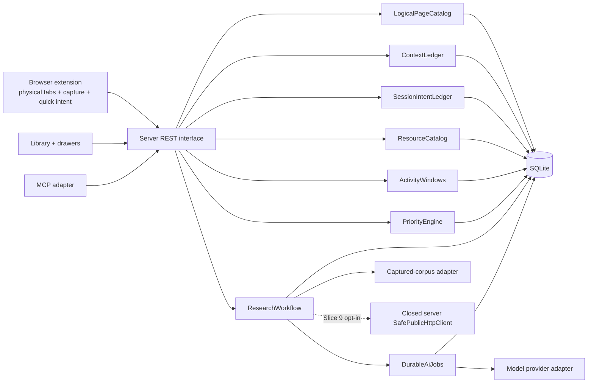

# Персональный слой внимания: подробный план реализации

- Статус: proposed
- Дата фиксации: 2026-08-12
- Исходная схема данных: 17
- Область: Library, browser extension, server, shared contracts, MCP, локальная SQLite
- Goal-mode исполнение: [personal-attention-layer-goal-runbook.md](personal-attention-layer-goal-runbook.md)

## 1. Цель

Добавить в TabHub персональный слой смысла и внимания поверх уже существующей Library. Он должен отвечать на четыре разных вопроса:

1. **Контекст:** зачем эта страница сохранена или вкладка открыта именно сейчас?
2. **Ресурс:** на какой платформе или типе ресурса находится страница?
3. **Исследование:** что агент выяснил о странице, подборке или ресурсе и на каких данных основан вывод?
4. **Приоритет:** как важность оценивает пользователь, как её оценивает агент и почему рекомендации расходятся?

Это не четыре независимых экрана. Целевой продуктовый результат — более информативная Library, в которой пользователь может быстро понять смысл страницы, сгруппировать коллекцию по ресурсу, поручить ограниченное исследование и получить объяснимую сортировку большой коллекции.

## 2. Результат для пользователя

После завершения плана пользователь сможет:

- записать одной фразой, зачем нужна страница, непосредственно в Drawer или popup расширения;
- при необходимости указать отдельный временный смысл конкретной физической вкладки;
- открыть в Library facet `Resources`, например YouTube, и совместить его с Topic, Browser, Status и Priority;
- увидеть по ресурсу число уникальных страниц, открытые копии, активность, покрытие контентом и состояние исследования;
- запустить исследование только после прозрачного preflight с охватом, приватностью и бюджетом;
- получить долговечный dossier с источниками, ограничениями, неизвестными и следующими шагами;
- хранить свою оценку отдельно от оценки агента;
- сортировать по `My importance`, `AI priority` или `Recommended`, не теряя происхождение и объяснение оценки;
- применять персональные правила ко всей коллекции в shadow mode до того, как они начнут влиять на порядок страниц.

### 2.1 Трассировка исходных идей

План считается полным только тогда, когда каждая исходная идея проходит всю цепочку `смысл → domain/data → UX → REST/MCP → slice → tests → observable outcome`.

| Исходная идея | Domain/data | Пользовательский путь | Transport/agent | Реализация | Доказательство результата |
|---|---|---|---|---|---|
| Контекст страницы и вкладки | `LogicalPageCatalog`, `ContextLedger`, `SessionIntentLedger`, page context, exact-tab intent, reviews и disposition | Drawer + popup; page/instance scope; accept/reject; `Not useful`; promote | Local/shareable REST projections; MCP read/write без `local_only` | Slices 1–2 | Journey J1; reload persistence, navigation-race, privacy-negative и provenance tests |
| Внимание по ресурсам | `ResourceCatalog`, aliases/override/merge/split, resource context, daily activity, user preference/AI outcome | `Topics \| Resources`, combined filters, header, activity windows и evaluation | Resource/context/activity REST; MCP list/get/context/activity/evaluation | Slices 3–4 | Journey J2; cross-browser dedup, Topic preservation, coverage epoch и resolver tests |
| Исследование находки | `ResearchWorkflow`, durable jobs, versioned corpus/evidence/report, immutable per-run consent | `Research this resource` из page/resource; preflight; progress; evidence; next action; refine | Async REST/MCP job/report lifecycle и closed server-only safe acquisition | Slices 7–9 | Journey J3; coverage arithmetic, evidence integrity, privacy/budget/cancel/restart tests |
| Личная + AI важность | User preference, rules, page/resource `PriorityOutcome`, versioned feedback, total ordering | Single/bulk manual rating; shadow explanation; rules preview; My/AI/Recommended | Priority/rules/jobs REST; MCP explain/feedback/on-behalf write | Slices 5–6 | Journey J4; full-corpus assessment XOR exclusion, pagination, user dominance и zero destructive-action tests |

Если новый implementation packet нельзя связать хотя бы с одной строкой этой таблицы или с обязательным cross-cutting invariant, он находится вне scope текущей инициативы.

## 3. Проверенная исходная точка

План опирается на текущую реализацию и read-only снимок `data/tabhub.sqlite` со schema 17. Counts ниже — исторический planning snapshot; при старте Goal mode G0 создаёт новый timestamped baseline manifest, и все migration assertions сравниваются с ним.

| Область | Что уже есть | Проверенное ограничение |
|---|---|---|
| Canonical pages | `tabs`, уникальность `(url_normalized, browser)` | Одинаковая страница в разных браузерах остаётся несколькими browser-scoped строками |
| Physical tabs | `tab_instances`, `browser_session_id`, точная активация и закрытие | Строка instance эфемерна; её `id` нельзя использовать как долговечную опору контекста |
| Масштаб | 1 509 canonical rows, 1 021 помечена открытой, 343 hostname | Ручной разбор каждой строки практически нереалистичен |
| Content | Захваченный текст у 22 страниц | Полный LLM-ranking по содержимому сейчас невозможен; отсутствие content не равно низкой ценности |
| Summary | `short/deep`, durable queue, retry, budget, stale-result protection | Summary нет ни у одной страницы; `deep` исследует только текст одной страницы |
| Importance | Одно поле `importance` со значениями `0..3`; текущий UI подписывает `0` как `Unrated`, `1` как `Low` | Все 1 509 строк имеют sentinel `0`; nullable semantics и provenance отсутствуют |
| Topics | Иерархические tags, `assigned_by=user\|agent` | Root topic `YouTube` содержит 202 страницы, тогда как `youtube.com` — 323; Topic и Resource семантически различны |
| Activity | Session-scoped physical totals и cumulative page totals | Исторических daily buckets нет; честно вычислить прошлые окна 7/30 дней нельзя |
| Knowledge | Custom fields, semantic relations, content embeddings | В live DB: 0 custom fields, 0 relations, 0 embeddings; контекст и reports не индексируются |
| UX | Library — основной workspace, Graph — альтернативное представление | Добавление новых top-level экранов вернёт раздробленную модель работы |
| MCP | Тонкий REST adapter для tabs/search/summary/tags/links/retention | `set_importance` перезаписывает общий scalar; long-running research не укладывается в текущий polling summary |

Ключевые существующие файлы:

- `packages/server/migrations/001_initial.sql`
- `packages/server/migrations/006_tab_instances.sql`
- `packages/server/migrations/007_browser_session_identity.sql`
- `packages/server/migrations/014_tab_activity.sql`
- `packages/server/migrations/015_tab_page_activity.sql`
- `packages/server/migrations/017_page_retention.sql`
- `packages/server/src/tab-instance-catalog.ts`
- `packages/server/src/activity-catalog.ts`
- `packages/server/src/summary-catalog.ts`
- `packages/server/src/summary-worker.ts`
- `packages/server/src/summary-provider.ts`
- `packages/server/src/retention-catalog.ts`
- `packages/server/src/embedding-catalog.ts`
- `packages/web/src/App.tsx`
- `packages/web/src/TabDrawer.tsx`
- `packages/web/src/TopicSidebar.tsx`
- `packages/web/src/GraphView.tsx`
- `packages/mcp/src/server.ts`
- `docs/decisions.md`

Перед началом реализации эти факты нужно повторно проверить: номера миграций и рабочая схема могут измениться.

## 4. Канонические термины

| Термин | Значение | Не смешивать с |
|---|---|---|
| Browser page | Текущая строка `tabs`, принадлежащая конкретному браузеру | Логическая страница между браузерами |
| Logical page | Browser-independent представление одной нормализованной страницы | Физическая вкладка |
| Physical tab | Конкретная открытая вкладка в конкретной browser session | Долговечная запись страницы |
| Page context | Долговечное объяснение «зачем мне эта страница» | Захваченный текст страницы |
| Session intent | Временное объяснение «зачем эта физическая вкладка открыта сейчас» | Page context |
| Topic | Пользовательская классификация «о чём это» | Resource |
| Resource | Платформа/источник «где это находится» | Topic или exact hostname |
| Summary | Производный текст по одной захваченной странице | Research report |
| Research run | Версионированный процесс изучения page/resource/selection | Одиночный summary request |
| Research report | Долговечный результат run с coverage и evidence | Пользовательская заметка |
| User importance | Явная субъективная оценка пользователя | AI score |
| AI assessment | Версионированная оценка агента с confidence и reasons | Истина или user importance |
| Recommended priority | Производный порядок из user importance, rules и AI assessment | Сохраняемая ручная оценка |
| Retention suggestion | Объяснимая рекомендация keep/defer/trash | Priority и тем более автоматическое удаление |

## 5. Неподвижные инварианты

1. Library остаётся главным workspace; Graph остаётся альтернативной визуализацией.
2. Существующее разделение browser page и physical tab сохраняется.
3. Logical page добавляется как knowledge-layer identity; текущие `tabs` не удаляются и не сливаются.
4. User importance и пользовательский context никогда не перезаписываются AI assessment.
5. Отсутствие захваченного контента снижает confidence, но не score.
6. Activity — сигнал внимания, а не доказательство ценности.
7. Retention остаётся fail-closed: AI может упорядочить предложения, но не удалять страницы.
8. Topic и Resource — ортогональные facets. Существующий topic `YouTube` не удаляется и не переписывается.
9. Все AI-derived данные имеют provenance, input fingerprint, версию policy/prompt и stale marker.
10. `local_only` context доступен только local first-party web/extension UI: он исключён из MCP resources/tools, AI-facing REST projections, provider prompts, telemetry и diagnostics.
11. Исследование не притворяется полным: coverage, пропущенные источники и partial failures всегда видимы.
12. MCP остаётся тонким adapter; доменные правила живут на server.
13. Весь новый UI одновременно поддерживает EN/RU, включая popup расширения.
14. На первых slices строка Library остаётся существующей browser page; logical data присоединяется к ней проекцией. Автоматическое схлопывание browser duplicates в одну строку не входит в эту инициативу.

## 6. Целевая архитектура



Каждый доменный модуль должен быть глубоким: маленький интерфейс скрывает schema details, пересчёты, versioning, stale detection и provenance. React и MCP не должны повторять URL resolution, scoring или job orchestration.

### 6.1 Предлагаемые интерфейсы модулей

Псевдокод задаёт ожидаемую форму, а не окончательные имена типов.

```ts
interface LogicalPageCatalog {
  resolve(input: BrowserPageRef): LogicalPageRef;
  get(id: LogicalPageId): LogicalPageView;
}

interface ContextLedger {
  readLocal(subject: ContextSubject): ContextBundle;
  readShareable(subject: ContextSubject): ShareableContextBundle;
  change(command: ContextCommand): ContextChangeResult;
}

interface SessionIntentLedger {
  readLocal(scope: ExactTabScope): SessionIntentBundle;
  readShareable(scope: ExactTabScope): ShareableSessionIntentBundle;
  listLocal(query: SessionIntentQuery): SessionIntentPage;
  change(command: SessionIntentCommand): SessionIntentChangeResult;
}

interface ResourceCatalog {
  list(query: ResourceQuery): ResourcePage;
  get(id: ResourceId): ResourceDetail;
  change(command: ResourceCommand): ResourceChangeResult;
}

interface ActivityWindows {
  getPage(id: LogicalPageId, window: ActivityWindow): ActivityRollup;
  getResource(id: ResourceId, window: ActivityWindow): ActivityRollup;
}

type PriorityOutcome =
  | { kind: 'assessment'; assessment: PriorityAssessment }
  | { kind: 'exclusion'; exclusion: PriorityExclusion };

interface PriorityEngine {
  assess(subjects: PrioritySubject[], ruleset: RulesetRef): PriorityOutcome[];
  explain(subject: PrioritySubject): PriorityExplanation;
  recordFeedback(input: PriorityFeedback): void;
}

interface DurableAiJobs {
  submit(task: AiTaskSpec): JobRef;
  get(id: JobId): JobView;
  cancel(id: JobId): JobView;
}

interface ResearchWorkflow {
  preflight(input: ResearchRequest): ResearchPreflight;
  request(input: ApprovedResearchRequest): JobRef;
  getReport(id: ResearchReportId): ResearchReport;
  listReports(target: ResearchTarget): ResearchReportSummary[];
}
```

`ContextCommand` — закрытый union `append`, `withdraw`, `restore`, `review`; каждая команда несёт typed page/resource `ContextSubject`, поэтому одинаковые числовые IDs двух context tables не могут смешаться. `SessionIntentCommand` — закрытый union `set`, `archive`, `promote`, `expire_due`; lifecycle, idempotency и проверка exact URL/revision не живут в REST или React. `ResourceCommand` — закрытый discriminated union для `create`, `set_aliases`, `apply_override`, `merge`, `split`, `rename` и `set_user_evaluation`; `set_aliases` передаёт полный desired normalized alias set и optimistic `expectedRulesetVersion`, а resource context намеренно проходит через `ContextLedger`, а не расширяет catalog command. Каждая ResourceCommand несёт idempotency key; append-only receipt хранит normalized request fingerprint и позволяет exact replay либо возвращает `IDEMPOTENCY_KEY_CONFLICT`. `PriorityOutcome = PriorityAssessment | PriorityExclusion` и всегда содержит subject, ruleset/version, feature fingerprint и timestamp. `ResearchRequest` может содержать `parentReportId`, поэтому refine/rerun не требует отдельного shallow module.

Внешний seam каждого модуля является также основной test surface. `readLocal` доступен только first-party web/extension handler с отдельной local-UI capability, `readShareable` — единственный метод, который разрешено использовать MCP/AI projections. Это разные trusted server entrypoints, а не клиентский audience query parameter; CORS/Origin сами по себе не считаются защитой. Web capability выдаётся как opaque HttpOnly same-origin server session. Текущая relay registration не является pairing: extension получает per-installation bearer только после short-lived одноразового challenge, явно инициированного пользователем в web и подтверждённого кодом в popup. Server хранит только credential/code hashes, привязывает credential к installation и extension origin, поддерживает rotation/revoke и возвращает generic fail-closed error. Capability не пишется в URL/log и никогда не передаётся MCP adapter. Внутренние adapters нужны только там, где уже существуют реальные варианты: production/fake model provider и captured-corpus/closed server-safe acquisition workflows внутри одного composite Resource adapter.

## 7. Общая модель provenance и evidence

Все новые записи, созданные человеком, правилом или моделью, используют одинаковую семантику:

```ts
type Provenance = {
  actor: "user" | "agent" | "system";
  method: "manual" | "on_behalf_of_user" | "rule" | "model" | "derived";
  model?: {
    provider: string;
    name: string;
    promptVersion: string;
  };
  rulesetVersion?: number;
  createdAt: string;
  sourceFingerprint: string;
};

type EvidenceRef = {
  kind:
    | "tab_content"
    | "user_context"
    | "activity"
    | "relation"
    | "research_claim";
  subjectId: string;
  revision?: number;
  locator?: string;
  excerptHash?: string;
};
```

Правила:

- score и confidence — всегда разные поля;
- ручное утверждение пользователя не получает искусственную probabilistic confidence;
- AI hypothesis можно принять, отклонить или заменить пользовательской записью;
- immutable assessment/report не редактируется задним числом: новый run создаёт новую версию;
- explanation содержит positive/negative contributions, missing signals и stale state;
- в логах сохраняются идентификаторы и метрики, но не полный private context или corpus.

## 8. Модель данных и последовательность миграций

Номера ниже предполагают, что следующая миграция после начала работы остаётся `018`. Если schema head изменится, номера нужно сдвинуть, сохранив порядок зависимостей.

### 8.1 Migration 018 — logical identity и совместимая user importance

Добавить:

```sql
CREATE TABLE logical_pages (
  id INTEGER PRIMARY KEY,
  identity_key TEXT NOT NULL UNIQUE,
  url_normalized TEXT NOT NULL,
  representative_url TEXT NOT NULL,
  created_at TEXT NOT NULL,
  updated_at TEXT NOT NULL
);

ALTER TABLE tabs ADD COLUMN logical_page_id INTEGER
  REFERENCES logical_pages(id);

CREATE UNIQUE INDEX tabs_id_logical_page_idx
ON tabs(id, logical_page_id);

CREATE TABLE logical_page_preferences (
  logical_page_id INTEGER PRIMARY KEY REFERENCES logical_pages(id) ON DELETE CASCADE,
  user_importance INTEGER CHECK (user_importance BETWEEN 1 AND 3),
  recorded_by TEXT CHECK (recorded_by IN ('user', 'agent')),
  record_method TEXT CHECK (
    record_method IN ('manual', 'on_behalf_of_user')
  ),
  importance_updated_at TEXT,
  updated_at TEXT NOT NULL,
  CHECK (
    (
      user_importance IS NULL
      AND recorded_by IS NULL
      AND record_method IS NULL
      AND importance_updated_at IS NULL
    )
    OR (user_importance IS NOT NULL AND recorded_by = 'user' AND record_method = 'manual')
    OR (user_importance IS NOT NULL AND recorded_by = 'agent' AND record_method = 'on_behalf_of_user')
  )
);

CREATE TABLE logical_page_importance_migration_audit (
  logical_page_id INTEGER PRIMARY KEY REFERENCES logical_pages(id) ON DELETE CASCADE,
  legacy_values_json TEXT NOT NULL,
  suggested_value INTEGER CHECK (suggested_value BETWEEN 1 AND 3),
  resolution_state TEXT NOT NULL CHECK (resolution_state IN ('legacy_unknown', 'conflict', 'confirmed')),
  created_at TEXT NOT NULL,
  reviewed_at TEXT
);
```

Backfill:

1. Сгруппировать browser pages по текущему `url_normalized`, не меняя существующий normalizer.
2. На первом этапе сохранять fragment, потому что текущая нормализация его сохраняет и агрессивное склеивание может объединить семантически разные документы.
3. Создать одну logical page на distinct normalized URL.
4. Обновить все tab creation/upsert paths (`tab-catalog`, `tab-instance-catalog`, activity materialization) так, чтобы logical page resolve/create и запись `tabs.logical_page_id` выполнялись атомарно в той же transaction.
5. Не переносить legacy `importance=1..3` непосредственно в user importance: старый MCP agent мог писать то же scalar, а provenance отсутствует. Сохранить одинаковое non-zero значение как `suggested_value` с `resolution_state=legacy_unknown` и предложить пользователю подтвердить его; до подтверждения `user_importance=NULL`.
6. Интерпретировать legacy `importance=0` как `NULL / unrated`. Это соответствует текущему UI contract (`0 - Unrated`); migration audit всё равно сохраняет исходное значение.
7. При конфликте browser copies оставить logical user importance и suggested value пустыми, сохранить все legacy values и записать `resolution_state=conflict` для review; не выбирать победителя молча.
8. На один compatibility release новые writes выполняются одной transaction: обновить logical preference и распространить то же значение на все `tabs` с данным `logical_page_id`. После перевода Library, Graph, filters, MCP и retention на новый reader dual-write удаляется отдельным cleanup commit.
9. `tabs.logical_page_id` физически остаётся nullable: текущий migration runner держит `foreign_keys=ON` и не поддерживает безопасное отключение FK вне migration transaction, поэтому parent-table rebuild опасен для child rows. После backfill установить `BEFORE INSERT/UPDATE` triggers, отклоняющие `NULL`, а каталог проверяет invariant. Настоящий `NOT NULL` допустим только после отдельного улучшения migration runner и полной child-table preservation проверки; это не входит в migrations 018–025.

`user_importance` семантически всегда является подтверждённым пользовательским суждением. `recorded_by=agent` допустим только вместе с `record_method=on_behalf_of_user` после явного поручения; model/rule/system-derived и непроверенные legacy значения туда не записываются.

Compatibility contract для legacy importance:

1. Server определяет actor/method по доверенному transport channel; клиент не может прислать их произвольно.
2. First-party legacy UI пишет `user/manual`; deprecated MCP `set_importance` пишет только `agent/on_behalf_of_user` и только по явному поручению пользователя, никогда `user/manual` и никогда AI assessment.
3. Входные tab IDs сначала дедуплицируются в logical-page IDs. Одна transaction обновляет canonical `logical_page_preferences` и на compatibility release проецирует значение во все `tabs` этого logical page; adapter не выполняет две независимые записи.
4. Значение `0` очищает canonical preference и legacy projection. Duplicate browser copies дают одну logical mutation и один audit event.
5. После Slice 6 dual-write удаляется только когда Library, Graph, filters, retention и MCP читают canonical preference; legacy MCP остаётся deprecated alias до отдельного breaking removal.

Rollback:

- до включения enforcement triggers достаточно перестать читать новые таблицы; после включения rollback сначала удаляет только эти triggers;
- backup live DB обязателен;
- миграционный тест должен работать на fresh copy актуальной базы, записывать её исходный count/hash и доказывать неизменность числа `tabs` и всех child datasets.
- тест обязан ingest’ить ранее неизвестный URL после migration и проверять, что browser page и logical page создаются атомарно.

Projection и lifecycle semantics:

| Данные/действие | Scope после migration 018 |
|---|---|
| Library row | Существующая browser page (`tabs`); logical fields присоединяются к ней |
| Title/URL | Остаются browser-scoped; logical representative выбирается детерминированно из самой свежей copy |
| Open/activate/close | Только exact physical instance; logical id никогда не используется как команда браузеру |
| Status/retention | Остаются browser-scoped до отдельного продуктового решения |
| Topics | Существующие assignments не переписываются; Library row показывает свои assignments, а logical detail может показать union с источником каждой browser copy |
| Personal context/user importance | Logical page, одинаково видимы на всех browser copies |
| Content/summary | Сохраняются на точной browser page и content revision |
| Research source | Ссылается на exact `tab_id`, `content_revision` и digest; одинаковый corpus deduplicates по digest |
| Resource/activity/AI assessment | Logical page; Library повторяет их на browser rows с одинаковым logical id |

Удаление или trash одной browser page не удаляет logical page, если остаётся другая copy либо knowledge-layer data. `Forget logical page` очищает knowledge-layer данные, но сохраняет identity row, пока на неё ссылается хотя бы одна browser page. Удалить саму identity row может только безопасный garbage collector после проверки отсутствия browser rows и knowledge references. Закрытие physical tab вообще не влияет на logical lifecycle.

### 8.2 Migration 019 — ContextLedger

Добавить долговечные entries:

```sql
CREATE TABLE context_entries (
  id INTEGER PRIMARY KEY,
  logical_page_id INTEGER NOT NULL REFERENCES logical_pages(id) ON DELETE CASCADE,
  kind TEXT NOT NULL CHECK (
    kind IN ('purpose', 'interest', 'question', 'project', 'next_action', 'disposition', 'note')
  ),
  body TEXT NOT NULL,
  actor TEXT NOT NULL CHECK (actor IN ('user', 'agent', 'system')),
  method TEXT NOT NULL CHECK (
    method IN ('manual', 'on_behalf_of_user', 'rule', 'model', 'derived')
  ),
  visibility TEXT NOT NULL CHECK (visibility IN ('local_only', 'share_with_ai')),
  confidence REAL CHECK (confidence IS NULL OR confidence BETWEEN 0 AND 1),
  source_fingerprint TEXT,
  model_provenance_json TEXT,
  stale_at TEXT,
  supersedes_id INTEGER REFERENCES context_entries(id),
  state TEXT NOT NULL DEFAULT 'active' CHECK (state IN ('active', 'withdrawn')),
  revision INTEGER NOT NULL,
  created_at TEXT NOT NULL,
  withdrawn_at TEXT,
  CHECK (supersedes_id IS NULL OR supersedes_id <> id),
  CHECK (
    method NOT IN ('rule', 'model', 'derived')
    OR source_fingerprint IS NOT NULL
  ),
  CHECK (method <> 'model' OR model_provenance_json IS NOT NULL),
  CHECK (
    (actor = 'user' AND method = 'manual')
    OR (actor = 'agent' AND method IN ('on_behalf_of_user', 'rule', 'model'))
    OR (actor = 'system' AND method = 'derived')
  ),
  UNIQUE (logical_page_id, revision),
  UNIQUE (id, logical_page_id)
);

CREATE TABLE context_entry_reviews (
  id INTEGER PRIMARY KEY,
  context_entry_id INTEGER NOT NULL REFERENCES context_entries(id) ON DELETE CASCADE,
  verdict TEXT NOT NULL CHECK (verdict IN ('accepted', 'rejected')),
  reviewed_by TEXT NOT NULL CHECK (reviewed_by IN ('user', 'agent')),
  review_method TEXT NOT NULL CHECK (review_method IN ('manual', 'on_behalf_of_user')),
  idempotency_key TEXT NOT NULL UNIQUE,
  supersedes_id INTEGER REFERENCES context_entry_reviews(id),
  created_at TEXT NOT NULL,
  CHECK (
    (reviewed_by = 'user' AND review_method = 'manual')
    OR (reviewed_by = 'agent' AND review_method = 'on_behalf_of_user')
  ),
  CHECK (supersedes_id IS NULL OR supersedes_id <> id)
);

CREATE TABLE tab_session_intents (
  id INTEGER PRIMARY KEY,
  installation_id TEXT NOT NULL,
  browser_session_id TEXT NOT NULL,
  browser_tab_id INTEGER NOT NULL,
  logical_page_id INTEGER NOT NULL REFERENCES logical_pages(id) ON DELETE CASCADE,
  body TEXT NOT NULL,
  actor TEXT NOT NULL CHECK (actor IN ('user', 'agent')),
  method TEXT NOT NULL CHECK (method IN ('manual', 'on_behalf_of_user', 'model')),
  visibility TEXT NOT NULL CHECK (visibility IN ('local_only', 'share_with_ai')),
  source_fingerprint TEXT,
  model_provenance_json TEXT,
  stale_at TEXT,
  state TEXT NOT NULL CHECK (state IN ('active', 'archived', 'promoted', 'expired')),
  idempotency_key TEXT NOT NULL UNIQUE,
  archived_at TEXT,
  expires_at TEXT,
  promoted_context_entry_id INTEGER,
  created_at TEXT NOT NULL,
  updated_at TEXT NOT NULL,
  CHECK (method <> 'model' OR (source_fingerprint IS NOT NULL AND model_provenance_json IS NOT NULL)),
  CHECK (
    (actor = 'user' AND method = 'manual')
    OR (actor = 'agent' AND method IN ('on_behalf_of_user', 'model'))
  ),
  FOREIGN KEY (promoted_context_entry_id, logical_page_id)
    REFERENCES context_entries(id, logical_page_id) ON DELETE RESTRICT
);

CREATE UNIQUE INDEX tab_session_active_intent_idx
ON tab_session_intents(installation_id, browser_session_id, browser_tab_id)
WHERE state = 'active';
```

Та же migration 019 создаёт минимальный capability ledger для `local_only` boundary:

- `local_installation_capabilities`: installation id, extension origin, hash 256-bit bearer, credential version, created/rotated/revoked/last-used timestamps;
- `local_pairing_challenges`: opaque challenge id, installation id, salted code hash, пяти-минутный expiry, consumed timestamp и bounded attempt count;
- code и bearer выдаются plaintext только один раз, не попадают в URL, logs, validation errors, telemetry или MCP;
- consume/rotation/revoke выполняются атомарно; старый bearer сразу перестаёт работать;
- relay scope, `Host`, `Origin`, CORS и loopback address без capability не дают local read/write;
- гарантия ограничена remote web, DNS rebinding, произвольным extension Origin и случайным local-agent доступом; malware и другой процесс с полномочиями того же OS user находятся вне threat model.

Migration 019 создаёт context только для logical page. Resource context добавляется после появления `resources` в migration 020; `ContextLedger` скрывает две физические таблицы за одним интерфейсом. Не использовать polymorphic id без внешнего ключа.

Review не меняет `actor` исходной agent hypothesis и не превращает её в user-authored text. `ContextLedger.review` создаёт append-only verdict; повтор с тем же idempotency key возвращает прежний result, а новая смена решения supersede прошлый review. Priority/research учитывают только current review state.

Поиск:

- отдельная FTS-таблица для context body;
- context не добавляется в `contents.text`;
- `content_revision` и `context_revision` fingerprint’ятся независимо;
- `local_only` участвует только в first-party UI search; MCP/AI search использует отдельную projection и не раскрывает даже совпадение по private text.

Lifecycle session intent:

- ключ — `(installation_id, browser_session_id, browser_tab_id)`, а не `tab_instances.id`;
- popup и Drawer после reload получают intent только через `SessionIntentLedger.readLocal(exactScope)`; list/history route не сканирует React state или `tabs` напрямую;
- `readShareable` применяет ту же non-enumerating projection, что page context: `local_only` intent не раскрывает ни body, ни hidden count, ни факт существования;
- после исчезновения вкладки intent архивируется с `archived_at` и неизменяемым `expires_at`;
- пользователь может явно promote его в page context;
- promote в одной transaction создаёт context entry и записывает `promoted_context_entry_id`; повтор с тем же idempotency key возвращает прежний результат;
- рекомендуемый default: хранить archived intent 30 дней, затем переводить в `expired` и физически purge отдельной maintenance job; promoted intent хранится как provenance link, пока жив context entry.

### 8.3 Migration 020 — ResourceCatalog

Добавить:

```sql
CREATE TABLE resources (
  id INTEGER PRIMARY KEY,
  resource_key TEXT NOT NULL UNIQUE,
  name TEXT NOT NULL,
  kind TEXT NOT NULL,
  created_by TEXT NOT NULL CHECK (created_by IN ('system', 'user', 'agent')),
  created_at TEXT NOT NULL,
  updated_at TEXT NOT NULL
);

CREATE TABLE resource_preferences (
  resource_id INTEGER PRIMARY KEY REFERENCES resources(id) ON DELETE CASCADE,
  user_evaluation INTEGER CHECK (user_evaluation BETWEEN 1 AND 3),
  recorded_by TEXT CHECK (recorded_by IN ('user', 'agent')),
  record_method TEXT CHECK (record_method IN ('manual', 'on_behalf_of_user')),
  updated_at TEXT NOT NULL,
  CHECK (
    (user_evaluation IS NULL AND recorded_by IS NULL AND record_method IS NULL)
    OR (user_evaluation IS NOT NULL AND recorded_by = 'user' AND record_method = 'manual')
    OR (user_evaluation IS NOT NULL AND recorded_by = 'agent' AND record_method = 'on_behalf_of_user')
  )
);

CREATE TABLE resource_match_rules (
  id INTEGER PRIMARY KEY,
  rule_key TEXT NOT NULL,
  version INTEGER NOT NULL,
  resource_id INTEGER NOT NULL REFERENCES resources(id) ON DELETE CASCADE,
  host_pattern TEXT NOT NULL,
  path_prefix TEXT NOT NULL DEFAULT '',
  priority INTEGER NOT NULL DEFAULT 0,
  ruleset_version INTEGER NOT NULL,
  enabled INTEGER NOT NULL DEFAULT 1 CHECK (enabled IN (0, 1)),
  supersedes_id INTEGER REFERENCES resource_match_rules(id),
  created_at TEXT NOT NULL,
  retired_at TEXT,
  CHECK (supersedes_id IS NULL OR supersedes_id <> id),
  UNIQUE (rule_key, version),
  UNIQUE (id, resource_id)
);

CREATE UNIQUE INDEX resource_match_rules_current_pattern_idx
ON resource_match_rules(host_pattern, path_prefix)
WHERE retired_at IS NULL;

CREATE TABLE logical_page_resources (
  id INTEGER PRIMARY KEY,
  logical_page_id INTEGER NOT NULL REFERENCES logical_pages(id) ON DELETE CASCADE,
  resource_id INTEGER NOT NULL REFERENCES resources(id) ON DELETE CASCADE,
  assigned_by TEXT NOT NULL CHECK (assigned_by IN ('system', 'user', 'agent')),
  assignment_method TEXT NOT NULL CHECK (assignment_method IN ('manual', 'rule', 'model')),
  confidence REAL CHECK (confidence IS NULL OR confidence BETWEEN 0 AND 1),
  source_fingerprint TEXT,
  model_provenance_json TEXT,
  stale_at TEXT,
  rule_id INTEGER,
  is_primary INTEGER NOT NULL DEFAULT 1 CHECK (is_primary IN (0, 1)),
  assigned_at TEXT NOT NULL,
  superseded_at TEXT,
  FOREIGN KEY (rule_id, resource_id)
    REFERENCES resource_match_rules(id, resource_id),
  CHECK (
    (assigned_by = 'user' AND assignment_method = 'manual')
    OR (assigned_by = 'system' AND assignment_method = 'rule')
    OR (assigned_by = 'agent' AND assignment_method IN ('rule', 'model'))
  ),
  CHECK (
    assignment_method <> 'model'
    OR (source_fingerprint IS NOT NULL AND model_provenance_json IS NOT NULL)
  ),
  CHECK (assignment_method <> 'rule' OR source_fingerprint IS NOT NULL)
);

CREATE UNIQUE INDEX logical_page_primary_resource_idx
ON logical_page_resources(logical_page_id)
WHERE is_primary = 1 AND superseded_at IS NULL;

CREATE UNIQUE INDEX logical_page_current_resource_membership_idx
ON logical_page_resources(logical_page_id, resource_id)
WHERE superseded_at IS NULL;

CREATE TABLE resource_context_entries (
  id INTEGER PRIMARY KEY,
  resource_id INTEGER NOT NULL REFERENCES resources(id) ON DELETE CASCADE,
  kind TEXT NOT NULL CHECK (
    kind IN ('purpose', 'interest', 'question', 'project', 'next_action', 'disposition', 'note')
  ),
  body TEXT NOT NULL,
  actor TEXT NOT NULL CHECK (actor IN ('user', 'agent', 'system')),
  method TEXT NOT NULL CHECK (
    method IN ('manual', 'on_behalf_of_user', 'rule', 'model', 'derived')
  ),
  visibility TEXT NOT NULL CHECK (visibility IN ('local_only', 'share_with_ai')),
  confidence REAL CHECK (confidence IS NULL OR confidence BETWEEN 0 AND 1),
  source_fingerprint TEXT,
  model_provenance_json TEXT,
  stale_at TEXT,
  supersedes_id INTEGER REFERENCES resource_context_entries(id),
  state TEXT NOT NULL DEFAULT 'active' CHECK (state IN ('active', 'withdrawn')),
  revision INTEGER NOT NULL,
  created_at TEXT NOT NULL,
  withdrawn_at TEXT,
  CHECK (supersedes_id IS NULL OR supersedes_id <> id),
  CHECK (
    method NOT IN ('rule', 'model', 'derived')
    OR source_fingerprint IS NOT NULL
  ),
  CHECK (method <> 'model' OR model_provenance_json IS NOT NULL),
  CHECK (
    (actor = 'user' AND method = 'manual')
    OR (actor = 'agent' AND method IN ('on_behalf_of_user', 'rule', 'model'))
    OR (actor = 'system' AND method = 'derived')
  ),
  UNIQUE (resource_id, revision),
  UNIQUE (id, resource_id)
);

CREATE TABLE resource_context_entry_reviews (
  id INTEGER PRIMARY KEY,
  context_entry_id INTEGER NOT NULL,
  resource_id INTEGER NOT NULL REFERENCES resources(id) ON DELETE CASCADE,
  verdict TEXT NOT NULL CHECK (verdict IN ('accepted', 'rejected')),
  reviewed_by TEXT NOT NULL CHECK (reviewed_by IN ('user', 'agent')),
  review_method TEXT NOT NULL CHECK (review_method IN ('manual', 'on_behalf_of_user')),
  idempotency_key TEXT NOT NULL UNIQUE,
  supersedes_id INTEGER REFERENCES resource_context_entry_reviews(id),
  created_at TEXT NOT NULL,
  FOREIGN KEY (context_entry_id, resource_id)
    REFERENCES resource_context_entries(id, resource_id),
  CHECK (
    (reviewed_by = 'user' AND review_method = 'manual')
    OR (reviewed_by = 'agent' AND review_method = 'on_behalf_of_user')
  ),
  CHECK (supersedes_id IS NULL OR supersedes_id <> id)
);
```

Resolver behavior:

1. Default grouping использует registrable domain, а не наивный последний pair labels.
2. Rules append-only и имеют stable `rule_key`, version и global ruleset version. Изменение target/pattern/priority/enabled вставляет successor с тем же `rule_key`, а отдельная `resource_match_rule_heads` projection атомарно указывает новую current row; catalog проверяет `supersedes_id` того же key, `version+1` и отсутствие второго current pattern. `retired_at` на исторической строке не обновляется. Assign/remove и matched/overridden/unmatched/ambiguous/excluded также являются immutable events с отдельными head tables, поэтому historical assignment/resolution semantics восстанавливаются после merge/split/restart.
3. Seed aliases для YouTube включают как минимум `youtube.com` и `youtu.be`; `www` не создаёт новый Resource.
4. User override всегда сильнее system rule.
5. Resolver backfill никогда не supersede current `assigned_by='user' AND assignment_method='manual'`; user override хранится как append-only current assignment, поэтому повторный backfill безопасен.
6. Merge/split supersede старое назначение и создаёт новое в одной transaction; история assignments является audit trail и не переписывает Topic.
7. Поздние adapters вроде YouTube channel или GitHub repo добавляются только после реальных UX-сценариев.
8. `ResourceCatalog.list({ resolution: 'unmatched_or_ambiguous' })` возвращает явную review queue; resolver не принуждает слабое совпадение.
9. User resource evaluation хранится только в `resource_preferences`; AI оценка ресурса не использует это поле как write target.
10. Resolver классифицирует public web, authenticated web, localhost/private origin, browser-internal, extension и file/data URLs отдельно. Local/private/internal resources никогда автоматически не становятся external-research targets; exact exclusion reason видим в review queue.
11. Resolver precedence детерминирован: current user/manual assignment, затем agent/on-behalf assignment, explicit user/on-behalf alias rule, system seed rule и только затем registrable-domain derived rule. Внутри класса сравниваются priority, exact host перед suffix, longest path-prefix и longest host. Равные authoritative matches разных resources возвращают `ambiguous`; row ID не является semantic tie-break.
12. Access class `authenticated`/`sensitive` создаётся только explicit rule/resource command. URL-only weak evidence не угадывает public target и остаётся unmatched/ambiguous; embedded credentials, localhost/private IP и internal schemes получают typed exclusion.
13. `resource_command_receipts` append-only хранит idempotency key, kind и normalized request fingerprint. Exact replay возвращает исходный receipt/timestamps; повтор ключа с другим payload даёт `IDEMPOTENCY_KEY_CONFLICT`. Merge сохраняет source identity со current lifecycle `merged`; split переносит только явно выбранные page memberships и оставляет source active.

Для обеих context tables `ContextLedger.append` внутри transaction проверяет, что `supersedes_id` относится к тому же subject, имеет меньшую revision и ещё не superseded другой записью. `ContextLedger.review` применяет те же append-only/idempotency rules к page и resource reviews. Cross-subject supersession и cycles отклоняются domain error; одной self-reference CHECK для этого недостаточно.

### 8.4 Migration 021 — daily activity buckets

Добавить daily UTC buckets на logical page:

```sql
CREATE TABLE logical_page_activity_daily (
  logical_page_id INTEGER NOT NULL REFERENCES logical_pages(id) ON DELETE CASCADE,
  activity_date TEXT NOT NULL,
  foreground_ms INTEGER NOT NULL CHECK (foreground_ms >= 0),
  engaged_ms INTEGER NOT NULL CHECK (engaged_ms >= 0 AND engaged_ms <= foreground_ms),
  updated_at TEXT NOT NULL,
  PRIMARY KEY (logical_page_id, activity_date)
);

CREATE TABLE activity_tracking_epochs (
  metric TEXT PRIMARY KEY,
  coverage_started_at TEXT NOT NULL
);
```

Требования к ingest:

- accepted interval делится по UTC day boundaries; поскольку protocol передаёт только aggregate `foregroundMs/engagedMs`, обе величины распределяются пропорционально overlap duration с детерминированным remainder в последний bucket, чтобы сумма сохранилась точно;
- повторный event не увеличивает bucket второй раз;
- существующий stream cursor остаётся источником idempotency;
- текущий protocol принимает только monotonic sequence. Lower/out-of-order sequence после advancement остаётся rejected, как сейчас; Slice 4 не обещает gap recovery. Gap detection/telemetry обязательны, а gap-aware event ledger — отдельное protocol решение, если измерения покажут потерю событий;
- migration записывает один immutable epoch `logical_page_activity_daily` в `activity_tracking_epochs`; `7d/30d` доступны только с этого timestamp и возвращают persisted `coverageStart`, в том числе для страниц без событий;
- старые cumulative totals продолжают показываться как `all time since tracking`;
- UI не восстанавливает исторические окна из lifetime totals;
- resource rollup вычисляется через logical-page membership, отдельная materialized table добавляется только после измеренного performance bottleneck.

### 8.5 Migration 022 — personal rules и priority assessments

Добавить:

```sql
CREATE TABLE priority_rulesets (
  id INTEGER PRIMARY KEY,
  name TEXT NOT NULL,
  created_at TEXT NOT NULL,
  updated_at TEXT NOT NULL
);

CREATE TABLE priority_rule_versions (
  ruleset_id INTEGER NOT NULL REFERENCES priority_rulesets(id) ON DELETE CASCADE,
  version INTEGER NOT NULL,
  rule_ast_json TEXT NOT NULL,
  natural_language_source TEXT,
  created_by TEXT NOT NULL CHECK (created_by IN ('user', 'agent')),
  created_at TEXT NOT NULL,
  PRIMARY KEY (ruleset_id, version)
);

CREATE TABLE priority_ruleset_activations (
  scope TEXT PRIMARY KEY,
  ruleset_id INTEGER NOT NULL,
  version INTEGER NOT NULL,
  activated_at TEXT NOT NULL,
  FOREIGN KEY (ruleset_id, version)
    REFERENCES priority_rule_versions(ruleset_id, version)
);

CREATE TABLE priority_assessments (
  id INTEGER PRIMARY KEY,
  logical_page_id INTEGER NOT NULL REFERENCES logical_pages(id) ON DELETE CASCADE,
  agent_score INTEGER NOT NULL CHECK (agent_score BETWEEN 0 AND 100),
  agent_band TEXT NOT NULL CHECK (agent_band IN ('low', 'medium', 'high', 'critical')),
  confidence REAL NOT NULL CHECK (confidence BETWEEN 0 AND 1),
  reasons_json TEXT NOT NULL,
  missing_signals_json TEXT NOT NULL,
  ruleset_id INTEGER NOT NULL,
  ruleset_version INTEGER NOT NULL,
  feature_fingerprint TEXT NOT NULL,
  assessment_method TEXT NOT NULL CHECK (assessment_method IN ('rule', 'model')),
  model_provenance_json TEXT,
  evaluated_at TEXT NOT NULL,
  superseded_at TEXT,
  FOREIGN KEY (ruleset_id, ruleset_version)
    REFERENCES priority_rule_versions(ruleset_id, version),
  CHECK (assessment_method <> 'model' OR model_provenance_json IS NOT NULL),
  UNIQUE (id, logical_page_id)
);

CREATE UNIQUE INDEX priority_current_assessment_idx
ON priority_assessments(logical_page_id)
WHERE superseded_at IS NULL;

CREATE TABLE resource_priority_assessments (
  id INTEGER PRIMARY KEY,
  resource_id INTEGER NOT NULL REFERENCES resources(id) ON DELETE CASCADE,
  agent_score INTEGER NOT NULL CHECK (agent_score BETWEEN 0 AND 100),
  agent_band TEXT NOT NULL CHECK (agent_band IN ('low', 'medium', 'high', 'critical')),
  confidence REAL NOT NULL CHECK (confidence BETWEEN 0 AND 1),
  reasons_json TEXT NOT NULL,
  missing_signals_json TEXT NOT NULL,
  ruleset_id INTEGER NOT NULL,
  ruleset_version INTEGER NOT NULL,
  feature_fingerprint TEXT NOT NULL,
  assessment_method TEXT NOT NULL CHECK (assessment_method IN ('rule', 'model')),
  model_provenance_json TEXT,
  evaluated_at TEXT NOT NULL,
  superseded_at TEXT,
  FOREIGN KEY (ruleset_id, ruleset_version)
    REFERENCES priority_rule_versions(ruleset_id, version),
  CHECK (assessment_method <> 'model' OR model_provenance_json IS NOT NULL),
  UNIQUE (id, resource_id)
);

CREATE UNIQUE INDEX resource_priority_current_assessment_idx
ON resource_priority_assessments(resource_id)
WHERE superseded_at IS NULL;

CREATE TABLE priority_exclusions (
  id INTEGER PRIMARY KEY,
  logical_page_id INTEGER NOT NULL REFERENCES logical_pages(id) ON DELETE CASCADE,
  reason TEXT NOT NULL CHECK (
    reason IN (
      'unsupported_url', 'private_or_internal', 'user_excluded',
      'policy_excluded', 'insufficient_signals', 'temporarily_unavailable'
    )
  ),
  detail_json TEXT NOT NULL DEFAULT '{}',
  ruleset_id INTEGER NOT NULL,
  ruleset_version INTEGER NOT NULL,
  feature_fingerprint TEXT NOT NULL,
  evaluated_at TEXT NOT NULL,
  superseded_at TEXT,
  FOREIGN KEY (ruleset_id, ruleset_version)
    REFERENCES priority_rule_versions(ruleset_id, version),
  UNIQUE (id, logical_page_id)
);

CREATE UNIQUE INDEX priority_current_exclusion_idx
ON priority_exclusions(logical_page_id)
WHERE superseded_at IS NULL;

CREATE TABLE resource_priority_exclusions (
  id INTEGER PRIMARY KEY,
  resource_id INTEGER NOT NULL REFERENCES resources(id) ON DELETE CASCADE,
  reason TEXT NOT NULL CHECK (
    reason IN (
      'unsupported_url', 'private_or_internal', 'user_excluded',
      'policy_excluded', 'insufficient_signals', 'temporarily_unavailable'
    )
  ),
  detail_json TEXT NOT NULL DEFAULT '{}',
  ruleset_id INTEGER NOT NULL,
  ruleset_version INTEGER NOT NULL,
  feature_fingerprint TEXT NOT NULL,
  evaluated_at TEXT NOT NULL,
  superseded_at TEXT,
  FOREIGN KEY (ruleset_id, ruleset_version)
    REFERENCES priority_rule_versions(ruleset_id, version),
  UNIQUE (id, resource_id)
);

CREATE UNIQUE INDEX resource_priority_current_exclusion_idx
ON resource_priority_exclusions(resource_id)
WHERE superseded_at IS NULL;

CREATE TABLE priority_feedback (
  id INTEGER PRIMARY KEY,
  logical_page_id INTEGER NOT NULL REFERENCES logical_pages(id) ON DELETE CASCADE,
  assessment_id INTEGER NOT NULL,
  verdict TEXT NOT NULL CHECK (verdict IN ('accept', 'reject', 'too_high', 'too_low')),
  note TEXT,
  actor TEXT NOT NULL CHECK (actor IN ('user', 'agent')),
  method TEXT NOT NULL CHECK (method IN ('manual', 'on_behalf_of_user')),
  idempotency_key TEXT NOT NULL UNIQUE,
  supersedes_id INTEGER,
  superseded_at TEXT,
  revision INTEGER NOT NULL,
  created_at TEXT NOT NULL,
  FOREIGN KEY (assessment_id, logical_page_id)
    REFERENCES priority_assessments(id, logical_page_id),
  FOREIGN KEY (supersedes_id, logical_page_id)
    REFERENCES priority_feedback(id, logical_page_id),
  CHECK (
    (actor = 'user' AND method = 'manual')
    OR (actor = 'agent' AND method = 'on_behalf_of_user')
  ),
  CHECK (supersedes_id IS NULL OR supersedes_id <> id),
  UNIQUE (id, logical_page_id),
  UNIQUE (logical_page_id, revision)
);

CREATE UNIQUE INDEX priority_current_feedback_idx
ON priority_feedback(logical_page_id)
WHERE superseded_at IS NULL;

CREATE TABLE resource_priority_feedback (
  id INTEGER PRIMARY KEY,
  resource_id INTEGER NOT NULL REFERENCES resources(id) ON DELETE CASCADE,
  assessment_id INTEGER NOT NULL,
  verdict TEXT NOT NULL CHECK (verdict IN ('accept', 'reject', 'too_high', 'too_low')),
  note TEXT,
  actor TEXT NOT NULL CHECK (actor IN ('user', 'agent')),
  method TEXT NOT NULL CHECK (method IN ('manual', 'on_behalf_of_user')),
  idempotency_key TEXT NOT NULL UNIQUE,
  supersedes_id INTEGER,
  superseded_at TEXT,
  revision INTEGER NOT NULL,
  created_at TEXT NOT NULL,
  FOREIGN KEY (assessment_id, resource_id)
    REFERENCES resource_priority_assessments(id, resource_id),
  FOREIGN KEY (supersedes_id, resource_id)
    REFERENCES resource_priority_feedback(id, resource_id),
  CHECK (
    (actor = 'user' AND method = 'manual')
    OR (actor = 'agent' AND method = 'on_behalf_of_user')
  ),
  CHECK (supersedes_id IS NULL OR supersedes_id <> id),
  UNIQUE (id, resource_id),
  UNIQUE (resource_id, revision)
);

CREATE UNIQUE INDEX resource_priority_current_feedback_idx
ON resource_priority_feedback(resource_id)
WHERE superseded_at IS NULL;
```

Не хранить executable JavaScript, SQL или свободный prompt как rule runtime. `rule_ast_json` проходит allowlist validation и поддерживает только известные signals/operators.

`PriorityEngine.assess` в одной transaction supersede текущие assessment и exclusion конкретного subject и создаёт ровно один новый `PriorityOutcome`. Gate-запрос проверяет XOR: на один subject существует либо одна current assessment, либо одна current typed exclusion, но не обе. Exclusion является persisted/versioned результатом с ruleset и fingerprint, а не временной ошибкой job; отсутствие captured content само по себе остаётся `missingSignals` и не является exclusion.

Feedback append-only и provenance-aware. Повтор с тем же idempotency key возвращает исходную запись; новое решение для subject supersede прошлое, сохраняя assessment link, actor/method и revisions. `recordFeedback` отклоняет cross-subject supersession, cycle и `on_behalf_of_user` без явного пользовательского поручения.

### 8.6 Migration 023 — durable jobs для новых AI workflows

Существующая summary queue остаётся рабочей и неизменной: таблица `jobs` с `kind='summary'`, `summary_job_attempts`, partial unique index `jobs_one_active_summary_per_tab_idx` и FK `contents.summary_job_id -> jobs(id)`. Она служит образцом retry, cost, dedup, restart recovery и stale-result guard, но в этой инициативе не rebuild’ится.

Migration 023 создаёт отдельный ledger только для новых long-running kinds:

- `ai_jobs`: `kind IN ('resource_research', 'priority_assessment')`, typed subject, status, scheduling priority, progress, input fingerprint, budget, cancellation и result ref;
- `ai_job_attempts`: provider/model/prompt version/request id/usage/cost/error;
- `ai_job_events`: append-only state transitions и progress;
- partial unique indexes отдельно для active research target и active assessment target;
- terminal states: succeeded, partial, failed, cancelled, superseded.

`DurableAiJobs` — внутренний module, а не обещание одной физической таблицы. Он использует два реальных adapters:

1. existing summary queue adapter для `page_summary`;
2. new AI job ledger adapter для research/assessment.

Общий module унифицирует `JobRef/JobView`, scheduling policy и observability, не переписывая существующие IDs/FK. Capability `canCancel` является частью `JobView`: для legacy summary adapter в этой инициативе он `false`, потому что current status CHECK не поддерживает cancelled/superseded; cancel route возвращает typed `JOB_NOT_CANCELLABLE`. New research/assessment adapter поддерживает durable cancellation. Worker primitives retry/backoff/budget можно извлечь с replace-not-layer regression tests. Миграция legacy summary rows в единый ledger — отдельное будущее решение и не входит в migrations 018–025.

Fair scheduling:

- interactive page summary выше batch priority assessment;
- research получает гарантированный quota и не starvation;
- concurrency/daily budget задаются per kind;
- restart recovery проверяется на обоих adapters; cancellation — только там, где `canCancel=true`.

Важно: current migration runner включает `foreign_keys=ON` и выполняет SQL-файл внутри transaction. Любой future SQLite parent-table rebuild (`tabs`, `jobs`, `contents`) требует сначала изменить runner или применить отдельный offline export/import protocol с проверкой всех child rows. Нельзя `DROP` parent table и рассчитывать, что данные с `ON DELETE CASCADE` сохранятся.

### 8.7 Migration 024 — ResearchWorkflow

Добавить:

- `research_runs`: typed nullable `target_resource_id` / `target_logical_page_id`, user question, scope, approved budget, job id, corpus fingerprint, status;
- `research_run_selection_pages`: join table для explicit selection target;
- `research_sources`: exact nullable `tab_id`, required `logical_page_id`, captured `content_revision`, content digest, URL snapshot, acquisition method, inclusion state, failure reason; composite FK `(tab_id, logical_page_id) -> tabs(id, logical_page_id)` гарантирует принадлежность browser page;
- `research_reports`: immutable version, structured result JSON, coverage JSON, provenance, stale state;
- `research_claims`: normalized claim, confidence, report id;
- `research_claim_evidence`: claim id + typed source FK + locator/excerpt hash.

Это точная schema-24 captured baseline. Migration 025 ниже намеренно заменяет
только parent `research_sources` и shared projection на captured/live union; её
tabless live branch не должна ошибочно удовлетворять composite tab FK.

Schema invariants:

- run имеет CHECK «ровно один target»: `target_resource_id`, `target_logical_page_id` или `target_selection=1`, причём resource/page columns — настоящие FK; selection run создаётся только transaction, которая вставляет минимум одну строку `research_run_selection_pages`;
- каждый captured source ссылается на exact browser page и immutable `(content_revision, content_digest)` snapshot; logical id нужен для grouping, но не заменяет source identity;
- unique `(run_id, tab_id, content_revision, content_digest)` предотвращает duplicate corpus rows;
- evidence с `kind=tab_content` обязательно ссылается на `research_sources.id`, а не на непроверяемый polymorphic integer;
- context/activity/relation evidence используют отдельные typed nullable FK columns с CHECK «ровно один evidence kind» либо отдельные join tables; произвольный `subjectId` хранится только в output contract, не как единственная DB integrity mechanism;
- delete content/page сначала redacts или invalidates dependent evidence и помечает report stale/partial; cascade не должен бесшумно оставлять claim без источника;
- current report выбирается partial unique index по target, а история версий остаётся immutable;
- `research_run.job_id` имеет FK на durable job ledger; terminal job и published report связываются одной transaction.

Текущий `contents` хранит только последнюю revision и не является архивом. Поэтому при старте run `research_sources` сохраняет ограниченный immutable evidence snapshot: digest, URL/title, разрешённый excerpt или chunk set, locators и text needed by accepted claims. Full page text копируется только в пределах утверждённой retention/privacy policy. Если snapshot был intentionally redacted/purged, старый claim становится `evidence_unavailable` и report stale; один digest без материала не считается проверяемым evidence.

Минимальный report contract:

```ts
type ResearchReport = {
  target: ResourceRef | LogicalPageRef | SelectionRef;
  coverage: {
    discovered: number;
    captured: number;
    eligible: number;
    used: number;
    missing: number;
    failed: number;
  };
  executiveSummary: string;
  valueForUser: string;
  capabilities: string[];
  limitations: string[];
  risks: string[];
  unknowns: string[];
  nextSteps: string[];
  claims: Array<{
    text: string;
    confidence: number;
    evidenceRefs: EvidenceRef[];
  }>;
  provenance: Provenance & {
    generatedAt: string;
    inputFingerprint: string;
    usage: TokenUsage;
    costUsd: number;
  };
};
```

### 8.8 Migrations 025/026 — bounded live acquisition и privacy lifecycle

G9 reserves schema `24 → 25 → 26`, adds no `ai_jobs.kind`, and keeps v1
`resource_only`. Resource start needs a fresh G8 Resource preflight with at least
one captured seed. Page start first consumes persisted accepted
ResourceResolution; selection is unsupported. Typed refusal leaves writes and
network calls at zero, while ordinary captured-only page/selection research stays
available. Live acquisition v1 is public HTTPS only; authenticated/sensitive
sources, browser-only SPAs, challenges, redirects and unavailable server egress use
the complete user-selected exact-tab capture → refreshed preflight → captured-only
dossier path and are never counted as live acquisition success.

#### 8.8.1 Schema and migration boundary

Add stable `privacy_subject_generations`, monotonic `research_history_epochs`,
consents, closed server action authorizations/events, reconstructable checkpoints,
capture manifests, separately purgeable URL/DNS/body/key payloads, directed
handoffs plus source receipts, final-provider reservations, typed workflow
outcomes, purge command/result/one-shot authority, permanent server subject
tombstones and singleton runtime epoch/off marker. Generation/epoch, not reusable
row ID, is the durable privacy identity. G9 adds no extension storage receipt,
device tombstone, reset generation or relay credential.

Migration 025 performs a declared parent-table copy-swap of `research_sources` and
adds `live_acquisition` plus nullable unique `handoff_source_receipt_id`. Shared
`ResearchCorpusSource` and the safe manifest become discriminated captured/live
unions. Captured keeps required tab/revision/current-contents checks. Live requires
`tabId:null`, `selectedTabId:null`, `sourceKind:"live_acquisition"`,
`acquisitionMethod:"safe_public_http_v1"`, positive immutable acquisition
`contentRevision=1`, handoff receipt/digest, content digest and extracted time;
readers retain tabless rows and the C81 publisher validates them against the exact
immutable acquisition receipt/payload/target generation, never a current tab.
`research_claim_evidence.kind` remains legacy source-backed `tab_content`; local,
shared and agent evidence projections add required `sourceKind` and
`acquisitionMethod`, avoiding a child-table rebuild.

The directed receipt freezes the handoff/final-run/ordinal/logical-page/inclusion/
order/revision/digest/extracted-at/manifest tuple. The atomic handoff order is the
schema-023-compatible sequence defined below: coordinator supersede, final
`ai_jobs` insert with its automatic sole `submitted` event, `research_run` plus
handoff header, captured seeds, each live receipt/source/accepted-event/payload,
the existing queued run event, reservation, then terminal handoff receipt.
Assembly guards then close new receipts, sources, payloads and initial
`accepted/sequence_no=1` events, while existing guarded `invalidated|redacted`
successor events remain legal.

The special runner sets and verifies `foreign_keys=OFF` in autocommit, opens
`BEGIN IMMEDIATE`, then re-verifies it and `user_version=24`. It executes the safe
twelve-step swap and, before `user_version=25`/commit, proves exact row checksums,
saved `sqlite_schema` fingerprints, empty `foreign_key_check` and
`integrity_check=ok`; any failure rolls back. `finally` restores and verifies
`foreign_keys=ON`. Inventory covers all source indexes/triggers, external content
invalidation triggers and exact unchanged child schemas/FKs for
`research_source_state_events`, `research_source_payloads`,
`research_report_sources` and `research_claim_evidence`; children are not rebuilt
and there is no `research_evidence` table. External inventory also fingerprints
`research_report_sources_same_run`, `research_claim_evidence_same_run`, the
contents invalidation triggers and payload insert guard. Migration 023, `research_runs` and
`ai_job_events` are not rebuilt.

C90a also freezes the entire hard-purge deletion closure: job attempt/event/
idempotency/importance rows; research run/source/state/payload/snapshot/report/
claim/evidence/target/agent receipts; and G9 privacy/action/handoff rows. It names
every unconditional and conditional blocking `BEFORE DELETE`, including all
payload redaction guards. Migration 025 preserves each normal predicate and adds a
bypass requiring durable unspent authority plus connection-local exact-row
authority. Collision-free `pk:v1` typed UTF-8 length-prefix encoding freezes scalar/
composite PK order and exact trigger SQL per table. Ordinary deletes still abort;
C90b enumerates the exact child-to-parent plan before command creation and commits
its immutable row count plus canonical ordered-plan SHA-256 on the command. C90a's
data-only `executePrivacyPurgePlan` verifies that commitment and every exact row,
owns the entire fenced transaction, creates/consumes/removes random one-shot
authorities, closes the generation/epoch lifecycle, and exposes no callback or SQL
capability. C90b may invoke that deep primitive but cannot execute code inside it.

Migration 026 is a mandatory additive correction discovered before rollout; it
does not modify migration 025 or `executePrivacyPurgePlan`. It adds one globally
active durable purge intent with exact `waiting → ready → committed → completed`
phases and fail-closed `failed_hold`. Child-first deferred-FK run/action/job
snapshots and a parent-last insert publish `waiting` atomically. After bounded
quiescence, `ready` freezes the exact ordered execution rows; one
`BEGIN IMMEDIATE` then creates and links the schema-25 command before publishing
`committed`. The unchanged executor runs only through a guarded wrapper, and a
final transaction deletes sensitive exact-plan rows, writes a safe receipt and
publishes `completed`. Crash before, during or after the executor therefore rolls
back or resumes without opening the target to writers.

The 026 generator must derive exactly `65 × 3 = 195` INSERT/UPDATE/DELETE fences
from the frozen purge-target catalog, cover OLD and NEW ownership plus all
trigger-derived mutations, and guard lifecycle roots outside that catalog. Exact
committed deletes require the linked command, frozen `(table,pk:v1)` row, the
existing migration-025 finalization capability and a one-shot 026 capability;
generic active-intent bypasses are forbidden. Every schema-26 connection sets and
verifies `foreign_keys=ON` and `recursive_triggers=ON`, so REPLACE-family and
cascade paths cannot bypass the fence. Migration adopts only internally consistent
terminal schema-25 commands; any `pending|waiting` legacy command aborts 25→26
atomically. Request-bound/provider-usage ambiguity remains `failed_hold` and
retains the fence and reservation until explicit same-intent repair.

#### 8.8.2 Runtime, pure Resource preview and one-fetch protocol

Default-off `TABHUB_FEATURE_LIVE_ACQUISITION` exposes `liveAcquisition`; readers
and server privacy fences remain on. Existing relay v3/v4/v5 and G7 exact capture
do not change. Exactly one `CompositeResourceResearchAdapter` is registered for
the existing `resource_research` kind and has a closed C81/C90 workflow registry.
Candidate/claim/recovery/concurrency/reservation SQL filters by workflow before
claim. Long C90 execution is a tracked background promise so the existing
one-second runtime loop continues summary, priority and C81 jobs; DB workflow
concurrency remains one, completion/error wakes the runtime, and `stop()` aborts
and awaits tracked C90 tasks. Persisted sub-fairness prevents workflow starvation.
Unknown workflows and feature-off recovery use schema-024-legal `superseded` plus
typed outcomes and never publish.

C90a extracts pure, write-free `previewResourceUrl(url,rulesetVersion)` from the
canonical resolver, including exact/suffix host, path-prefix, priority and tie
semantics. Queue admission and the authorization transaction require the same
frozen ruleset/resource generation fingerprint. Every seed/traversal URL also
reuses `classifyResourceUrlForResearch`/`weak_sensitive_signal` plus the exact
`live_sensitive_url_policy:v1` from runbook decision #9: strict single decode of
host labels, path segments, query names and query values, fatal UTF-8/NFKC,
pre-casefold ASCII camel-boundary splitting, control/delimiter/residual-escape
rejection, exact host/path/query-name token+sequence markers, O(length x atom-count)
full-token segmentation by the frozen `credential_concat_atoms:v1` across all
three components, and decoded query-value JWT/bearer
fixtures. It repeats at queue, resolution, authorization and network start. Credential-like host/path/query
returns captured-only fallback with action/network calls 0. Fragment is stripped
from the fetch URL/action identity/request. Resource membership never weakens this
sensitive policy.

`SafePublicHttpClient` is a closed server-internal module callable only by C90;
there is no general route/MCP fetch API or caller method/header/Agent. Static
import-graph acceptance permits only the coordinator, forbids global/provider
fetch seams and sanitizes low-level errors. `parse5` is a pinned direct server
production dependency. URL v1 is HTTPS/DNS/443 only, with no userinfo, literal IP,
zone, internal label or ambiguous trailing dot.

Actions are closed `page|robots`. Page has unique
`(run,canonicalFetchUrlFingerprint)` and requires accepted Resource preview;
robots has unique `(run,origin)`, uses only server-derived exact
`https://origin/robots.txt` without query/fragment or Resource-path membership,
and never creates corpus/anchors. State is `planned → resolution_started →
resolved → authorized → started → completed|blocked|ambiguous`. Only `planned` may
commit `resolution_started`, once; no phase can re-resolve/re-authorize. Commit it
immediately before the sole DNS call: before it DNS/socket/GET are 0; afterward and
before `started`, only that DNS may occur. Startup/off/purge CAS-terminalizes a
prior-epoch unresolved action as `DNS_RESULT_UNKNOWN`, resolved/authorized as
pre-request blocked and started as request-ambiguous, with no repeated action.

DNS has a 3-second deadline and raw-answer cap 16; answers are binary-normalized,
deduped and byte-sorted. `public_ip_policy:v1` freezes the exact IPv4 deny CIDRs and
IPv6 global/special exclusions from runbook decision #9. Transport v1 requires a
safe public A and pins the lowest byte-sorted IPv4; ordinary safe AAAA is audited
but never selected. AAAA-only/DNS64-only gives `IPV4_REQUIRED_V1`, while known
NAT64/mapped/6to4/Teredo or any private/special answer rejects the set. Empty,
over-cap, mixed or rejected answers give `connectAttempts=0`; no arbitrary IPv6 is
guessed as an RFC6052 prefix. The chosen IPv4 and full set digest enter authorization.

A one-use custom connection factory dials only the numeric pinned IP and withholds
the TLS socket from `https.request` until secure-connect CA validation, explicit
hostname/SNI verification and normalized peer equality all pass. Only then may
HTTP write the fixed GET with identity encoding and no proxy/cookie/auth/referer;
page Accept is HTML/XHTML/plain while robots Accept is exactly `text/plain`.
There is no second DNS, failover, reuse, retry or redirect. Peer-mismatch tests
prove HTTP request/application bytes 0; kernel routing below the checked peer is
the stated trusted boundary.

Only exact 200 is body-eligible; 404/410 are robots-only no-policy. 206 and every
other status are terminal. Node parser `maxHeaderSize=16384`, raw pair cap 100,
security-field duplicate rejection and zero raw trailers apply before combining;
Location/Link/Alt-Svc are inert. Page MIME is HTML/XHTML/plain; an exact-200 robots
response is body-eligible only as `text/plain`, while HTML/XHTML/missing/other type
blocks the origin with page requests 0. Allowed MIME has absent or one
case-insensitive UTF-8 charset, decoding is fatal, encoding is absent/identity and
body cap is 64 KiB. Deadlines are connect+TLS 5 s, headers 8 s, body-idle 3 s and
`min(15 s, consent.expiresAt-startedAt)` total. Expiry aborts the socket, discards
bytes and terminalizes `CONSENT_EXPIRED_IN_FLIGHT`; terminal source CAS requires
its injected clock strictly before expiry.
`PublicContentUsabilityV1` uses the exact runbook predicate: normalized visible
text plus document-order non-overlapping article/main/role-main roots selected only
when neither root nor any ancestor is navigation/header/footer/aside/form/dialog/
menu/button chrome, with descendant chrome removed inside every root; or body with
the same chrome removed when no eligible primary root; both must reach
256 UTF-8 bytes and 160 non-space characters. Text/plain uses its full body. Meta
refresh, login/password, challenge/CAPTCHA/Cloudflare, long-nav/empty-root shells
including navigation nested inside `main` and primary content nested inside
navigation, and invalid UTF-8 reject.
Rejected bytes are never a source, mark only that action `sourceUsable=false` and
trigger its exact-tab fallback.

Authorization and `started` are separate fenced transactions. Terminal success is
one CAS transaction checking started state and all authorization/runtime/lease/
attempt/generation/history/purge fences. Page success atomically writes receipt,
logical page, ResourceResolution, revision-1 payload, checkpoint/counters and
completed state; robots success writes only receipt/policy/courtesy/counters and
completed. Blocked/ambiguous receipt plus checkpoint/counters are equally atomic;
no late write is accepted. No tab is created/navigated and no extension
acquisition state exists.

Traversal scans at most 5,000 inert anchors, canonicalizes/deduplicates/sorts URL
bytes, keeps 200 and caps merged `(depth,url)` queue at 1,000. Consent bounds are
1..16 HTTPS origins, 1..50 pages, depth 0..3, 30 seconds..15 minutes and provider
cost >0..2, defaults 1/10/1/5 minutes. Worst-case seed + one max acquired source
and positive 1..200000 output-token quote must fit, and G8 100-source/10,000-row/
4-MiB capacity must admit one source before an action.

Crawl courtesy persists one `(run,origin)` row with robots state, last/next start
and Retry-After. Atomic start CAS enforces global/per-origin concurrency 1 and at
least two seconds across restart/races. One robots GET/origin precedes pages and
counts toward `maxPages+originCount`. Exact parser semantics are frozen in runbook
#9: HTTP UA `TabHubResearch/1.0`, RFC9309 product token `TabHubResearch`, exact
`text/plain`, 64-KiB/fatal-UTF8/no-redirect; combine all case-insensitive exact product groups else all
`*` groups; case-sensitive normalized path+query octets with wildcard `*` and
terminal `$`; longest specificity, Allow wins ties; empty Disallow allows;
Sitemap/unknown ignored without ending group; malformed supported rules block.
Optional Crawl-delay 0..30 s
becomes max(2 s,value); duplicate/malformed/>30 blocks. 404/410 means no policy;
other failure blocks origin. Page 429 is never retried; Retry-After accepts only
nonnegative seconds or IMF-fixdate, is capped by consent expiry and persisted;
missing/malformed blocks origin for the run.

Counters satisfy `captured<=visited<=reserved<=maxPages`; redirects, blocked,
timeouts and ambiguity consume a reservation. One generic step is charged only
when a reserved page reaches terminal `captured|blocked|timeout|ambiguous`, hence
at most 50. At least one acquired source and no pending/ambiguous fetch is required
for handoff. Per-page `sourceUsable=false` is only an omission/fallback; derived
`runLiveSuccess` is null while final G8 is pending and true iff capturedPages>=1,
handoff exists and the successful dossier references a live source. Thus a mixed
run can succeed; zero usable sources terminalize with false/no report.

#### 8.8.3 Scheduling, handoff, budget and privacy

Coordinator budgets are schema-compatible attempts3/steps100/positive output cap/
consent cost/duration+120s, `maxConcurrent=1`, no provider and
`reservationPolicy=none`. Generic progress stays `0/1`; page counters live in a
typed checkpoint, with one generic step per terminal reserved page and at most 50.
One claim runs bounded sequential fetches and renews lease/checkpoint between
pages. C90 adds no separate timer/polling endpoint/wake receipt; it retains the
existing runtime loop and completion wake. Workflow-
filtered C90 recovery first terminalizes prior-epoch `resolution_started` as
`DNS_RESULT_UNKNOWN`, resolved/authorized as pre-request blocked and started as
request-ambiguous, without replay. It recovers only when attempts/wall/action
budgets remain and the queue has a never-started planned identity; otherwise consume
the exact attempt into typed schema-legal `superseded`. Last-attempt/wall exhaustion
hands off or terminalizes in that attempt. Workflow daily starts use
`TABHUB_LIVE_ACQUISITION_MAX_ATTEMPTS_PER_UTC_DAY` (default 20, range 1..100),
attributed to immutable `ai_job_attempts.started_at` inserted atomically with the
workflow-filtered claim; no new event type exists. This is separate from job
`maxAttempts=3`.

Handoff computes first, then one `BEGIN IMMEDIATE` orders writes as: supersede
coordinator; insert final G8 `ai_jobs` (existing trigger writes the sole submitted
job event); insert `research_run`/handoff header; rebuild still-valid captured seeds through existing G8 source/event/payload order;
for each acquired item insert source receipt → live source → accepted source-state
event → payload; insert existing `research_run_events.queued`; reserve budget;
insert terminal handoff receipt. No second job event or migration-023 trigger
change exists. Failure rolls everything back and replay
reads the receipt first. Preserve all original rows and admit the longest acquired
`(depth,captureSequence,digest)` prefix fitting consent, 4 MiB, 100 included and
10,000 manifest rows; at least one acquired source is mandatory and omissions are
visible.

Daily capacity is
`actualProviderCostUsd + SUM(active reservedUsd - active consumedUsd)`. Every
provider usage delta raises actual and consumed together, so it is never counted
twice. Handoff reserves the final job's full remaining-lineage allowance; C81
adopts it. Terminal/cancel releases only remainder. Unbound queued work re-reserves
on UTC rollover; bound attempts remain on their reservation date; only provider-
bound final attempts count daily attempts. Parent/quote drift terminalizes typed;
cost-only retry performs network calls 0 and rechecks every privacy/membership
fence.

Purge remains `run|logical_page|resource_history`: publish the schema-26 intent
and immutable generation/epoch/run/action/job snapshots first, terminalize planned
actions with DNS/socket/GET 0, wait only to deadline for a live-epoch DNS result,
CAS prior-epoch unresolved to `DNS_RESULT_UNKNOWN`, and abort/wait a started action.
Provider-bound work drains with event-owned usage accounting; unknown usage enters
`failed_hold` without reservation release. Only after quiescence may `ready` freeze
the corrected exact child-to-parent plan, including the five typed/reverse privacy
families and shared-binding retention rule. Command creation/linkage is atomic;
the guarded wrapper then passes the command's immutable count/SHA-256 and frozen
rows to the byte-identical migration-025 executor under both generations of
one-shot authority and finishes with an immutable terminal intent receipt.
Sensitive URL/DNS/body/key material is destroyed; safe digests/counts and server
subject tombstones remain. There is no device ACK/reset because G9 persists no
acquisition state in the extension. Existing G7/G8 pairing/forget behavior is
unchanged.

C90a owns frozen migration-025/special runner/schema+deletion inventories/guard replacements/
directed source swap/captured-live contracts/flag/workflow SQL/daily-limit/pure URL
preview/generations and the closed exact-plan transaction executor; C90b owns purge
target enumeration/policy/orchestration, additive migration 026, its deterministic
fence generator/runner, two-phase intents and guarded executor wrapper, plus the sole composite Resource adapter, tabless C81
publisher branch, deep SafePublicHttpClient, action ledger, recovery/orchestration/
IP+usability classifiers/robots/traversal/materialization/handoff/budget/purge; W90
owns consent and shows local-server egress versus browser
VPN/proxy, approved origins, no-cookie/auth/redirect policy, robots/cadence and
page/depth/time/byte/cost caps, exact `maxPages+originCount` network total, daily-
start remaining/UTC reset, per-source usability states and run live outcome,
captured-vs-live provenance, coverage/omissions, exact-tab fallback and purge UI. Order is
`C90a -> C90b -> W90`, only after clean three-way
contract audit and G8 PASS. G9 requires one real public server-egress HTTPS success,
private/mixed DNS `connectAttempts=0`, public-A+native-AAAA IPv4 selection,
AAAA-only fallback, prior-epoch DNS-result-unknown reconciliation, peer mismatch
HTTP application bytes 0, the rebinding/TLS/200-vs-206/header/trailer/UTF8/camel-
credential/chrome-free-primary-content usability/redirect/compression/page-vs-
robots-media-type/size/time/in-flight-expiry/RFC9309 robots/cadence/429/mixed-
run safety matrix, full exact-tab fallbacks, composite runtime
fairness/stop proof, old relay+G7 regression, P0/P1=0, mandatory UNVERIFIED=0 and
exact pre/post proof that tabs/windows never changed.

### 8.9 Search и embeddings

- Добавить отдельные FTS namespaces для context и research reports.
- Не менять молча смысл текущего content embedding.
- При необходимости semantic retrieval создать versioned namespaces `content`, `context`, `research`.
- Любой индекс содержит source revision и invalidates только соответствующий document kind.
- Semantic distance может быть сигналом релевантности запросу, но не importance.
- Search result может вернуть relevance/distance для объяснения, если это потребуется UI.

## 9. ContextLedger: поведение и UX

### 9.1 Page context

В `TabDrawer` сразу после title/URL добавить блок:

- textarea `Почему это важно / зачем сохранено`;
- intent/disposition chips: `Do`, `Research`, `Reference`, `Compare`, `Temporary`, `Not useful`, `Already handled`;
- visibility: `Local only` или `May be used by AI`;
- история entries и отметка actor;
- agent hypotheses визуально отделены и имеют `Accept` / `Reject`; verdict не меняет автора исходного текста.

В Library row показывать только icon и однострочный preview. Полный текст раскрывается в Drawer.

### 9.2 Session intent

В popup расширения добавить быстрый сценарий:

1. Открыть popup.
2. Ввести `Почему открыто сейчас`.
3. Нажать Enter.
4. Extension передаёт exact `(installationId, browserSessionId, browserTabId)` и текущую logical page.

Если URL физической вкладки изменился, старый intent архивируется или явно переносится; он не должен незаметно прикрепиться к новой странице.

### 9.3 Влияние на существующие функции

- Search: context становится отдельным searchable field.
- Summary/research: только `share_with_ai` entries включаются в prompt.
- Priority: context даёт signal и повышает coverage.
- Retention: explicit purpose/next action защищает страницу от агрессивной рекомендации.
- MCP: agent читает только `share_with_ai` projection и может записать entry с честным actor/method; `local_only` не возвращается ни в tool response, ни в MCP resource.
- Drawer focus trap должен включать `textarea`.

Context editor явно показывает scope `Для этой страницы во всех браузерах`, число затронутых browser copies и отдельный переключатель для `Только эта открытая вкладка`. Редактирование append-only: `Save` создаёт новую revision, `Cancel` не меняет ledger, `Remove` переводит entry в withdrawn, а `Undo` создаёт восстановительную revision. Preview выбирается детерминированно: latest active user `next_action`, затем `purpose`, затем `note`; неподтверждённая agent hypothesis не заменяет пользовательский preview.

Popup перед записью показывает текущие title/URL и scope `Page` / `This open tab`. Перед отправкой extension повторно читает exact tab URL, чтобы navigation race не прикрепил текст к другой странице. Запрос имеет idempotency key, попадает в существующую durable extension queue при offline server и после восстановления показывает доступное действие `Promote to page context`.

В `TabDrawer` действие `Only this open tab` доступно непосредственно из раскрытой physical-copy row. Если пользователь начинает из общего page block и открытых copies несколько, он сначала выбирает exact browser/window/tab из picker; scope label повторяет выбранную copy перед Save.

## 10. ResourceCatalog: поведение и UX

### 10.1 Library facet

В существующем sidebar добавить переключатель:

```text
[ Topics | Resources ]

Resources
  YouTube       323
  ChatGPT       ...
  Polymarket    ...
  GitHub        ...
```

Выбор Resource не открывает отдельный top-level route. Он:

- оставляет текущую Library table;
- пересекается с Topics, Browser, Status, Priority и State;
- меняет heading и добавляет resource header;
- поддерживает server-side pagination и sorting;
- показывает distinct logical pages, browser pages и physical open copies как разные метрики.

Переключение `[Topics | Resources]` меняет только список доступных значений, но не сбрасывает второй facet. Активные Topic и Resource всегда остаются видимыми filter chips над Library с отдельным remove и `Clear all`. Back/forward, scroll position и выбранная browser row сохраняются при переключении facet.

### 10.2 Resource header / ResourceDrawer

Показать:

- имя, domains/aliases и user note;
- unique pages и open copies;
- `On screen` и `Active use` для 7d/30d/all с coverage label;
- долю страниц с content, page context, summary и research coverage;
- user resource evaluation и AI assessment отдельно;
- ручной control `Unrated | 1 | 2 | 3` для Resource, AI explanation и disagreement flag;
- действия `Research`, `Add note`, `Edit aliases`, `Merge/Split`, `Review unmatched`.

В Slice 3 достаточно inline resource header и существующего drawer shell для редактирования aliases/note; не создавать пустую новую поверхность только ради сущности. Полноценный `ResourceDrawer` появляется в Slice 8, когда у него есть research progress/history. Он переиспользует общий drawer shell, но не раздувает `TabDrawer` условными ветками.

### 10.3 Graph

Resource nodes не входят в первые slices. После стабилизации Resource facet можно добавить явный projection toggle. По умолчанию крупный host не должен превращать Graph в нечитаемую звезду.

Текущий размер tab node зависит от legacy importance. При разделении оценок нельзя молча переключить его на Recommended: до Slice 6 размер использует только user importance, а позднее UI либо явно подписывает выбранную semantics, либо даёт отдельный toggle.

## 11. PriorityEngine

### 11.1 Разделение оценок

```ts
type PriorityView = {
  userImportance: 1 | 2 | 3 | null;
  agentScore: number | null;
  agentBand: "low" | "medium" | "high" | "critical" | null;
  confidence: number | null;
  recommendedBand: "low" | "medium" | "high" | "critical" | null;
  reasons: PriorityReason[];
  missingSignals: string[];
  rulesetVersion: number | null;
  evaluatedAt: string | null;
  stale: boolean;
};
```

Default combination policy:

1. Если `userImportance` задан, его band определяет основной порядок.
2. AI score используется только как tie-break внутри пользовательского band.
3. Если ручной оценки нет, provisional order задают AI band/score.
4. Low confidence добавляет `Needs review`, но не понижает важность автоматически.
5. AI assessment никогда не записывается в user importance.

Полный Recommended order:

1. `effectiveBand` берётся из user importance (`3=high`, `2=medium`, `1=low`); если user importance отсутствует — из current AI assessment, включая `critical`.
2. Stale/missing AI assessment при отсутствии user importance даёт `unranked`, а не `low`.
3. Сортировка: `critical > high > medium > low > unranked`.
4. Внутри одного band сначала user-confirmed, затем AI-provisional; далее current AI score descending, выбранный secondary sort, normalized browser name и `tabs.id`.
5. `Needs review` — независимый flag/filter. Он не меняет band и не маскирует ручную оценку.
6. Resource assessment использует ту же политику, но хранится в typed resource tables.

### 11.2 Signals

Первый deterministic ruleset может использовать:

- explicit page/resource context и next action;
- Topic, project и Resource membership;
- status, pinned/open state, workspace и relations;
- active use отдельно от on-screen time;
- recency и age;
- наличие content, summary, report;
- redundancy/novelty;
- explicit floor/cap/exclusion из personal rules.

Каждый contribution имеет readable reason. Отсутствующий content добавляется в `missingSignals`, а не отрицательный contribution.

### 11.3 Personal rules

Rule editor хранит:

- исходную natural-language формулировку пользователя;
- скомпилированный allowlisted AST;
- version;
- preview на 10–20 representative pages;
- diff с предыдущей версией;
- явное подтверждение активации.

Пользовательский flow:

1. Открыть `Personal priority rules` из Priority filter/header.
2. Создать правило естественным языком или изменить structured conditions.
3. При invalid/unsupported условии увидеть точную ошибку, а не частично активированное правило.
4. Просмотреть compiled rule и representative preview с объяснением изменений.
5. Сохранить draft, затем отдельно активировать version.
6. В любой момент disable ruleset, reset к empty baseline или rollback к предыдущей immutable version.
7. Feedback `too high/too low` сохраняется как evidence для следующего draft, но не меняет active rule автоматически.

Примеры допустимых правил:

- поднять страницы с `next_action` и Topic `Current projects`;
- не считать пассивное foreground time достаточным без active use;
- пометить uncaptured authenticated resources как `Needs review`, а не low priority;
- защищать страницы с ручной importance 3 от retention queue.

### 11.4 Library presentation

Колонка показывает две оценки:

```text
You: 3   AI: 78
High · linked to active project; unique source
```

Sort modes:

- `My importance`;
- `AI priority`;
- `Recommended`.

Ручные controls доступны в Drawer, Library row action и bulk toolbar: `Unrated | 1 | 2 | 3`, `Clear`, actor/method/timestamp. Изменение logical user importance сразу одинаково проецируется во все browser copies, но не меняет AI assessment. Bulk action показывает count logical pages, чтобы browser duplicates не получили двойную операцию.

Sorting выполняется на server до pagination. Shadow mode сначала показывает badges/explanations, но не меняет default ordering.

`PriorityEngine` оценивает logical pages, но не заменяет Library query. `TabCatalog.list` остаётся источником browser-page rows и делает `LEFT JOIN` к единственной current logical assessment/preference. Для равных logical keys стабильный tie-break — существующая выбранная secondary sort, затем normalized browser name и `tabs.id`. Поэтому две browser copies могут стоять рядом, но не схлопываются и сохраняют exact physical actions. Обязателен pagination test, где cross-browser duplicates оказываются по обе стороны page boundary без пропусков и повторов.

### 11.5 Retention integration

- explicit user importance/context — защитные signals;
- low AI score может влиять только на порядок review candidates;
- AI не вызывает trash/delete;
- текущие reason/warning receipts сохраняются;
- переход с legacy `importance=0` на `NULL` требует отдельной regression проверки retention candidate query.

## 12. ResearchWorkflow

### 12.1 Разница с deep summary

Deep summary остаётся быстрым анализом текста одной страницы. ResearchWorkflow:

- работает с page, resource или explicit selection;
- формирует source manifest;
- поддерживает несколько шагов и partial result;
- фиксирует coverage и evidence;
- хранит версии и stale state;
- имеет budget/cancel/recovery;
- не перезаписывает `contents.summary` или user context.

### 12.2 Acquisition levels

1. **Inventory metadata:** URL/title/status/activity без model call.
2. **Captured corpus:** только уже захваченные texts выбранного scope.
3. **Explicit selection:** пользователь указывает конкретные открытые pages для capture/use.
4. **Bounded live exploration:** opt-in public-HTTPS server-only `SafePublicHttpClient` с immutable per-run consent, allowlisted origins, DNS resolve+pin, private-network/redirect/retry/proxy/credential запретами, max pages, depth, time и cost; no tab navigation or page-code execution.

Slice 8 заканчивается на captured-only baseline; обязательный root Goal продолжается через Slice 9 и добавляет bounded public server-safe exploration. Это закрытый Resource-only coordinator, а не arbitrary server-side crawler или general fetch API. Authenticated/sensitive pages не fetch'ятся автоматически и остаются в user-selected exact-tab G7 flow.

```ts
type AcquisitionConsent = {
  runId: string;
  scopeFingerprint: string;
  transport: "server_safe_public_https_v1";
  allowedOrigins: string[];
  maxPages: number;
  maxDepth: number;
  maxDurationMs: number;
  maxCostUsd: number;
  approvedAt: string;
  expiresAt: string;
};
```

Run хранит immutable consent envelope и его fingerprint. Server coordinator перед каждой DNS/socket фазой сверяет run, Resource preview/ruleset, sensitive-URL policy, scope, origin, expiry, generations и остаток budgets; mismatch/expiry до `started` возвращает typed error и network calls 0. После `started` action deadline равен `min(15s, expiresAt-startedAt)`: expiry aborts the socket, discards bytes, terminalizes `CONSENT_EXPIRED_IN_FLIGHT`, а terminal materialization CAS отдельно требует transaction clock строго до `expiresAt`. Extension не участвует. Saved resource policy в обязательном scope отсутствует.

### 12.3 Preflight

Перед запуском показать:

- discovered/captured/eligible/missing pages;
- public HTTPS origins and explicit captured-only fallback for authenticated/sensitive sources;
- какие context entries разрешено отправить provider;
- estimated calls/tokens/cost/time;
- выбранную acquisition level;
- ожидаемое ограничение достоверности;
- кнопку явного подтверждения.

Если `eligible=0`, preflight не показывает тупиковую кнопку запуска: он предлагает `Capture selected open pages`, разрешает выбрать exact physical copies и возвращает пользователя к обновлённому preflight. Закрытие Drawer не отменяет durable run; resource header показывает job badge, а после возврата открывает текущий progress. Ошибка нового run не скрывает последний successful report: UI показывает его как previous/stale вместе с причиной сбоя новой попытки.

### 12.4 Prompt safety

- page content всегда маркируется как untrusted source material;
- инструкции из страницы не исполняются;
- acquisition получает только one-shot exact public-HTTPS fetch authorization, credentials/referrer/redirect disabled;
- provider input логируется только как digest/metadata;
- authenticated/sensitive live source fail-closed переходит в explicit user-selected exact-tab capture; saved policy не поддерживается в Slices 0–9.

### 12.5 Scheduling

- interactive summary имеет более высокий scheduling priority;
- batch priority recompute ограничивает concurrency;
- research использует quota и не starvation;
- cancel проверяется между steps;
- restart продолжает с последнего durable checkpoint;
- stale corpus завершает run как `partial` или `superseded`, но не публикует тихо устаревший report.

### 12.6 Вход в исследование и следующий шаг

Research начинается не только из Resource header. В `TabDrawer` есть действие `Research this resource`; если page unmatched/ambiguous, UI показывает предлагаемое Resource assignment и требует подтверждения до preflight. Для одиночной страницы доступен `Research this page`, а для bulk selection — общий selection preflight.

После report пользователь может:

- открыть точное evidence и source revision;
- сохранить предложенный next step как user-confirmed page/resource context;
- вручную оценить Resource, не меняя AI assessment;
- задать уточняющий вопрос через refine, который создаёт новый run с `parentReportId` и сохраняет предыдущий report;
- повторить run на обновлённом corpus, явно видя diff coverage.

## 13. REST и MCP contracts

### 13.1 REST routes

Logical pages/context:

- `GET /api/logical-pages/:id`
- `GET /api/local/pages/:logicalPageId/context` — first-party handler вызывает только `readLocal`; _(план: `/api/local/logical-pages/:id/context`; фактический маршрут зафиксирован 2026-08-23)_
- `GET /api/agent/pages/:logicalPageId/context` — MCP/AI handler вызывает только `readShareable`; _(план: `/api/agent/logical-pages/:id/context`)_
- `POST /api/logical-pages/:id/context`
- `POST /api/logical-pages/:id/context/:entryId/withdraw`
- `POST /api/logical-pages/:id/context/:entryId/restore`
- `POST /api/logical-pages/:id/context/:entryId/reviews`
- `GET /api/local/session-intents?installationId=...&browserSessionId=...&browserTabId=...` — exact current intent после reload; _(план: `/api/local/tab-session-intents`)_
- `GET /api/local/session-intents?logicalPageId=...&state=...` — first-party history с pagination;
- `GET /api/agent/session-intents?installationId=...&browserSessionId=...&browserTabId=...` — только shareable projection без private existence signal; _(план: `/api/agent/tab-session-intents`)_
- `POST /api/tab-session-intents`
- `PATCH /api/tab-session-intents/:id`
- `POST /api/tab-session-intents/:id/promote`

Resources:

- `GET /api/resources`
- `GET /api/resources/:id`
- `PATCH /api/resources/:id`
- `GET /api/resources/:id/pages`
- `GET /api/resources/:id/activity?window=7d|30d|all`
- `GET /api/local/resources/:id/context`
- `GET /api/agent/resources/:id/context`
- `POST /api/resources/:id/context`
- `POST /api/resources/:id/context/:entryId/withdraw`
- `POST /api/resources/:id/context/:entryId/restore`
- `POST /api/resources/:id/context/:entryId/reviews`
- `GET /api/resources/review-queue`
- `POST /api/resources/commands` — typed create/override/merge/split/rename command
- `PUT /api/resources/:id/user-evaluation`
- `GET /api/resources/:id/priority` — current `PriorityOutcome`, включая typed exclusion;
- `POST /api/resources/:id/priority-feedback`
- `POST /api/resources/:id/research/preflight`
- `POST /api/resources/:id/research`

Priority/personalization:

- `GET /api/logical-pages/:id/priority` — current `PriorityOutcome`, включая typed exclusion;
- `PATCH /api/tabs/importance` — single/bulk user importance из UI; `POST /api/agent/user-importance` — on-behalf-of-user запись от агента _(план: `PUT /api/logical-pages/:id/user-importance` и `/user-importance/bulk`; фактический контракт зафиксирован 2026-08-23)_
- `POST /api/logical-pages/:id/priority-feedback`
- `GET /api/personalization/rules`
- `POST /api/personalization/rules/preview`
- `POST /api/personalization/rules/versions`
- `POST /api/personalization/rules/activate` — возвращает `JobRef` полного recompute _(план: `/rules/versions/:version/activate`)_
- `POST /api/personalization/rules/disable`
- `POST /api/personalization/rules/reset`
- `POST /api/personalization/priority/recompute`
- `POST /api/personalization/priority/read-batch` — максимум 100 typed
  page/resource subjects, input-order response с current outcome и derived
  `isCurrent`/`dirty`, без raw feature payloads;
- `GET /api/personalization/priority/review-queue` — bounded paginated stable
  page-then-Resource queue с opaque cursor для W50 без N+1 запросов.

Jobs/reports:

- `GET /api/ai/jobs/:id`
- `POST /api/ai/jobs/:id/cancel`
- `POST /api/research/preflight` — page/resource/selection target
- `POST /api/research/runs` — initial/refine/rerun через optional `parentReportId`
- `GET /api/research/reports?targetType=...&targetId=...`
- `GET /api/research/reports/:id`
- `POST /api/research/reports/:id/refine`

Research routes above are the first-party local-capability surface. MCP never
receives that HttpOnly capability and therefore uses a separate trusted agent
surface: `POST /api/agent/research/preflight`,
`POST /api/agent/research/runs`, `GET /api/agent/research/reports`,
`GET /api/agent/research/reports/:id` and
`POST /api/agent/ai/jobs/:id/cancel`. The server, not the MCP client, fixes
`agent/on_behalf_of_user` provenance. Start/cancel require bounded
`authorizationRef` and idempotency key; their append-only command receipt is
checked before mutable preflight revalidation, so exact replay after corpus
drift returns the original job instead of creating a new one or producing a
false conflict. Agent report detail is a separate safe projection: report and
claim conclusions remain readable, but URL/title/excerpt, raw locator material,
local-only existence/counts, prompts, provider bodies/errors and capability
secrets are absent. Agent preflight exposes only the accepted safe manifest and
origin digests. Authenticated/sensitive origins still require an exact per-run
confirmation; MCP cannot silently manufacture or save it.

The page research entry reads the accepted current resolver result through
`GET /api/logical-pages/:id/resource-resolution`. It returns the existing closed
`ResourceResolution` union and never infers a Resource in the browser. Resolved
pages may enter Resource research directly; ambiguous candidates require an
explicit choice/override, while unmatched pages require an explicit existing
Resource choice or review rather than URL guessing.

Все mutations принимают idempotency key там, где повтор запроса может создать duplicate entry/job.

Context reads имеют server-owned audience projection: first-party web/extension UI с valid local capability получает локальные entries, а AI/MCP projection — только `share_with_ai`. Клиент не может обойти это произвольным query parameter, Origin header или вызовом agent route. Full context body и capability исключаются из access logs и error payloads.

### 13.2 MCP tools

Добавить:

- `get_page_context` — возвращает только `ShareableContextBundle` и не раскрывает hidden count;
- `set_page_context`
- `get_tab_session_intent` — exact-scope shareable projection без hidden count/existence signal;
- `set_tab_session_intent`
- `list_resources`
- `get_resource` — включает unique/browser/physical counts, `onScreenMs`, `activeUseMs`, `coverageStart`, user evaluation и отдельную AI assessment;
- `get_resource_context` — только shareable projection;
- `set_resource_context`
- `start_research` — typed page/resource/selection target, сразу возвращает `JobRef`;
- `get_ai_job`
- `cancel_ai_job`
- `list_research_reports`
- `get_research_report`
- `explain_priority`
- `record_priority_feedback` — typed page/resource subject; server фиксирует `actor=agent`, `method=on_behalf_of_user` и требует idempotency key;
- `set_user_importance` только для явного поручения пользователя, с `method=on_behalf_of_user`

`start_research` выполняет safe agent preflight и exact approval как одну
клиентскую операцию, но server-side receipt делает её durable-idempotent.
Если preflight обнаруживает authenticated/sensitive origins без точного
подтверждения, tool не запускает job: он возвращает typed confirmation-required
результат с безопасными digest requirements, после чего пользователь должен
явно подтвердить именно этот per-run набор. Повтор с тем же command key и теми
же declarative inputs возвращает исходный `JobRef`, даже если corpus уже
изменился. `get_ai_job`, list/get reports остаются отдельными явными вызовами;
скрытого polling loop в `start_research` нет.

Добавить resources:

- `tabhub://logical-page/{id}` — shareable projection без private existence signals;
- `tabhub://resource/{id}`
- `tabhub://research/{reportId}` — **не реализован** (2026-08-23): отчёт читается через tool `get_research_report`; `tabhub://tab/{id}` реализован дополнительно;
- опционально `tabhub://job/{id}` — не реализован

`start_research` не повторяет 55-second polling pattern текущего summary tool: он сразу возвращает durable job ID, который читается отдельным tool/resource.

Текущий `set_importance` пометить deprecated после появления нового contract. До отдельного breaking removal он является только compatibility alias §8.1: server-side channel определяет `agent/on_behalf_of_user`, tab IDs дедуплицируются до logical IDs, запись идёт через одну canonical transaction и никогда не используется для AI assessment.

### 13.3 Contract completion matrix

Для каждого нового endpoint/tool evidence manifest фиксирует:

| Проверка | Обязательное доказательство |
|---|---|
| Success | Shared schema парсит request/response; REST и MCP projection согласованы |
| Validation | Invalid subject/scope/rule/window получает стабильный typed 4xx/tool error |
| Not found/conflict | Отдельные typed codes, не generic 500 |
| Idempotency | Повтор mutation с тем же key возвращает тот же domain result без второй записи/job |
| Pagination/sort | Stable cursor/page semantics; filters применяются до pagination |
| Privacy | `local_only` body и даже hidden-count отсутствуют в agent/MCP outputs и logs |
| Provenance | Actor/method/model/ruleset/fingerprint присутствуют там, где требуются invariant’ом |
| Compatibility | Feature flag off и deprecated clients сохраняют поведение предыдущего accepted gate |
| Long job | Submit возвращает `JobRef`; status/cancel/not-cancellable/report states проверены отдельно |

Ни один MCP tool не считается завершённым только по регистрации имени: обязателен transcript вызова через реальный MCP server adapter и negative privacy/error case.

## 14. UI integration map

| Surface | Изменение |
|---|---|
| `App.tsx` | Resource facet/filter, context preview, split priority column, research/job badges; orchestration постепенно вынести из большого файла |
| `TabDrawer.tsx` | Context первым блоком, user/AI priority, deep summary controls, research links, обновлённый focus trap |
| `TopicSidebar.tsx` | Общий shell для `[Topics \| Resources]`, без смешения stores |
| Новый `ResourceDrawer` (Slice 8) | Resource profile, activity windows, coverage, research history и actions; Slice 3 ограничивается inline header |
| Library table | Resource column, context indicator, `You + AI` priority, server-side sort modes |
| Extension popup | Quick session intent/page context рядом с capture action |
| `GraphView.tsx` | На первых этапах только явная semantics node size; resource projection отложен |
| EN/RU catalogs | Все labels/errors/states в web и extension добавляются синхронно |

Рекомендуемый порядок секций Drawer:

1. Identity: title, URL, browser/physical copies.
2. Personal context и session intent.
3. My importance и AI explanation.
4. Next action.
5. Summary/research.
6. Topics/resources.
7. Activity.
8. Retention.
9. Links и captured content.

## 15. Вертикальные slices

Каждый slice должен быть independently shippable. Применимые gates выбираются по затронутым surfaces: migration/data, shared contract, REST/MCP, UI/extension, privacy и rollback. Универсальные entry/exit правила, evidence manifest и точные Goal-mode packets определены в [Goal-mode runbook](personal-attention-layer-goal-runbook.md); slice не начинается без PASS всех incoming DAG dependencies.

### Slice 0 — safety baseline

Работы:

- сделать backup `data/tabhub.sqlite` вне migration path;
- создать sanitized fixture с характерными cross-browser duplicates;
- создать timestamped entry manifest: HEAD, git status, schema/migration head, DB SHA-256, counts и deterministic checksums по tabs/children/activity/topics/content/importance;
- добавить migration smoke runner на копии live DB;
- проверить backup restore, `integrity_check` и `foreign_key_check`;
- зафиксировать p50/p95 Library query, размер DB и initial performance budgets;
- определить feature flags `context`, `resources`, `priorityShadow`, `research`.

Acceptance:

- fixture воспроизводит schema 17 и проходит все existing tests;
- backup можно открыть и проверить `PRAGMA integrity_check`;
- восстановленная disposable copy совпадает с entry manifest по counts/checksums;
- full `test`, `typecheck`, `build` и live health baseline записаны с командами/exit codes;
- никакое новое поведение не включено.

Rollback: удалить только fixture/flag code; live DB не меняется.

### Slice 1 — logical identity + user importance foundation

Работы:

- migration 018 и backfill;
- `LogicalPageCatalog`;
- shared types;
- compatibility reads/writes legacy importance;
- diagnostics для conflicting browser-copy ratings;
- no-op UI: порядок Library не меняется.

Acceptance:

- browser-row count точно совпадает с G0 baseline manifest;
- counts и checksums дочерних `contents`, `tab_tags`, `links`, `custom_fields`, `tab_instances`, activity и retention rows не меняются;
- одинаковый normalized URL из разных браузеров получает одну logical page;
- ingest ранее неизвестного URL атомарно создаёт mapped browser/logical records; `unmapped=0` сохраняется для каждого writer path;
- `0` становится `unrated`, non-zero сохраняется как `legacy_unknown` suggestion до явного подтверждения;
- legacy MCP write имеет `agent/on_behalf_of_user`, никогда `user/manual`; duplicate tab IDs дают одну canonical logical mutation и одну атомарную compatibility projection;
- physical activation/close работает как раньше;
- retention behavior явно покрыт regression test.

Rollback: feature flag возвращает legacy reads; backup восстанавливает pre-migration DB.

### Slice 2 — first-class context

Работы:

- migration 019;
- `ContextLedger` + FTS;
- append-only agent-hypothesis reviews и disposition `Not useful/Already handled`;
- REST + shared contracts;
- верхний блок Drawer;
- quick input в extension popup;
- MCP tools/resources;
- prompt projection только для `share_with_ai`;
- retention protection signal.

Acceptance:

- page context переживает закрытие всех physical copies;
- session intent остаётся привязан к exact browser session/tab;
- после server/UI reload exact intent читается через `SessionIntentLedger`, а повторный promote возвращает тот же context result;
- navigation не переносит intent на другой URL;
- agent entry не перезаписывает user entry;
- accept/reject сохраняет исходный agent actor, идемпотентен и влияет только через current review;
- local-only text отсутствует в model provider fixture;
- local-only text отсутствует в MCP tool/resource responses, AI projection, access/error logs и telemetry;
- context находится обычным search;
- MCP `get_page_context` видит shareable entry, а local-only entry неотличима от отсутствующей;
- cross-subject supersede/cycle отклоняется;
- promote/purge idempotent и проверены на 30-day boundary;
- textarea участвует в keyboard focus trap, scope и affected copies видимы.

Rollback: скрыть UI и перестать читать context; entries сохраняются для повторного включения.

### Slice 3 — ResourceCatalog + Library facet

Работы:

- migration 020;
- registrable-domain resolver и seed aliases;
- backfill logical-page membership;
- resource list/detail и local/shareable context routes;
- unmatched queue, create/override/merge/split commands и resource preference;
- `[Topics | Resources]` sidebar;
- Resource column, inline header и компактный alias/note editor в существующем shell;
- resource all-time activity aggregation;
- MCP list/get resource и shareable resource context.

Acceptance:

- YouTube aliases попадают в один Resource;
- existing Topic `YouTube` не меняется;
- Resource filter пересекается с Topic, Browser, Status и Priority;
- переключение facet сохраняет второй filter, scroll и selected row; active chips/clear/back работают;
- counts различают logical pages, browser rows и physical copies;
- cross-browser duplicates не удваивают unique-page count;
- user override resolver переживает повторный backfill;
- merge/split history восстанавливается, AI resource assessment не меняет user evaluation;
- resource note/next action переживает reload, а `local_only` не появляется в MCP/AI/log/telemetry projection.

Rollback: отключить resource facet; mappings остаются изолированными от tags/tabs.

### Slice 4 — daily activity windows

Работы:

- migration 021;
- interval bucketing и idempotency;
- page/resource rollup query;
- resource activity REST/MCP projection;
- 7d/30d/all selector;
- coverage labels;
- metrics для sequence gaps/out-of-order rejection/duplicate events.

Acceptance:

- interval через midnight делится на два дня пропорционально с точным сохранением исходных totals;
- replay event не увеличивает totals;
- sequence gap наблюдаем, lower/out-of-order event предсказуемо rejected согласно текущему contract;
- `engaged_ms <= foreground_ms` всегда;
- прошлые 7/30 days не выдумываются из lifetime totals;
- UI сохраняет различие `On screen` / `Active use`;
- REST и MCP возвращают одинаковые totals/coverage и не удваивают cross-browser copies.

Rollback: UI возвращается к all-time totals; новые buckets не влияют на old tables.

### Slice 5 — shadow PriorityEngine

Работы:

- migrations 022–023 foundation: priority schema плюс new AI job ledger/facade; research tables появятся только в Slice 8;
- allowlisted rule evaluator;
- feature fingerprint и dirty recompute;
- durable bounded batch assessment jobs с restart recovery;
- deterministic metadata/activity assessment;
- page и resource assessment/exclusion coverage;
- explanation drawer;
- feedback capture;
- shadow badges без изменения default sort.

Acceptance:

- user importance физически не изменяется после batch run;
- одинаковые inputs/ruleset дают одинаковый assessment;
- missing content снижает confidence, не score;
- explanations перечисляют contributions и missing signals;
- conflict rules разрешаются детерминированно;
- batch recompute resumable и bounded;
- после job каждая logical page и eligible resource имеют ровно один current `PriorityOutcome`: assessment XOR persisted typed exclusion;
- page/resource feedback имеет actor/method, idempotent replay и append-only supersession; cross-subject supersede отклоняется;
- `DurableAiJobs` facade восстанавливает summary и assessment adapters после restart; legacy summary честно сообщает `canCancel=false`, а cancel возвращает `JOB_NOT_CANCELLABLE`.

Rollback: выключить shadow badge/jobs; user preferences остаются независимыми.

### Slice 6 — opt-in priority sorting

Работы:

- server-side sort modes;
- Library controls `My / AI / Recommended`;
- single/bulk manual importance/evaluation controls и provenance;
- `Needs review` filter;
- rules preview/version activation;
- disable/reset/recompute и rollback immutable version;
- deprecated path для legacy `set_importance`.

Acceptance:

- sorting выполняется до pagination;
- cross-browser duplicates на page boundary не пропадают, не повторяются и сохраняют exact physical actions;
- user band доминирует в Recommended;
- полный order для null/1/2/3, critical и stale/missing assessment детерминирован;
- single/bulk edit и clear проецируются по logical identity, не меняя AI assessment;
- stale assessment не выглядит актуальным;
- переключение sort не меняет сохранённые оценки;
- old default ordering сохраняется, пока пользователь явно не выбрал новый mode.
- legacy MCP `set_importance` никогда не создаёт `user/manual`; duplicate tab IDs дают одну `agent/on_behalf_of_user` logical mutation, а clear `0` не меняет AI assessment.

Rollback: убрать новые sort modes; shadow data можно оставить.

### Slice 7 — существующий deep page summary в UI

Работы:

- добавить выбор `Short / Deep` в Drawer;
- показывать capture prerequisite;
- действие `Capture and summarize` для доступной открытой вкладки;
- web вызывает существующий browser command relay по exact physical-instance identity, extension повторно проверяет URL, выполняет текущий content extractor и только после ingest запускает summary; это single-page command flow, не research exploration adapter из Slice 9;
- progress/errors/retry;
- покрыть пользовательский orchestration tests.

Feature boundary: весь новый Slice 7 exact capture + `Short / Deep` Drawer flow
закрыт отдельным default-off `TABHUB_FEATURE_PAGE_SUMMARY_CAPTURE` и optional
client capability `pageSummaryCapture`. Он намеренно не использует `research`.
При выключении новый Drawer flow и relay `capture-tab-content` недоступны, но
existing Library short-summary action на уже захваченном content и остальные
browser relay commands сохраняют поведение Slice 6.

Acceptance:

- UI не отправляет guaranteed 409 при отсутствии content;
- при нескольких copies пользователь выбирает exact instance; offline extension, stale/navigated/closed tab и unsupported page имеют отдельные recoverable states;
- deep result остаётся page summary, не называется resource research;
- recapture supersedes stale job как раньше;
- EN/RU тексты полны.

Rollback: оставить только existing short action.

### Slice 8 — captured-only resource research

Работы:

- migration 024 поверх job ledger/facade из Slice 5;
- `ResearchWorkflow` и research adapter для `DurableAiJobs`;
- entry points из page/resource/selection, report history и refine/rerun;
- preflight;
- capture selected open pages переиспользует bounded batch того же exact-instance capture command без navigation: пользователь подтверждает список, extension обрабатывает только уже открытые copies, а failures возвращаются в обновлённый preflight;
- source manifest, reports, claims/evidence;
- ResourceDrawer progress/history;
- evidence viewer, `Save next step as context` и resource evaluation;
- MCP async job flow;
- content/context FTS integration.

Acceptance:

- run использует только approved captured corpus;
- `eligible=0` ведёт к capture-selection flow, а не к тупиковой ошибке;
- coverage показывает все missing/failed pages;
- claim имеет хотя бы один valid evidence ref либо явно помечен inference;
- refine создаёт новую version с parent link и не изменяет last successful report;
- cancel/restart/retry/partial/supersede протестированы;
- stale source revision не публикуется как свежий report;
- daily budget и cost ledger работают;
- prompt injection fixture не меняет job instructions;
- закрытие Drawer не теряет job, failed rerun не скрывает last successful report.

Rollback: выключить research submission; готовые reports остаются read-only.

### Slice 9 — bounded server-safe public exploration

Работы:

- migration 025 для immutable consent, append-only DNS/fetch events, guarded tabless G8 source bridge и restart checkpoint;
- один composite `resource_research` adapter и закрытый server-only `SafePublicHttpClient`; extension/relay не меняются;
- immutable per-run consent envelope/fingerprint без saved resource policy;
- allowlisted origins;
- max pages/depth/time/cost;
- durable checkpoints между exact fetches;
- понятный список fetched/captured/skipped pages.

Acceptance:

- без consent никакой network fetch не начинается;
- coordinator/client не выходят за approved origins/budget и не экспонируют generic fetch seam;
- authenticated/sensitive live source даёт typed captured-only fallback, network calls = 0;
- expired/mismatched consent до network start даёт typed error, network calls = 0; consent, истёкший in-flight, bounded-abort'ит единственный socket и никогда не materialize'ит source;
- cancel останавливает следующий step;
- fetch action audit доступен пользователю;
- restart продолжает только never-started planned identities; prior-epoch `resolution_started` становится `DNS_RESULT_UNKNOWN`, resolved/authorized — pre-request blocked, started — request-ambiguous, без второго DNS/fetch/successor action;
- one usable + one unusable mixed run может завершить live dossier с видимой omission/fallback, zero-usable run — нет; UI показывает `maxPages+originCount` и daily-start remaining/reset;
- direct event/consent mutation и orphan checkpoint отклоняются; authorized forget/history purge redacts exact URL payload и идемпотентно очищает whole-run rows;
- server не превращается в arbitrary URL fetcher.

Rollback: выключить server live-acquisition writer; schema-26 readers/privacy fences и captured-only research продолжают работать.

### Slice 10 — optional projections and specialized adapters

Slice 10 не входит в основной implementation Goal. Возможные продолжения создаются как отдельные goals только после usage evidence:

- Resource nodes в Graph через explicit toggle;
- YouTube channel, GitHub repo/org, Reddit community adapters;
- resource-level saved policies;
- separate context/research embeddings;
- learned rule suggestions из feedback без автоматической активации.

Entry: существует accepted usage report с конкретной проблемой, пользователь выбрал одно bounded product extension и определены отдельные success/rollback criteria; это термин «расширение продукта», не browser-extension transport G9.

Acceptance: выбранное расширение проходит собственный E2E и не меняет default Library/Graph, privacy, priority или retention semantics без явного toggle/migration.

Rollback: feature flag полностью возвращает Final Gate state Slices 0–9 и не удаляет пользовательские данные.

## 16. Test matrix

### 16.1 Migrations/data integrity

- migration schema 17 → current на пустой DB, fixture и копии live DB;
- explicit schema 24 → 25 → 26 consent/audit transition и rollback-to-read-only behavior;
- `PRAGMA foreign_key_check` и `PRAGMA integrity_check`;
- counts до/после;
- logical identity cross-browser;
- fragment behavior;
- legacy importance conflicts;
- rollback/compatibility read.
- schema-26-aware rollback artifact/profile открывает migrated DB и Library, но при feature-off не запускает новые writers/jobs/browser actions; schema-24/25 binary ожидаемо отклоняется и не считается rollback.

### 16.2 Context

- page context vs session intent;
- close/reopen/navigation lifecycle;
- supersession/history;
- agent-hypothesis review idempotency, review supersession и actor preservation;
- user vs agent precedence;
- local capability enforcement, local-only provider/MCP/log/hidden-count exclusion;
- FTS EN/RU/Unicode;
- promoted-intent/evidence FK-safe forget order, idempotent retry и typed failure;
- retention protection.

### 16.3 Resources

- registrable domains, `www`, mobile/localized hosts;
- `youtube.com` + `youtu.be` aliases;
- user merge/split override;
- merge/split history, repeated backfill и unmatched/ambiguous review queue;
- append-only resource rule version/supersession; historical assignment сохраняет old rule semantics;
- user resource evaluation vs AI assessment separation;
- cross-browser unique count;
- Resource + Topic + Browser filter intersection;
- stable pagination/sorting;
- unresolved/ambiguous resolver result.

### 16.4 Activity

- duplicate stream events;
- UTC day split;
- sequence gaps и lower/out-of-order rejection;
- browser session restart;
- engaged/foreground invariant;
- 7d/30d/all boundaries;
- unavailable pre-migration history;
- resource rollup performance.

### 16.5 Priority

- `unrated != explicit low`;
- AI cannot overwrite user importance;
- user band dominance;
- server sort before pagination;
- deterministic rule conflicts;
- low coverage/confidence;
- fingerprint staleness;
- shadow mode does not change default order;
- feedback provenance;
- resource assessment/evaluation parity и typed exclusion coverage;
- retention never auto-deletes.

### 16.6 Research/jobs

- active job dedup/reuse;
- fair scheduling;
- cancellation;
- restart recovery;
- retries/backoff;
- daily budget;
- content/context revision supersede;
- partial corpus;
- source manifest integrity;
- claim/evidence referential integrity;
- report history, parent-linked refine/rerun и last-successful fallback;
- sensitive resource preflight;
- immutable/expired/mismatched per-run consent, append-only action sequence, pre-start zero-network expiry and `expiresAt-1ms` in-flight bounded abort plus terminal materialization fence, и checkpoint replay без duplicate action;
- planned/started/completed crash windows, extension receipt dedup и ambiguous-without-replay recovery;
- consent/event/checkpoint FK ownership, immutable-trigger negative tests и authorized privacy purge/redaction;
- prompt injection;
- MCP async lifecycle.

### 16.7 Web/extension/MCP

- Library-first navigation;
- Resource facet and intersection filters;
- active Topic/Resource chips, clear/back flow, scroll and selected-row preservation;
- context preview and keyboard flow;
- Drawer focus trap with textarea;
- context scope label, save/cancel/withdraw/undo and popup navigation-race/offline retry;
- split priority presentation;
- research polling/cancel/errors;
- `eligible=0` capture flow, resume-after-close и fallback к last successful report;
- mandatory Resource-only public live acquisition consent/progress/fallback/in-flight
  purge, deterministic budget omissions and final handoff state;
- popup exact physical scope;
- MCP read-only/destructive annotations;
- MCP provenance;
- MCP/AI projections and logs exclude `local_only` text;
- EN/RU parity in web and extension;
- keyboard navigation для tabs/segmented controls/chips, focus restoration после Drawer/preflight, `aria-sort`, accessible names/states для dual priority и live regions для job progress/errors;
- contrast, RU pluralization/date/number formatting и отсутствие устаревших async messages после смены locale.

### 16.8 Сквозные product journeys

Модульные тесты не заменяют четыре обязательных E2E journey:

1. **Контекст:** exact-tab intent из popup → promotion в page context → disposition `Not useful` → review agent hypothesis → close/reopen persistence → MCP видит только shareable projection.
2. **Ресурс:** Resource YouTube + существующий Topic одновременно → корректные unique/browser/physical counts → 7d/30d/all activity → alias override без изменения Topic.
3. **Исследование:** `Research this resource` из интересной страницы → persisted page-to-Resource resolution → public-HTTPS privacy/coverage/worst-case-budget/server-egress consent → минимум одна ранее missing Resource page проходит sensitive policy + pure preview + one-shot DNS-pinned `SafePublicHttpClient` + usability check + persisted ResourceResolution → immutable tabless handoff → final G8 provider run → dossier с видимым acquired evidence и budget omissions → proof private/mixed DNS `connectAttempts=0`, peer mismatch HTTP application bytes 0, retries/redirects/scripts/subrequests/tab-window mutations 0 → сохранить next step → refine с сохранением прошлого report. Exact-tab capture остаётся обязательным полным fallback для authenticated/sensitive/SPA/challenge/login/insufficient-text/redirect/transport-unavailable content и не засчитывается как public live leg.
4. **Приоритет:** single/bulk user importance → rules preview/activation → full assessment → My/AI/Recommended sort → feedback → доказательство отсутствия AI retention action.

Каждый journey проходит на fresh restarted server с реальной extension session, имеет EN/RU smoke, keyboard path и redacted evidence receipt. Они являются обязательной частью Final Gate, описанного в Goal-mode runbook.

## 17. Observability

Добавить локальные operational metrics:

- logical pages без mapping;
- resource resolver: matched/unmatched/ambiguous/overridden;
- context entries по actor/visibility без body;
- daily bucket duplicate events, sequence gaps и out-of-order rejections;
- assessment coverage, confidence distribution, stale count и recompute queue depth;
- user/AI disagreement rate и feedback;
- research queue time, duration, coverage, partial/failure/cancel rate, tokens/cost;
- source revision mismatches;
- Library query latency для каждого sort/filter mode.

Никакая telemetry не должна включать URL query secrets, full context, captured text или report body без отдельной явной политики.

### 17.1 Product outcome metrics

| Metric ID | Формула | Sample sufficient | Goal threshold |
|---|---|---|---|
| `context_save_reliability` | durable successful/idempotently-replayed saves ÷ attempts | scripted 50-operation run всегда; observation — 7 полных дней и ≥20 attempts | scripted 100%; observation ≥99% |
| `resource_accounting` | `(resolved + explicit unmatched/ambiguous) ÷ eligible logical pages` | полный current eligible corpus + S10K fixture | 100%; automatic resolved share отдельно измеряется, 95% — calibration target, не замена accounting |
| `resource_override_durability` | overrides, сохранившиеся после resolver backfill ÷ overrides | deterministic fixture минимум 20 overrides | 100% |
| `priority_coverage` | `(current assessments + typed exclusions) ÷ eligible subjects` | полный current eligible corpus + S10K fixture | 100% |
| `priority_usefulness` | user `accept` ÷ reviewed deterministic explanations | ≥20 из R50 sample | ≥70%; ниже — G5/G6 calibration не завершена |
| `research_evidence_validity` | claims с valid evidence либо explicit inference ÷ all claims | все claims technical dossier, минимум 1 dossier | 100% |
| `live_acquisition_delivery` | scripted Resource acquisitions с ≥1 previously-missing usable public source, immutable tabless handoff, final dossier/evidence, private/mixed DNS connectAttempts 0, peer mismatch HTTP application bytes 0 и zero script/subrequest/redirect/tab mutation ÷ eligible scripted attempts | mandatory J3 live leg на frozen R99 runtime, минимум 1 | 100%; measurement deferral/waiver неприменимы |
| `research_actionability` | reports, после которых выбран investigate/defer/discard ÷ reviewed reports | statistical sample ≥5 reports; один dossier остаётся обязательным UAT, но не делает sample статистически достаточной | ≥80% при sufficient sample |
| `safety` | privacy leaks, AI-overwrites, AI destructive actions, origin/budget escapes | все scripted negative suites; deferred sample не допускается | 0 |

Final вычисляет sufficiency/threshold отдельно для каждого `Metric ID`. Immediate/scripted gate каждой metric обязан пройти всегда. Measurement checkpoint разрешён только для её недостающей observation sample (`context_save_reliability`, `priority_usefulness` при pre-sample UAT waiver, `research_actionability` до 5 reports); он никогда не заменяет failed sufficient sample и неприменим к safety/accounting/coverage/evidence integrity.

## 18. Privacy, purge и lifecycle

- `local_only` — default для нового context до явного выбора пользователя.
- Для authenticated/sensitive resources research preflight всегда требует confirmation.
- `Forget logical page` удаляет page context, assessments, feedback и page-specific evidence refs.
- Resource report, потерявший source, помечается stale/partial; он не продолжает показывать удалённый excerpt.
- Отдельное действие удаляет research history ресурса.
- Learned aggregates из feedback не сохраняются после purge без явно принятой anonymization policy.
- Reopen/cancel-trash semantics остаются совместимыми с текущим retention lifecycle.

`Forget logical page` выполняет один idempotent `PrivacyLifecycle` command с FK-safe порядком, а не набор независимых deletes:

1. запретить новые jobs/actions для subject и отменить active cancellable runs;
2. для существующих G7 exact-tab capture receipts создать server durable tombstones для paired installations; online extension удаляет matching receipts и ACK’ает digest, offline получает command при reconnect, а явно forgotten/unpaired installation теряет credentials и обязана очистить G7 receipts до re-pair; G9 live acquisition полностью server-only и не добавляет device receipt/ACK/reset;
3. append-only invalidation/redaction events лишают dependent evidence snapshot/locator материала и помечают reports stale/partial до удаления source context/content;
4. hard-purge все `tab_session_intents` logical page, включая promoted/archived/expired: intent не переводится молча в «promoted без link»;
5. удалить context reviews/entries, priority feedback/outcomes и остальные user/AI knowledge rows в порядке child → parent;
6. удалить/detach logical page только согласно существующему browser-page retention contract; physical open-tab control остаётся отдельным явным действием.

`promoted_context_entry_id` использует `ON DELETE RESTRICT`, поэтому нарушение порядка завершается typed lifecycle error, а не orphan. Server-side deletion commit может завершиться до offline ACK, но subject навсегда tombstoned и не может resume; UI показывает pending device cleanup до ACK/unpair. Failure откатывает transaction/checkpoint; retry с тем же idempotency key продолжает безопасно. Tests покрывают promoted intent, active research evidence, partial report, online/offline receipt purge, stale command после purge и повторный forget.

## 19. Нефункциональные требования

- Library first page не должна ждать AI jobs.
- Новые filters/sorts работают server-side и не загружают всю коллекцию в browser; дополнительно используются current-live-scale и synthetic 10k-row fixtures.
- Background recompute имеет bounded batches и уступает interactive work.
- Migration на копии текущей DB укладывается в измеренный maintenance window.
- Все mutation routes идемпотентны или имеют idempotency key.
- Job/report JSON проходит schema validation при записи и чтении.
- Feature flags позволяют отключить UI и writers отдельно от readers.
- Final создаёт два hashed artifacts/profiles: release candidate и schema-26-aware rollback-safe C98. Текущий server fail-fast бросает `DatabaseSchemaTooNewError`, если DB version выше migration head binary, поэтому обычный предыдущий schema-24/25 build не является rollback path.
- Никакая model/provider dependency не создаётся внутри доменного модуля; adapter передаётся ему явно.

### 19.1 Зафиксированные acceptance budgets

G0 измеряет baseline и записывает окончательные budgets до feature work. Он создаёт и хэширует `L0-live-scale` — fresh disposable copy актуальной live DB с immutable `Q0-library-v1` (default list, text search, activity sort/filter, tab detail), а также deterministic `S10K-v1` из 10 000 browser rows с duplicates/topics/contents/physical copies/activity и immutable `Q10K-base-v1` с теми же base queries. G3 один раз создаёт/хеширует `Q10K-G3-v1` для resource intersections; G6 — `Q10K-G6-v1` для My/AI/Recommended pagination. Старый query set не редактируется: изменение состава всегда создаёт новый version/hash. Начальные defaults:

- `L0/Q0` Library p95 после каждого gate ≤ `max(baseline × 1.20, baseline + 100 ms)`;
- `S10K/Q10K-base` existing-query p95 ≤ `max(G0 baseline × 1.25, G0 baseline + 150 ms)`;
- новый query set G3/G6 на introducing gate имеет p95 ≤ 1 000 ms; позднее p95 ≤ `min(1 000 ms, max(accepted introduction baseline × 1.20, accepted introduction baseline + 100 ms))`;
- local context/resource/priority mutation p95 ≤ 500 ms на 50 последовательных операций без model call;
- migration fresh live-copy ≤ 60 s, `integrity_check=ok`, `foreign_key_check` пуст;
- deterministic priority pass текущей коллекции ≤ 60 s без model calls, batch size ≤ 100;
- accepted AI budget overrun = 0;
- privacy leaks, AI overwrite user judgment, AI-triggered close/trash/delete, cross-origin escape и invalid evidence references = 0;
- EN/RU catalog parity = 100%, serious/critical automated a11y violations на новых surfaces = 0.

Non-safety threshold можно изменить после G0 только через documented decision и согласование; его нельзя ослаблять задним числом только потому, что реализация не прошла gate.

## 20. Предлагаемая карта файлов

Имена ориентировочные; окончательная раскладка должна следовать существующим conventions репозитория.

```text
packages/server/migrations/
  018_logical_pages.sql
  019_context_ledger.sql
  020_resources.sql
  021_activity_daily.sql
  022_priority_assessments.sql
  023_ai_jobs.sql
  024_research.sql
  025_live_acquisition.sql

packages/server/src/
  logical-page-catalog.ts
  context-ledger.ts
  session-intent-ledger.ts
  resource-catalog.ts
  resource-resolver.ts
  activity-windows.ts
  priority-engine.ts
  priority-rules.ts
  durable-ai-jobs.ts
  research-workflow.ts
  research-provider.ts
  composite-resource-research-adapter.ts
  research-acquisition-coordinator.ts
  safe-public-http-client.ts
  live-acquisition-policy.ts
  privacy-lifecycle.ts

packages/shared/src/
  logical-pages.ts
  context.ts
  resources.ts
  priority.ts
  research.ts

packages/web/src/
  ResourceDrawer.tsx
  ResourceFacet.tsx
  PersonalContextEditor.tsx
  PriorityCell.tsx
  PriorityExplanation.tsx
  ResearchPanel.tsx

packages/extension/
  quick-context client/UI additions

packages/mcp/src/
  thin tool/resource adapters only

docs/
  personal-attention-layer-goal-runbook.md
  implementation-evidence/personal-attention-layer/G<n>.md
  implementation-evidence/personal-attention-layer/Final.md
  implementation-evidence/personal-attention-layer/post-rollout-measurement.md
```

Не создавать отдельные shallow catalogs для каждого SQL query. Сложность backfill, resolver, precedence, fingerprint и scheduling должна оставаться внутри соответствующих глубоких модулей.

## 21. Рекомендуемая последовательность небольших commits

1. `test: add schema-17 migration fixture and baseline assertions`
2. `feat(server): add logical page identity without behavior changes`
3. `feat(shared): add context and logical-page contracts`
4. `feat(server): add context ledger and search projection`
5. `feat(web): add page context to drawer`
6. `feat(extension): add quick session intent`
7. `feat(mcp): expose context tools`
8. `feat(server): add resource resolver and backfill`
9. `feat(web): add Resources facet and drawer shell`
10. `feat(server): add daily activity buckets and windows`
11. `feat(server): add durable AI job facade without migrating summary rows`
12. `feat(server): add shadow page and resource priority assessments`
13. `feat(web): show AI explanation and feedback in shadow mode`
14. `feat(mcp): expose priority explanation and feedback`
15. `feat(web): add opt-in priority sorting and rules lifecycle`
16. `feat(web): expose exact-copy short and deep page summary workflows`
17. `feat(server): add captured-only research workflow and evidence snapshots`
18. `feat(web): add research preflight, history, evidence and refine`
19. `feat(mcp): add async research job and report tools`
20. `feat(server): add immutable per-run acquisition consent and action audit`
21. `feat(server): add closed safe acquisition coordinator and composite workflow adapter`

Каждый commit должен оставлять tests зелёными и не смешивать schema foundation с большим UI rewrite.

## 22. Решения, которые нужно принять до соответствующего slice

| Решение | Рекомендуемый default | Когда обязательно |
|---|---|---|
| Logical identity | Текущий normalized URL, fragment сохраняется; никаких heuristic canonical merges | Slice 1 |
| Legacy `importance=0` | Мигрировать в `NULL / unrated` | Slice 1 |
| Conflicting browser importance | Не скрывать; logical value остаётся unrated до review, legacy values сохраняются только для диагностики | Slice 1 |
| Session intent retention | Archive после session, purge через 30 дней, explicit promote | Slice 2 |
| Context privacy | `local_only` по умолчанию | Slice 2 |
| Trusted local projection | Same-origin/extension capability; MCP имеет только shareable interface | Slice 2 |
| Resource aliases | System seeds + user override; Topic не менять | Slice 3 |
| Resource evaluation | User 1–3/null отдельно от typed AI assessment | Slice 3/5 |
| Project association | V1 использует existing Topics/workspaces + context kind `project`; отдельную Projects entity не вводить | Slice 2/5 |
| Activity windows | История начинается в дату migration; old totals только all-time | Slice 4 |
| Combined priority | User band доминирует, AI tie-break | Slice 5 |
| Agent on behalf of user | Отдельный method и видимый provenance; только по явному поручению | Slice 5/MCP |
| Research provider | Текущий provider adapter, но per-run privacy preflight | Slice 8 |
| Report purge | Stale/redact при удалении evidence; explicit report-history delete | Slice 8 |
| Live exploration | Только closed server-internal `SafePublicHttpClient` через Resource-only coordinator с immutable per-run consent/budget; no generic fetch/extension transport/saved policy | Slice 9 |
| Graph resources | Отложить до usage evidence и включать отдельным toggle | Slice 10 |
| Root Goal scope | Slices 0–9 + Final обязательны; Slice 10 — отдельный future goal | До старта Goal |
| User acceptance | Deterministic sample/dossiers; waiver только до просмотра, failed UAT не обходится | Final Gate |

## 23. Не входит в этот план

- cloud sync, accounts и multi-user permissions;
- автоматическое AI-удаление или закрытие вкладок;
- универсальный server-side web crawler;
- замена Topics ресурсами;
- отдельная Projects hierarchy до evidence, что Topics/workspaces + context недостаточны;
- восстановление исторических daily buckets из cumulative totals;
- автоматическое принятие agent context или importance за мнение пользователя;
- ранний rewrite Graph вокруг Resource nodes;
- обучение непрозрачной модели на пользовательской истории без объяснимых rules/feedback.

## 24. Исполнение в Goal mode с субагентами

Канонический execution contract находится в [personal-attention-layer-goal-runbook.md](personal-attention-layer-goal-runbook.md). Он определяет:

- точный root-goal objective без автоматического token budget;
- dependency DAG G0–G9 и Final Gate;
- максимум три параллельных субагента в lanes Core, Web и Adapters;
- session-sized packets, эксклюзивные write leases и quarantine текущих extension changes;
- entry/exit gates, обязательный handoff и sanitised evidence manifests;
- continuation, stop/block, rollback и final-completion protocols.

Root goal создаётся только при явном старте реализации; этот planning change сам его не запускает. Обязательный scope — Slices 0–9. Slice 10 создаётся позже отдельным goal только по usage evidence.

## 25. Критерии завершённости

### 25.1 Gate-level completion

Каждый gate G0–G9 считается завершённым только при одновременном выполнении:

1. Все его packets приняты root, leased paths соблюдены, неизвестных edits нет.
2. Incoming dependencies имеют `PASS` evidence manifests.
3. Exact scoped commands, exit codes и cross-surface tests записаны; перед `PASS` каждого gate полный `corepack pnpm test`, `corepack pnpm typecheck`, `corepack pnpm build` завершился с exit code 0; утверждение «работает» без evidence не принимается.
4. Feature flag off воспроизводит поведение предыдущего accepted gate.
5. Migration gate проходит на fresh DB и fresh baseline-copy с совпадающими counts/checksums child data, `integrity_check=ok` и пустым `foreign_key_check`.
6. REST/MCP contracts проходят success/error/idempotency/pagination/privacy/provenance cases.
7. Web/extension изменения проходят EN/RU, keyboard, focus и accessibility checks.
8. Применимый live smoke проходит после fresh build/restart и extension reload.
9. Rollback выполнен на disposable copy, а не только описан.
10. Открытых P0/P1 findings и обязательных `UNVERIFIED` нет.

Final Gate имеет отдельный manifest `Final.md` и считается завершённым только на одном frozen accepted build/HEAD после PASS G6 и G9: C98 создаёт/проверяет hashed schema-26-aware rollback artifact/profile с новыми writers/UI/adapters выключенными; C99 проверяет candidate; затем root-owned R99 и последовательные A99 → Q99a → W99 → Q99b → U99 приняты. Full regression/build/restart, fresh-DB и fresh live-copy migration/restore, budgets и четыре journeys прошли. A99/W99 не управляют одной browser session параллельно. Attempted real rollout обязан пройти, а waiver допустим только если rollout не начинался и был записан до R99. Любой последующий Final/privacy/safety FAIL запускает root-owned R100: disable writers/actions, запустить exact C98 artifact на той же schema-26 DB и доказать restart; destructive backup restore запрещён без отдельного разрешения и quantified write reconciliation. После R100 affected gate и все DAG descendants становятся stale/pending, Final остаётся FAIL до повторной проверки. Required diffs accounted/integrated, P0/P1 и обязательных `UNVERIFIED` нет. Точный entry/exit contract задан в §10.1 Goal-mode runbook.

### 25.2 Функциональный результат

Все утверждения ниже должны быть доказаны E2E, а не только наличием schema/UI:

1. **Контекст:** page context переживает закрытие вкладок; session intent относится к exact physical copy; disposition и review работают; shareable context доступен агенту, `local_only` не оставляет MCP/AI/log/telemetry existence signal.
2. **Resources:** Resource является отдельным facet от Topic; aliases/override/merge/split обратимы; unique/browser/physical counts и activity не имеют cross-browser double count; user evaluation не смешана с AI assessment.
3. **Research:** page/resource/selection captured-only preflight показывает точный corpus/privacy/budget; async run переживает restart/cancel/partial; G9 page entry resolves to Resource and mandatory public live leg acquires ≥1 previously missing same-Resource page through one DNS-pinned server-only inert safe fetch, passes public-content usability, hands an immutable tabless source to a final G8 job, exposes acquired evidence/omissions and proves private/mixed DNS connect attempts 0, peer mismatch HTTP application bytes 0, retries/redirects/scripts/subrequests/tab-window mutations 0; authenticated/sensitive/login/SPA/challenge/insufficient-text/redirect/transport failures complete the exact-tab captured-only fallback without being counted live; каждый claim имеет valid evidence или явный inference; history/refine/next-action flow сохраняет прошлые reports.
4. **Priority:** single/bulk user importance и resource evaluation остаются пользовательскими; every logical page/eligible resource имеет assessment или typed exclusion; полный Recommended order детерминирован до pagination; feedback versioned; AI destructive retention actions = 0.

### 25.3 Нефункциональный и safety result

- full `corepack pnpm test`, `corepack pnpm typecheck`, `corepack pnpm build` завершаются с exit code 0;
- Library/current-scale и synthetic-10k performance проходят budgets §19.1;
- migration/restore drill проходит на fresh актуальной DB-copy;
- privacy leaks, AI overwrite user judgment, AI-triggered close/trash/delete, cross-origin budget escape и invalid evidence references равны 0;
- EN/RU parity равна 100%, serious/critical automated a11y issues на новых surfaces равны 0;
- exact physical activation/close/capture не открывает duplicate URL;
- README, `docs/decisions.md`, schema/API/MCP documentation и Final evidence manifest соответствуют фактическому runtime.

### 25.4 Product acceptance

Все четыре journeys §16.8 проходят на fresh restarted app с реальной extension session. UAT sample фиксируется до просмотра результатов:

- 20 priority explanations: root-owned `R50` фиксирует seed/hash до первого G5 collection assessment; каждый subject назначается ровно одной stratum по precedence `needs_review/disagreement > unranked/stale > critical/high > medium > low`; внутри используется `(SHA-256(seed || logicalPageId), logicalPageId)`, берутся первые 4 без duplicates, deficit заполняется из ещё не выбранных subjects той же hash-сортировкой с явным fallback reason;
- technical dossier/live-acquisition candidate: среди public Resources с `logicalPageCount >= 10`, `capturedCount >= 1`, `missingCount >= 1` и минимум одним production-policy-eligible linked HTTPS URL выбрать max page count, затем normalized resource key, затем resource id. Если candidates нет, isolated runtime того же frozen R99 build использует `R-UAT12-v1`: 12 database pages, 6 captured/6 missing и pinned public HTTPS pages with at least one safe public A record, fetchable by the real server-only `SafePublicHttpClient` without credential/redirect/localhost/mock/private-network bypass; native public AAAA may be present in the audited answer set but remains unselected. Fixture не пишет live DB. Если pinned public fixture недоступна, J3/Final не проходят, а не подменяются captured-only dossier. Technical dossier обязан включать acquired evidence from J3; personally relevant dossier остаётся на R99-selected runtime;
- subjective dossier: один лично значимый Resource выбирает пользователь. Waiver допустим только до открытия sample/dossier и означает `uat_not_executed=true`; проваленный выполненный UAT waiver’ом не обходится.

Любое замечание, принятое как P0/P1, возвращает соответствующий gate в работу. Для каждой required metric §17.1 Final отдельно вычисляет `sample_sufficient(m)` и `threshold_pass(m)`. Только недостаточная sample конкретной metric разрешает запись в `docs/implementation-evidence/personal-attention-layer/post-rollout-measurement.md` с `metric_id`, observed/required sample, датой, owner и trigger; достаточную, но проваленную sample нельзя обойти checkpoint другой metric. Сам follow-up goal/automation создаётся только после завершения текущего Goal и отдельной пользовательской авторизации; до измерения долгосрочная продуктовая гипотеза не объявляется подтверждённой.

### 25.5 Формула завершения root Goal

`update_goal(status=complete)` разрешён только при логическом AND:

```text
PASS(G0..G9)
AND PASS(Final Gate)
AND PASS(J1..J4)
AND PASS(J3_live_acquisition_with_acquired_evidence_and_zero_tab_mutation)
AND full_test_typecheck_build_exit_0
AND schema25_rollback_artifact_smoke_pass
AND fresh_and_live_copy_migration_integrity_and_restore_pass
AND privacy_and_destructive_safety_violations = 0
AND open_P0 = 0
AND open_P1 = 0
AND required_unverified = 0
AND required_diff_accounted_and_integrated = true
AND docs_current
AND (
  (uat_executed = true AND uat_pass = true)
  OR (uat_not_executed = true AND explicit_pre_sample_uat_waiver = true)
)
AND (
  (live_rollout_attempted = true AND actual_live_rollout_pass = true)
  OR (live_rollout_attempted = false AND explicit_pre_R99_deployment_waiver = true)
)
AND FOR_EACH required_product_metric m:
  scripted_or_immediate_gate_pass(m) = true
  AND (
    (sample_sufficient(m) = true AND threshold_pass(m) = true)
    OR (
      checkpoint_eligible(m) = true
      AND m IN {
        context_save_reliability,
        priority_usefulness,
        research_actionability
      }
      AND
      sample_sufficient(m) = false
      AND measurement_checkpoint_created_for(m) = true
    )
  )
```

Долгосрочное улучшение качества рекомендаций, optional Graph projection и specialized adapters не маскируются под незавершённость этого Goal: после доказанного Final Gate они получают отдельные measurement-backed goals.
